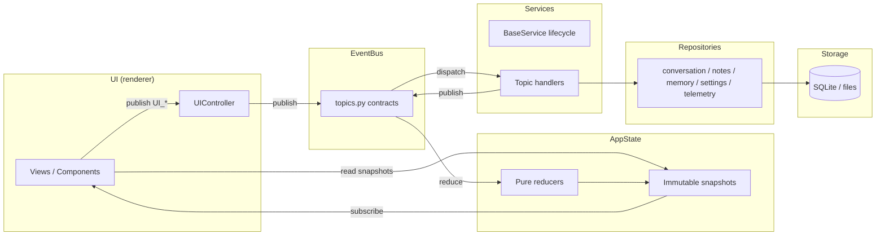
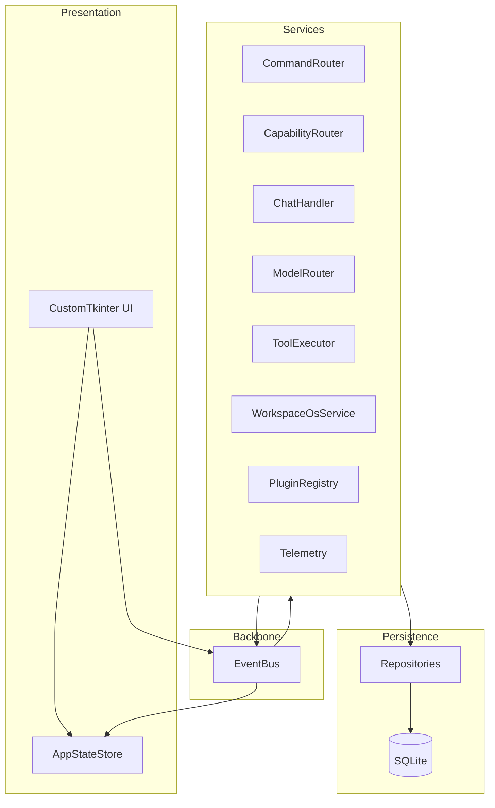

# AI Command Center — Architecture

See [ARCHITECTURE_ENFORCEMENT.md](ARCHITECTURE_ENFORCEMENT.md) for the implementation directives that coding agents must follow when modifying this repository.

## Authority hierarchy

```text
PROJECT_CONSTITUTION_V4.md
  → AGENTS.md / ARCHITECTURE_ENFORCEMENT.md
    → ARCHITECTURE.md (this document)
      → core/contracts.py, core/events/topics.py
        → Phase gate history (below)
          → Implementation
```

This document **expands** runtime architecture; it does not supersede the Constitution.

---

## Mission summary

AI Command Center is a **Workspace OS** — an ambient desktop command surface where workspace entities, knowledge, tools, and intelligence converge. Chat is one tool among many, not the product identity.

**North star:** [architecture/WORKSPACE_VISION.md](architecture/WORKSPACE_VISION.md)

**Transformation program (single backlog):**

| Document | Purpose |
|----------|---------|
| [architecture/ARCHITECTURE_TRANSITION_PLAN.md](architecture/ARCHITECTURE_TRANSITION_PLAN.md) | **Only execution backlog** — Programs 1–4, audit, enforcement, gates |
| [architecture/AGENT_RUNTIME_INTERFACE.md](architecture/AGENT_RUNTIME_INTERFACE.md) | **Capability provider contract** — host vs sidecar; integration gate for QwenPaw and future runtimes |

---

## Workspace-first direction

Current UX is chat-forward; target UX is **workspace-first**:

- **Now:** CustomTkinter shell; Workspace OS walking skeleton; inspector (Ctrl+Shift+W)
- **Next:** Workspace canvas as default home; chat as card-attached tool
- **Long-term:** Agents, workflows, and plugins orbit workspace entities

Constitutional ownership flow is unchanged:

```text
UI → AppState → EventBus → Services → Repositories → Storage
```

### Layer ownership boundaries

Each layer may call only the layer directly below it (plus read-only snapshots from AppState).
Services coordinate exclusively through EventBus topics — never direct service-to-service calls.



| Layer | Owns | Must not |
|-------|------|----------|
| UI | Rendering, input, `UI_*` publishes | SQLite, files, Ollama, direct service calls |
| AppState | Snapshots, reducer purity | Persistence, side effects |
| EventBus | Topic routing | Business logic |
| Services | Domain reactions, lifecycle | Direct peer service calls |
| Repositories | CRUD, indexing | UI or cross-service orchestration |
| Storage | Bytes on disk | Application logic |

Follow-on UI backlog: [UI_REFURBISHMENT_BACKLOG.md](architecture/UI_REFURBISHMENT_BACKLOG.md)

---

## Subsystem map



| Subsystem | Module roots | Spec |
|-----------|--------------|------|
| Workspace OS | `core/workspace/`, `core/entity/`, `core/workspace_os_service.py` | [WORKSPACE_VISION.md](architecture/WORKSPACE_VISION.md) |
| Model routing | `services/model_router_service.py`, `platform/model_registry.py` | [MODEL_ORCHESTRATION.md](architecture/MODEL_ORCHESTRATION.md) |
| Agents (planned) | topics in `core/event_bus.py` | [AGENT_FRAMEWORK.md](architecture/AGENT_FRAMEWORK.md) |
| Workflows (planned) | `core/workflow/` | [WORKFLOW_ENGINE.md](architecture/WORKFLOW_ENGINE.md) |
| Chat | `services/chat_handler_service.py`, `ui/views/chat_view.py` | [CHAT_MODERNIZATION_SPEC.md](architecture/CHAT_MODERNIZATION_SPEC.md) |
| UI refurbishment | `ui/views/`, `ui/components/`, `ui/inspector/` | [UI_REFURBISHMENT_BACKLOG.md](architecture/UI_REFURBISHMENT_BACKLOG.md) |
| Platform | `platform/`, `utils/hotkey.py` | [PLATFORM_STRATEGY.md](architecture/PLATFORM_STRATEGY.md), [PACKAGING_MSI_DESIGN.md](architecture/PACKAGING_MSI_DESIGN.md) |
| EventBus (R4) | `core/event_bus.py`, `core/events/dispatch_policy.py` | [ASYNC_EVENTBUS_POLICY.md](architecture/ASYNC_EVENTBUS_POLICY.md) — sync today; async dispatch design complete |
| Tools | `tools/`, `services/tool_executor_service.py` | Phase 4B flow below |
| Settings | `repositories/settings_repository.py`, `services/settings_service.py` | Settings section below |
| Plugins | `services/plugin_registry_service.py` | Plugin registry below |

---

## Long-term direction (3-year)

1. **Workspace canvas default** — entities, layouts, resources as primary surface
2. **Model orchestration** — tiered routing, multi-provider adapters ([MODEL_ORCHESTRATION.md](architecture/MODEL_ORCHESTRATION.md))
3. **Agent runtime** — supervised bus-native agents ([AGENT_FRAMEWORK.md](architecture/AGENT_FRAMEWORK.md))
4. **Workflow engine** — declarative multi-step automation ([WORKFLOW_ENGINE.md](architecture/WORKFLOW_ENGINE.md))
5. **Cross-platform packaging** — Windows now; macOS/Linux per [PLATFORM_STRATEGY.md](architecture/PLATFORM_STRATEGY.md)
6. **Chat renaissance** — AppState-first, workspace-attached chat ([CHAT_MODERNIZATION_SPEC.md](architecture/CHAT_MODERNIZATION_SPEC.md))

Gate history and phase verification scripts remain authoritative for **completed** work; new work follows transformation tracks.

---

## Data flow (target)

```text
UI → EventBus → Services → EventBus → AppState → UI
```

No shortcuts. UI never calls services or repositories directly.

Bootstrap (`ApplicationCore.startup()` → `services.load_all()`) is a **documented exception** — wiring purity adds no value at cold start.

---

## Repository access policy

**Only `ApplicationCore` (via `create_application()`) may construct or hold repository instances.**

| Layer | May access repositories? |
|-------|--------------------------|
| `ApplicationCore` / `create_application()` | Yes — composition root only |
| Services | Yes — injected at registration time by ApplicationCore |
| UI | **Never** |
| Scripts / tests | Prefer EventBus; diagnostics may use debug-mode bus taps |

Repositories are not exposed on `ApplicationCore` public fields.

---

## UI communication policy

UI modules may use **only**:

1. **EventBus** — publish intents (`settings.set_request`, `ui.command`, …)
2. **AppState** — read `AppStateStore.snapshot` and subscribe to state changes

UI receives `bus` and `state_store` — **not** `ApplicationCore`, `ServiceManager`, or repositories.

`UIController(bus, state_store)` is the sole UI bridge.

UI must **not**:

- Import `db.repository`
- Import `application.ApplicationCore` for runtime wiring
- Call `ServiceManager.get()` for mutations
- Call service methods directly

---

## Official hotkey

| Setting | Value |
|---------|--------|
| **Default** | `Alt+Space` |
| **Stored in** | `settings.hotkey` → `settings.snapshot` |
| **Not used** | `Win+Space` — conflicts with Windows language switching |

Tray icon remains fallback if global hook registration fails.

---

## Command routing

```text
UI → ui.command → CommandRouterService → command.routed → Phase 3 handlers
```

### `command.routed` payload

```json
{
  "text": "user input",
  "intent": "chat | shell | note_search | note_new | navigate",
  "args": {},
  "status": "pending"
}
```

Phase 3 services subscribe to `command.routed` by intent (Ollama chat, Obsidian, etc.).

AppState projection: `last_command`, `last_command_intent` updated via reducer.

---

## Context manager (required before Ollama)

**Every AI request** must call `ContextManager.build_context()` before `OllamaService`.

Phase 3 V1:

```python
bundle = context_manager.build_context(
    query,
    clipboard=None,  # explicit per request — not background monitoring
    notes=None,
)
# OllamaService receives bundle.prompt only
```

Phase 4D adds `conversation_summary` compression and `graph_snippets` opt-in.

---

## Phase 4 event flows

### Tool execution (4B)

```text
command.routed (shell) → ShellToolService → tool.invoke → ToolExecutorService → tool.result
```

### Model routing (4F)

```text
command.routed (chat) → ChatHandler → ModelRouterService.resolve() → model.selected → OllamaHttpService
```

### Memory graph (4E)

```text
memory.remember → MemoryGraphService → memory.stored
memory.select → MemoryGraphService → memory.selected → ContextManager (opt-in)
```

### Telemetry (5C+)

```text
EventBus → TelemetryService (raw passthrough) → telemetry_events (SQLite)
scripts/telemetry_summary.py → offline correlation + SESSION SUMMARY
```

**Firewall:** PASSIVE WITH DERIVED OFFLINE INTELLIGENCE

- Runtime: dumb camera only — no inference, no bus publish, no behavioral classification.
- Offline: hesitation, retry, command correlation, friction score in `telemetry_summary.py` only.
- Telemetry optional — removing `TelemetryService` does not break core flows.

### Plugin registry (5B+ v2)

```text
plugins/manifests/*.yaml → PluginManifestRepository
                                              ↓
PluginRegistryService → plugin.catalog → PluginsView
       ↓
plugin.enable_request / plugin.disable_request
       ↓
SQLite plugin_state (persist)
plugin.state_changed
service.restart_request { service: "..." }
       ↓
ServiceManager → stop(service) → start(service)
```

- Core plugins cannot be disabled.
- Extension plugin state persists in SQLite.
- Toggling an extension with a declared `service` triggers a `service.restart_request`.
- `ServiceManager` listens to restart requests and performs the actual lifecycle sequence.

### Overlay (4C)

```text
ui.palette_open → overlay.show → UI (compact | palette geometry)
settings.set_request → settings.snapshot → AppState → SettingsView
```

---

## State ownership

Two kinds of state — both intentional, no refactor required.

### Operational state (authoritative — lives in services)

Runtime lifecycle inside the service process.

Examples:

- `ServiceState.READY`
- `ServiceState.STARTING`
- `ServiceState.DEGRADED`
- `ServiceState.ERROR`

**Source of truth:** `BaseService._state`  
**UI visibility:** mirrored into `AppState.services` via `service.state_changed` events.

### Presentation state (UI-consumable projection — lives in AppState)

Derived snapshots for rendering.

Examples:

- `service_status` (from `ServiceSnapshot`)
- `settings` (from `settings.snapshot`)
- `last_error`
- `phase`

**Source of truth:** `AppStateStore` reducers only — never write AppState from services directly.

---

## Settings

SQLite → `repositories.settings_repository.SettingsRepository` (canonical) → `core.settings.settings_service.CoreSettingsService` (schema/migration) → `services.settings_service.SettingsService` (EventBus I/O) → **`settings.snapshot`** event → AppState reducer.

The compatibility re-export in `core/settings/settings_repository.py` ensures the canonical repository is the only one used; the old in-memory stub has been removed.

### `settings.snapshot` payload

```json
{
  "theme": "dark",
  "accent": "#3B82F6",
  "default_model": "llama3.2:3b",
  "ollama_url": "http://localhost:11434",
  "hotkey": "alt+space",
  "low_memory_mode": false,
  "window_width": 1100,
  "window_height": 700,
  "window_alpha": 0.95,
  "obsidian_vault_path": "",
  "overlay_mode": "palette",
  "telemetry_enabled": true,
  "schema_version": 1
}
```

Payload is produced from `SettingsSnapshot.to_payload()`. Emitted on service load and after every settings write.

### UI mutation path

```text
UI publishes settings.set_request { "key": "...", "value": "..." }
    → SettingsService handles
    → SQLite updated
    → settings.changed (incremental)
    → settings.snapshot (full projection)
    → AppState updated
    → UI re-renders from snapshot
```

---

## EventBus wildcard policy

**Wildcard subscriptions are forbidden in production code.**

Forbidden outside debug/diagnostics:

- `bus.subscribe_all(handler)`
- `bus.subscribe("*", handler)`

Allowed:

- `AppStateStore` — topic-scoped subscriptions only
- `scripts/verify_*.py` — `EventBus(debug_mode=True)` for test taps
- Future diagnostics panel — explicit `debug_mode=True` bus instance

Rationale: wildcard listeners cause performance and debugging nightmares as plugins, logging, and analytics accumulate.

---

## Event topic registry

Canonical topic constants live in `ai_command_center/core/events/topics.py`.

| Topic | Producer | Consumers | Payload |
|-------|----------|-----------|---------|
| `settings.updated` | SettingsService | AppState, UI | `{"key": str, "value": Any}` |
| `settings.snapshot` | SettingsService | AppState, ObsidianService, UI | full settings projection |
| `service.started` | BaseService | AppState, telemetry | `{"service": str}` |
| `service.ready` | BaseService | AppState, telemetry | `{"service": str}` |
| `service.stopped` | BaseService | AppState, telemetry | `{"service": str}` |
| `service.error` | BaseService | AppState, telemetry | `{"service": str, "detail": str}` |
| `service.state_changed` | BaseService | AppState | `{"name": str, "state": str, "detail": str}` |
| `tool.started` | ToolExecutorService | UI, telemetry | `{"tool": str, "invoke_id": str}` |
| `tool.completed` | ToolExecutorService | UI, telemetry | `{"tool": str, "invoke_id": str}` |
| `tool.failed` | ToolExecutorService | UI, telemetry | tool failure payload |
| `telemetry.event` | TelemetryService | future UI/analytics | normalized telemetry event |
| `system.snapshot` | SystemSnapshotBuilder | AppState | canonical system snapshot |
| `bus.handler_error` | EventBus | observability, AppState | `{topic, source, error, traceback}` |
| `model.selected` | ModelRouterService | AppState, telemetry | `{model, intent, reason, tier}` |

---

## Roadmap status

Phase gates (Tracks 1–3, 4–5, 6.1–6.3): **complete**. All open work is in [architecture/ARCHITECTURE_TRANSITION_PLAN.md](architecture/ARCHITECTURE_TRANSITION_PLAN.md).

| Program | Focus | Status |
|---------|-------|--------|
| 1 — Stabilization | Execution reliability, model router, shell hardening | **Mostly complete** — S1/S2 shell async + sandbox remain |
| 2 — Enforcement | UCGS block local, arch baseline, contracts | After P1 exit |
| 3 — Workspace Adoption | Shift gravity chat → workspace | After P1 exit |
| 4 — Platform Expansion | Vectors, multi-agent, MSI, Linux | Gated on P3 |

| Former track | Now |
|--------------|-----|
| 6.4 Vector search | Program 4 — constitutional gate required |
| 6.5 Multi-agent | Program 4 — Appendix C gate in transition plan |

**Residual risks** (mapped to transition plan): `app.py` direct bus subscriptions (W4 measure); Inspector `after(0)` vs UIQueue (S4 minor); hero_panel/layout violations **closed** in code.

Settings re-export (`core/settings/settings_repository.py`), `tools/tool_executor.py` execution contract, and telemetry re-export are **documented** (S7 closed 2026-07-06).

---

## Gate history

Current phase: **Phase 6 — IN PROGRESS**
Previous snapshot: Phase 5 complete at commit `3970aa5` / tag `phase-5-complete-20260620`

| Gate | Script | Result |
|------|--------|--------|
| Phase 1–3D | `verify_phase*.py` | PASS |
| Contracts | `verify_contracts.py` | PASS |
| Phase 4A | `verify_phase4a.py` | PASS |
| Phase 4B | `verify_phase4b.py` | PASS |
| Phase 4C | `verify_phase4c.py` | PASS |
| Phase 4D | `verify_phase4d_compression.py` | PASS |
| Phase 4E | `verify_phase4e.py` | PASS |
| Phase 4F | `verify_phase4f.py` | PASS |
| Phase 5A | `verify_phase5a.py` | PASS |
| Phase 5B | `verify_phase5b.py` | PASS |
| Phase 5C preflight | `verify_phase5c_preflight.py` | PASS |
| Phase 5C gate | `verify_phase5c.py` | PASS |
| Phase 5C+ telemetry | `verify_phase5c_telemetry.py` | PASS |
| Capability completion | `verify_capability_completion.py` | PASS |
| Note audits | `audit_note_integration.py` | PASS |
| Daily driver | `run_daily_driver.py` | PASS |
| Constitution | `verify_constitution.py` | PASS |

UCGS v3: **STRICT** | Phase: 6 | Verdict: `IN_PROGRESS`
