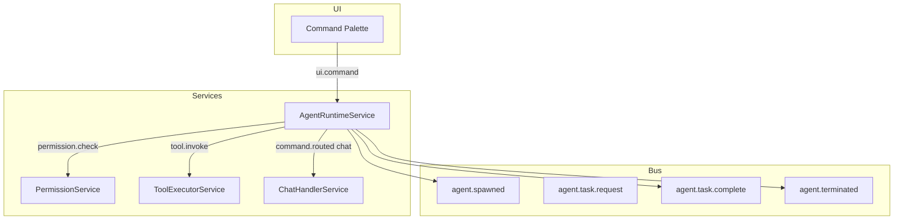

# Agent Framework

**Status:** Architecture Specification  
**Vision ref:** [WORKSPACE_VISION.md](WORKSPACE_VISION.md) — Agents  
**Constitutional refs:** No direct service-to-service calls; PermissionService gate

---

## Purpose

Specify a bus-native multi-agent runtime where agents are supervised EventBus participants, not background threads with direct service access.

---

## Current State

| Asset | Status |
|-------|--------|
| Event topics `agent.spawned`, `agent.terminated` | Defined in `core/events/topics.py` |
| `AICapabilityRegistryService` | Registers AI-executable actions |
| `PermissionService` | Gates action invocation |
| `AgentRuntimeService` | A1 supervised demo skeleton implemented and registered |

---

## Target Architecture

---

## Agent Lifecycle

| State | Entry | Exit |
|-------|-------|------|
| `SPAWNING` | `agent.spawn.request` | `agent.spawned` |
| `RUNNING` | task assigned | task complete or cancel |
| `WAITING` | blocked on tool/LLM | result received |
| `TERMINATED` | timeout, cancel, complete | `agent.terminated` |

Agents carry: `agent_id`, `parent_workspace_id`, `capabilities[]`, `request_id` correlation.

---

## Phases

| Phase | Deliverable | Acceptance |
|-------|-------------|------------|
| **A0** | Topic + domain model `AgentSession` | Dataclass in `domain/` |
| **A1** | Single supervised agent demo | Implemented |
| **A2** | Tool-using agent loop | Existing demo only; expansion gated |
| **A3** | Multi-agent with workspace scope | Gated by Appendix C and Program 4 |

---

## Constitutional Compliance

- Agents **publish** tool and chat intents; never import repositories
- All AI paths through ContextManager
- Permission denied → `permission.denied` + agent error state
- Telemetry: `telemetry.event` for spawn/complete/fail

---

## Risks

| Risk | Mitigation |
|------|------------|
| Runaway agent loops | Hard cap on steps; `agent.cancel.request` |
| Permission escalation | PermissionService mandatory pre-flight |
| UI thread blocking | AgentRuntime runs on worker; UI via AppState only |

---

## Acceptance Criteria (A1)

- [x] `AgentRuntimeService` registered in service_factory
- [x] Spawn/terminate visible in AppState
- [x] No direct imports between AgentRuntime and ChatHandler
- [x] Pytest coverage for supervised demo paths

Further runtime expansion is blocked by the Appendix C sign-off described in
`ARCHITECTURE_TRANSITION_PLAN.md` and summarized in `PROGRAM4_GATE_STATUS.md`.
