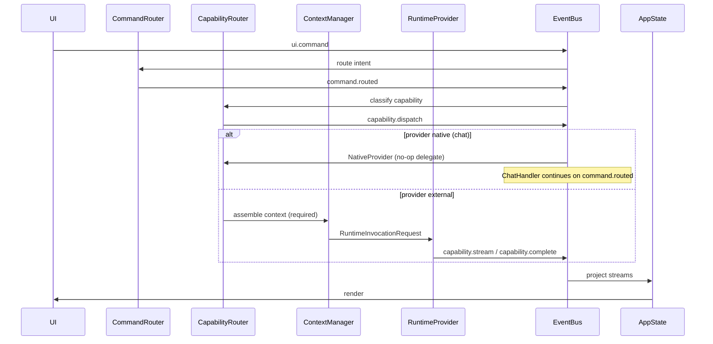

# Agent Runtime Interface (ARI)

**Status:** Constitutional contract (Tier B)  
**Authority:** `PROJECT_CONSTITUTION_V4.md` Invariant 13  
**Related:** [WORKSPACE_VISION.md](WORKSPACE_VISION.md), [AGENT_FRAMEWORK.md](AGENT_FRAMEWORK.md), [ARCHITECTURE_TRANSITION_PLAN.md](ARCHITECTURE_TRANSITION_PLAN.md)

---

## Purpose

This document is the **integration contract** for all agent and capability runtimes.

AI Command Center (ACC) is the **host platform**. External runtimes (QwenPaw, OpenHands, CrewAI, custom sidecars) are **capability providers**. If this interface is stable, new providers become adapters. If it is vague, each integration becomes architectural debt.

**Constitutional rule:** No external runtime may become the system of record for application state, workspace state, or platform governance.

---

## Ownership matrix

| Domain | Owner | External runtime role |
|--------|-------|------------------------|
| UI / UX | ACC | None — no embedded third-party consoles |
| Workspace entities | ACC (`EntityService`, repositories) | Read bridged context only |
| Orchestration | ACC (`CapabilityRouterService`, `AgentRuntimeService`, workflows) | Execute capability slices |
| Settings | ACC (`SettingsSnapshot`) | Receive derived config; never write settings files |
| Conversation history | ACC (`SessionService`, SQLite) | Ephemeral turn context; results merged back via bus |
| Memory (authoritative) | ACC (`MemoryGraphService`, repositories) | Optional recall bridge; ACC persists |
| Tools (desktop) | ACC (`ToolExecutorService`) | May request tool invoke via bus; never call shell directly |
| Permissions | ACC (`PermissionService`) | Must pass permission gate before side effects |
| Telemetry | ACC (`TelemetryService`) | Emit events; ACC records |

---

## Capability taxonomy

ACC routes user intent to a **capability kind**, then to a **provider**.

| Kind | Description | Default provider (Phase 1) | Target external provider |
|------|-------------|---------------------------|--------------------------|
| `chat` | General Q&A, workspace-aware dialogue | `native` | — |
| `planning` | Schedules, agendas, multi-step plans | `native` → `qwenpaw` | QwenPaw sidecar |
| `coding` | Code generation, repo-aware edits | `native` → `qwenpaw` | QwenPaw sidecar |
| `research` | Web/doc research loops | `native` | QwenPaw / future |
| `automation` | Workflow and tool chains | `native` | ACC workflows |
| `agents` | Supervised multi-agent runs | `native` | QwenPaw patterns (study) |
| `memory` | Remember / recall operations | `native` | ACC only (authoritative) |

Classification inputs: explicit prefixes (`/plan`, `/code`, …), intent from `CommandRouterService`, and lightweight keyword heuristics. Classification is advisory metadata; routing policy selects the provider.

---

## Runtime flow



**Invariant preserved:** All AI requests pass through `ContextManager` before any LLM or external runtime call (Constitution Invariant 6).

---

## Provider interface

Implementations live under `ai_command_center/runtime/providers/`.

```python
class AgentRuntimeProvider(Protocol):
    provider_id: str  # e.g. "native", "qwenpaw"

    def health(self) -> ProviderHealth: ...

    def supports(self, kind: CapabilityKind) -> bool: ...

    def invoke(self, request: RuntimeInvocationRequest) -> None:
        """Async via EventBus — publish capability.* events; never block UI thread."""
        ...
```

### RuntimeInvocationRequest (domain contract)

| Field | Type | Notes |
|-------|------|-------|
| `request_id` | `str` | Correlates with chat/agent pipeline |
| `kind` | `CapabilityKind` | Routed capability |
| `provider_id` | `str` | Selected provider |
| `query` | `str` | User text |
| `context_bundle` | `ContextBundle` | From ContextManager — required for external calls |
| `workspace_id` | `str` | Optional scope |
| `workspace_entity_id` | `str` | Optional card/entity scope |
| `session_id` | `str` | Optional conversation scope |

Providers **must not** mutate ACC repositories directly. Results return via bus events; ACC services persist.

### ProviderHealth

| State | Meaning |
|-------|---------|
| `ready` | Provider available |
| `degraded` | Partial (e.g. sidecar slow) |
| `unavailable` | Not configured or unreachable |
| `error` | Last health check failed |

---

## EventBus topics

Canonical constants in `ai_command_center/core/events/topics.py`.

| Topic | Direction | Payload highlights |
|-------|-----------|-------------------|
| `capability.classified` | Router → observers | `kind`, `provider_id`, `request_id`, `query` |
| `capability.dispatch` | Router → providers | Full dispatch envelope + `command_routed` snapshot |
| `capability.runtime.request` | Router → external provider | `RuntimeInvocationRequest` fields |
| `capability.stream` | Provider → UI path | `request_id`, `chunk` (maps to `chat.chunk` when kind=chat) |
| `capability.complete` | Provider → UI path | `request_id`, `text`, `metadata` |
| `capability.error` | Provider → UI path | `request_id`, `message` |
| `capability.fallback` | Router → telemetry | External failed; falling back to native |

Existing topics remain authoritative for UX today:

- `chat.*` — native chat streaming (AppState projection)
- `agent.*` — supervised agent lifecycle
- `tool.*` — ACC tool execution

External providers map streams to `capability.stream` / `capability.complete`; a thin adapter may also emit `chat.chunk` / `chat.complete` for chat-kind invocations until AppState adds dedicated capability projections.

---

## Context bridging

External runtimes receive **derived context**, never raw repository access.

1. `CapabilityRouterService` receives `command.routed`.
2. For external provider: publish context assembly requests (same pattern as `ChatHandlerService`).
3. `ContextManager` produces a bounded `ContextBundle` (settings snapshot, memory snippets, entity scope, session tail).
4. Provider receives serialized bundle in `RuntimeInvocationRequest`.

Sidecars must treat context as **read-only input**. Writes flow: provider result → bus → ACC service → repository.

---

## Sidecar integration (QwenPaw)

**Mode:** Subprocess + HTTP/SSE (Python 3.13 venv; host may run 3.14).

| Concern | Rule |
|---------|------|
| Packaging | Isolated venv or container; not in-process import |
| Lifecycle | ACC spawns, health-checks, stops sidecar |
| Auth | Localhost-only; no exposed WAN port by default |
| State | Sidecar session ephemeral; ACC session authoritative |
| Tools | Sidecar requests `tool.invoke` on bus; ACC executes |
| UI | No QwenPaw web console embedded |

Phase 1 delivers `QwenPawSidecarProvider` stub (health + contract). Phase 2 wires REST/SSE bridge.

---

## Forbidden patterns

| Pattern | Why forbidden |
|---------|---------------|
| External runtime writes SQLite / settings files | Violates Invariant 13 |
| UI imports sidecar SDK | Violates UI isolation |
| Service calls `qwenpaw.api.foo()` directly | Violates EventBus governance |
| Skip ContextManager for external LLM calls | Violates Invariant 6 |
| Duplicate conversation store in sidecar as canonical | Violates source-of-truth |
| Embedded third-party chat UI replacing ACC shell | Violates host platform ownership |

---

## Implementation phases

| Phase | Deliverable | Acceptance |
|-------|-------------|------------|
| **1** | ARI doc, `CapabilityKind`, `CapabilityRouterService`, `NativeProvider`, `QwenPawSidecarProvider` stub | Classification events on chat route; tests pass |
| **2** | QwenPaw sidecar spawn + SSE → `capability.stream` | `/plan` query uses sidecar when configured |
| **3** | ContextManager bundle before external invoke | Grounded planning with ACC memory/history/entity context |
| **4** (current) | Settings: per-capability provider map + settings UI | User selects provider in settings |
| **5** (next) | Program 5 runtime plugin manifest | Third-party providers as plugins |

---

## Verification

- `python scripts/verify_constitution.py` — Invariant 13 referenced in doc set
- `pytest tests/test_capability_router.py` — classification + dispatch
- `pytest tests/test_capability_context.py` — context bundle before external invoke
- `pytest tests/test_qwenpaw_sse.py tests/test_qwenpaw_sidecar.py` — SSE parser + bridge deferral
- `pytest tests/test_capability_provider_settings.py` — per-capability provider map + settings round-trip

---

## References

- Constitution: `PROJECT_CONSTITUTION_V4.md` Invariant 13
- Code: `ai_command_center/domain/runtime_capability.py`, `ai_command_center/runtime/`, `ai_command_center/services/capability_router_service.py`
