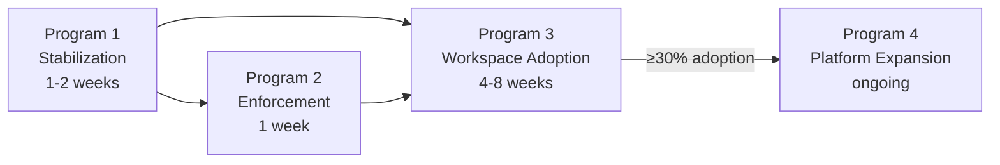

# Architecture Transition Plan

**Status:** **Single source of truth** — all backlog, audit, enforcement stages, stabilization history, and program execution live here only.  
**Authority:** Derived from code audit, supplemental dependency/EventBus/Workspace OS analysis, and `PROJECT_CONSTITUTION_V4.md`  
**Scope:** Four programs — no feature sprawl until gravity shifts

> **Do not create parallel backlogs.** Architecture specs (`WORKSPACE_VISION.md`, `MODEL_ORCHESTRATION.md`, etc.) describe *what* to build; this document describes *when* and *in what order*.

---

## Executive Summary

The codebase **already implements** the target layer cake:

```text
UI → AppState → EventBus → Services → Repositories → Storage
```

The UI layer is clean. The bus-native palette stack works. Workspace OS exists but carries **~10% of structural runtime** while the chat ecosystem carries **~80–90%**.

This plan does **not** ask you to rebuild Workspace OS. It asks you to:

1. **Stabilize** what exists so architecture executes reliably.
2. **Enforce** boundaries so fixes are not re-broken.
3. **Shift center of gravity** so Workspace becomes the entry point — chat becomes a consumer.
4. **Expand platform** only after gravity has moved.

```text
Today                          Target (Program 3)
─────                          ──────────────────
Chat                           Workspace
 ↓                               ↓
Memory                         Context
 ↓                               ↓
Model                          Entities
                                 ↓
                               Tools
                                 ↓
                               Chat (consumer)
```

---

## Master Backlog — Four Programs Only

| Program | Goal | Deliverable | Time |
|---------|------|-------------|------|
| **1 — Stabilization** | Make current architecture trustworthy | Architecture executes reliably | 1–2 weeks |
| **2 — Enforcement** | Prevent regression | Contributors cannot reintroduce debt | 1 week (immediately after P1) |
| **3 — Workspace Adoption** | Move runtime from chat system to workspace system | >60% workspace runtime influence; five-pillar exit gate | 4–8 weeks |
| **4 — Platform Expansion** | Add capability on correct foundation | Multi-provider, agents, workflows, Linux | After P1–P3 |
| **5 — Reasoning Layer** | State-driven cognitive stack | World model context, capability facade, planner, execution gates | After P3 exit (see [VNEXT_STATE_DRIVEN_BLUEPRINT.md](VNEXT_STATE_DRIVEN_BLUEPRINT.md)) |

**Sequencing rule:** Program 2 starts the week Program 1 exits. Program 3 runs in parallel with late P2 only after P1 exit criteria pass. Program 4 does not start until Program 3 hit **Emerging → Core** on the adoption scorecard (see §Program 3). Program 5 does not start until Program 3 exit criteria pass and Phase A foundation (context compiler) is merged.

---

## Legacy Debt Intake (merged — source files deleted)

The following documents were **merged into this file and removed** on 2026-07-03:

| Former document | Content now in |
|-----------------|----------------|
| `TODO_NEXT_SESSION.md` | §Former session TODO, §Quick Start |
| `docs/development/TRANSFORMATION_AUDIT.md` | §TD registry, Appendix D |
| `docs/development/STABILIZATION_LOG.md` | Appendix A |
| `docs/development/TRANSFORMATION_ROADMAP.md` | §Track mapping, Programs 1–4 |
| `docs/development/ENFORCEMENT_ROADMAP.md` | Program 2, Appendix B |
| `docs/ARCHITECTURE_REVIEW_MULTI_AGENT.md` | Program 4 gate, Appendix C |

### TD registry → program mapping

| ID | Item | Audit status | Program item | Notes |
|----|------|--------------|--------------|-------|
| TD-01 | F821 `T` in Badge | **FIXED** | — | Appendix A FIX-001 |
| TD-02 | F821 `Any` in WorkspaceOsService | **FIXED** | S8 | Keep F821 in CI |
| TD-03 | ModelRouter in factory | **FIXED** | **S3** | Registry injected; single-provider LLM dispatch via payload filter |
| TD-04 | SystemView poll leak | **FIXED** | **S4** | Generation token + mid-flight `_poll_live` checks stop reschedule after `on_hide` |
| TD-05 | Inspector Tk marshal | **PARTIAL** | **S4** | `after(0)` added; migrate to `UIQueue` |
| TD-06 | EventBus swallows errors | **FIXED** | S6 | `bus.handler_error` exists |
| TD-07 | AppState listener errors | **FIXED** | S5 | `app.error` exists; verify `close()` everywhere |
| TD-08 | `shell=True` | **HARDENED** | **S2** | Production sandbox + permission gate — **done** |
| TD-09 | Ruff F401 | **FIXED** | S8 | Maintain in CI |
| TD-10 | `motion_widgets.py` | KEEP | — | No action |
| TD-11 | Requirements drift | **VERIFIED** | S7 | `requirements.txt` matches runtime imports (2026-07-06 audit) |

### Former session TODO → program mapping

| Pending item | Program | Item |
|--------------|---------|------|
| Track 6.4 — Vector / embeddings memory | **4 — P1** | Blocked: UCGS profile forbids vectors without constitutional phase gate |
| Track 6.5 — Multi-agent runtime | **4 — P1** | Gate: Appendix C (see Program 4 gates below) |
| SQLite migration housekeeping | **1 — S7** | Procedure in S7 — no code until new schema |

### Completed work (archived — do not re-open)

| Source | Items |
|--------|-------|
| Audit refactor 2026-06-29 | ConversationRepository shim, UIQueue wake-up, Ollama unload, service_factory, view registry, doc consolidation, SQLite migrations v2 |
| STABILIZATION_LOG FIX-001–010 | F821, SystemView lifecycle wiring, inspector marshal, bus/app_state errors, ModelRouter factory, shell shlex, logging — see Appendix A |
| TRANSFORMATION_AUDIT | TD-01, TD-02, TD-03, TD-06, TD-07, TD-09 |
| UI violations | `hero_panel.py`, `layout/compiler.py` — clean in current tree |

### `TRANSFORMATION_ROADMAP` track → program mapping

| Track | Goal | Program | Item |
|-------|------|---------|------|
| 1 Stabilization | P0/P1 fixes | **1** | S1–S8 (**complete**; S7 doc-only) |
| 2 Enforcement | warn → block | **2** | E1–E4 |
| 4 R4 Async EventBus | Non-blocking dispatch | **1** | S1 (`tool.invoke` worker; R4b queue exists) |
| 5 Structural refactor | God classes, UI violations | **1** + **3** | S7; W4 (`app.py` bus → AppState listeners) |
| 6 Platform / MSI | Packaging, paths | **4** | P1 after P3 midpoint |
| 7 Agent platform | A1 skeleton → product | **4** | P1; workspace scope from **W1** first |
| 8 Workflow engine | W1 skeleton → product | **4** | P1; bus-native tools from **W3** first |
| 9 Chat renaissance | Entity-attached chat | **3** | W2 (not a separate track) |

### `ARCHITECTURE.md` residual risks → program mapping

| Residual risk (ARCHITECTURE.md §Roadmap) | Program |
|------------------------------------------|---------|
| `core/settings/settings_repository` re-export confusion | S7 |
| `app.py` direct bus subscriptions | W4 (measure) + Track 5 split |
| `tools/tool_executor.py` stub vs service | S7 document |
| `hero_panel` / `layout/compiler` UI violations | **Closed** in code; E4 clean baseline |
| Tracks 5–9 pending | Programs 1–4 above |

---

## Audit Consolidation Map

All audit findings collapse into **16 backlog items** across four programs. Nothing is left orphaned.

| Consolidated item | Source audit themes | Program |
|-------------------|---------------------|---------|
| **S1 — Execution reliability** | Sync shell on UI thread; TOOL_INVOKE blocking; ChatHandler sync bus cascade; tool cancel gap; shutdown gaps | 1 |
| **S2 — Shell & tool hardening** | Unsandboxed shell; command injection paths; workflow tool invoke without permission; workspace_os_actions shell | 1 |
| **S3 — Model routing wire-up** | ModelRouter exists; ProviderRegistry built but unused; Chat→LLM_REQUEST fans to Ollama+OpenAI; bypass router abstraction | 1 |
| **S4 — UI runtime safety** | SystemView poll leak (`on_hide` race); Inspector `after(0)` vs UIQueue; UIQueue error swallowing | 1 |
| **S5 — State & lifecycle** | AppState unsubscribe/close paths; listener leaks; concurrent tool/Ollama status races | 1 |
| **S6 — Observability foundation** | EventBus error telemetry gaps; silent keyring failures; logging architecture; topic instrumentation (measure phase) | 1 |
| **S7 — Dependency cleanup** | Orphan AssetService; stub settings/telemetry modules; duplicate PluginManifest; stale arch lint baseline | 1 |
| **S8 — Static quality gate** | F821 / ruff hygiene; broken-import prevention | 1 |
| **E1 — CI blockers** | Constitution gate; UCGS CI block (exists); pytest + arch lint in CI | 2 |
| **E2 — Local block mode** | `enforcement_mode: block`; pre-commit block on FAIL/S4/S5 | 2 |
| **E3 — Contract & drift** | UCGS `contract_drift` metadata bug; empty `contract_lock` in project config; entity.* topics outside `topics.py` | 2 |
| **E4 — Boundary ratchet** | Service→service direct-call ban for new code; Workspace OS grandfather list; bus-only palette stack tests | 2 |
| **W1 — Workspace entry routing** | Command router workspace-agnostic; palette stack bypasses entities; UIController 17/19 topics non-workspace | 3 |
| **W2 — Domain re-homing** | Notes/memory/chat/tools as workspace-scoped; global memory → workspace memory; standalone sessions → entity conversations | 3 |
| **W3 — Context & bus native WOS** | ContextManager entity graph; Workspace OS direct-call island (11 edges); chat optional entity injection | 3 |
| **W4 — AppState domain split** | 47 topics → single 1345-line reducer; measure then split Chat/Workspace/Tool/Model/Plugin state | 3 |
| **P1 — Platform capabilities** | Multi-provider tiers; agents beyond demo; workflow persistence; Linux; large context; plugin marketplace; vectors | 4 |

---

## Program 1 — Stabilization

### Goal

Make the **current** architecture execute reliably. No new features. No Workspace redesign.

### Why first

The audits found the spine is correct but **execution paths are unsafe**: UI thread blocking, shell injection, routing gaps, and lifecycle leaks undermine trust in everything built on top.

### Backlog

#### S1 — Execution reliability

| Task | Evidence | Done when |
|------|----------|-----------|
| Move `tool.invoke` off sync/UI thread | `TOOL_INVOKE` not in `ASYNC_ELIGIBLE_TOPICS`; `tool_executor_service.py` `subprocess.run(timeout=30)` on publisher thread | Shell/chat palette never freezes ≥30s |
| Fix ChatHandler inline bus cascade | `chat_handler_service.py:146-148` — three request/response publishes synchronously per message | Chat path documented; optional async gather or documented sync contract |
| Tool subprocess cancellation | `tools/tool_executor.py:78-90` — cancel does not kill process | Cancel interrupts or rejects concurrent invoke |
| Graceful shutdown | Daemon threads in EventBus/Ollama/Obsidian; swallowed shutdown errors | Shutdown test passes; no hung subprocess after exit |

#### S2 — Shell & tool hardening

| Task | Evidence | Done when |
|------|----------|-----------|
| Wire production sandbox | `tests/support/sandbox.py` exists; `test_prompt_injection_sandbox.py` xfail | `ToolExecutorService` validates before `subprocess` |
| Permission-gate `TOOL_INVOKE` | Workflow/agent/shell paths skip `PermissionService` | Shell requires explicit permission or user-only gate |
| Restrict `shell=True` | `tool_executor_service.py:44-47`, `workspace_os_actions.py:90` | Metachar policy documented; dangerous patterns blocked |

#### S3 — Model routing wire-up

**Audit gap:** `ModelRouterService` is registered (`service_factory.py:115`) and `ChatHandler` publishes `model.resolve.request` — but execution still uses **dual LLM subscribers** (`OllamaHttpService` + `OpenAIHttpService` both on `llm.request`) with provider string filtering. `ProviderRegistry` is built (`service_factory.py:100`) and **never injected** into router or chat.

| Task | Evidence | Done when |
|------|----------|-----------|
| Inject `ProviderRegistry` into `ModelRouterService` | `WiredServices.provider_registry` unused by services | Router resolves `(model, provider)` from registry |
| Single LLM dispatch path | Two services subscribe `LLM_REQUEST` | **Chat → ModelRouter → Provider → LLM** — never Chat → Ollama directly |
| Router publishes `provider` on `model.selected` | `model_router_service.py:77-87` includes provider field | ChatHandler uses router result for `LLM_REQUEST` payload only |

Target sequence:

```text
ChatHandler
  → model.resolve.request
  → ModelRouterService (uses ProviderRegistry)
  → model.resolve.result
  → llm.request { provider, model }
  → exactly one provider service handles request
```

#### S4 — UI runtime safety

| Task | Evidence | Done when |
|------|----------|-----------|
| SystemView poll leak | `system_view.py:686-690` `on_hide` sets `_active=False` but in-flight `_collect` may reschedule `_poll` and `after(0)` | Navigating away stops background psutil threads |
| Inspector thread marshaling | `workspace_os_inspector.py:143` uses `after(0)` not `UIQueue` | Inspector uses same `UIQueue` pattern as `event_coordinator.py` |
| UIQueue error visibility | `ui_queue.py:43-46` swallows callback exceptions | Errors logged; optional toast in dev mode |

#### S5 — State & lifecycle

| Task | Evidence | Done when |
|------|----------|-----------|
| AppState unsubscribe audit | `app_state.py:1342-1345` `close()` exists; verify all composition roots call it | `application.shutdown()` → `state_store.close()` verified in test |
| UIController / EventCoordinator teardown | Shell mixins subscribe bus topics | All `unsubscribe()` on app destroy |
| Tool/Ollama status races | `tool_executor.py`, `ollama_http_service.py` unguarded mutable status | Documented single-flight or lock |

#### S6 — Observability foundation

| Task | Evidence | Done when |
|------|----------|-----------|
| EventBus handler telemetry | `bus.handler_error` published; not all UI paths log | Every handler failure has structured log + topic |
| Topic counters (measure phase) | No runtime QPS; `TelemetryService` writes SQLite | `eventbus.topic.count` metric per topic in `system.snapshot` or telemetry |
| Logging foundation | Silent `secret_store.py` except blocks | Keyring failures logged at WARNING |
| Secret handling | API key SQLite fallback `secret_store.py:47-48` | Prefer keyring-only; warn on plaintext persist |

#### S7 — Dependency cleanup

| Task | Evidence | Done when |
|------|----------|-----------|
| Remove or wire `AssetService` | Not in `service_factory.py` | Deleted or registered with bus-only access |
| Retire stub modules | `telemetry/telemetry_service.py`, `core/settings/settings_service.py` | Single canonical service per domain |
| Unify `PluginManifest` | `domain/` vs `core/` duplicate | One contract |
| Document `repositories/` ↔ `db/` facade | Dual persistence layer | ADR: repositories own storage; `db/` is implementation detail |
| SQLite migrations | Ongoing housekeeping | Runner: `repositories/database_bootstrap_repository.py` (v2). To add: define `_migrate_vN`, append `(N, _migrate_vN)` to `_MIGRATIONS`; no `schema.sql` edit |

#### S8 — Static quality gate

| Task | Evidence | Done when |
|------|----------|-----------|
| F821 zero tolerance | `ruff check --select F821` (currently clean) | CI fails on F821 |
| Import boundary test | `verify_constitution.py` UI checks | Extended to flag new service→service in `services/` |

### Deliverable

Architecture **executes reliably**: no UI freeze on shell, model path goes through router, leaks closed, instrumentation started.

### Exit criteria (Program 1)

- [x] `test_prompt_injection_sandbox` passes (xfail removed)
- [x] `test_eventbus_concurrency` + shutdown test green
- [x] Chat integration test proves `ModelRouterService` + single provider dispatch
- [x] SystemView navigation test: no psutil activity after `on_hide`
- [x] Topic counter visible in telemetry or system snapshot

### Time

**1–2 weeks**

---

## Program 2 — Enforcement

### Goal

Prevent regression. Governance today is **optional locally** (`enforcement_mode: warn`); CI blocks merges but developers can accumulate debt until push.

### Why immediately after stabilization

Without enforcement, Program 1 fixes get re-broken in the next PR.

### Backlog

#### E1 — CI blockers (harden existing)

| Task | Current state | Target |
|------|---------------|--------|
| Constitution gate | Runs in `.github/workflows/ucgs.yml` | Required on all PRs; no bypass |
| UCGS CI block | `UCGS_ENFORCEMENT: block` on main/PR | FAIL/S4/S5 block merge |
| Pytest + arch lint | 183 tests; ratchet baseline | FAIL on new R1–R3 violations |
| Ruff | CI runs full check | Add F821, layer-import rules |

#### E2 — Local block mode

| Task | Evidence | Target |
|------|----------|--------|
| Phase 2 enforcement | `ucgs.config.yaml: enforcement_mode: warn` | `enforcement_mode: block` |
| Pre-commit hook | `.cursor/hooks/ucgs-pre-commit.py` warns | Blocks commit on FAIL |
| Git hook install | `tools/install_git_hooks.py` | Documented in README onboarding |

#### E3 — Contract & drift

| Task | Evidence | Target |
|------|----------|--------|
| Fix UCGS metadata bug | `ucgs_runner.py:110` — `bool(metadata["contract_drift"])` true for nested dict | Read `metadata["contract_drift"]["contract_drift"]` |
| Restore contract lock | `ucgs.config.yaml: contract_lock: {}` overrides profile | Merge profile `contract_lock` files list |
| Canonical entity topics | `entity.created` in `event_bus.py`, not `topics.py` | All topics in `core/events/topics.py` |

#### E4 — Boundary ratchet

| Task | Evidence | Target |
|------|----------|--------|
| Clean arch baseline | `tests/arch_lint_baseline.json` — stale `hero_panel.py` entries | Baseline empty |
| Service boundary test | 11 direct edges in Workspace OS only | New `service→service` edges fail CI except allowlist |
| Bus-only palette rule | 27/30 services bus-clean | AST test: `services/*.py` cannot import peer services |
| Workspace OS allowlist | `workspace_os_service.py`, `service_factory.py` | Explicit grandfather file list in `arch_lint.py` |

### Deliverable

**Cannot merge if architecture violated.** Constitution, UCGS, and arch lint are blockers — not suggestions.

### Exit criteria (Program 2)

- [ ] Local `python tools/ucgs_runner.py` with `enforcement_mode: block` passes on clean tree
- [ ] `arch_lint_baseline.json` is `{}` or deleted
- [ ] Deliberate UI→service import fails pre-commit
- [ ] `contract_drift: false` when no contract files changed

### Time

**1 week** (starts when Program 1 exit criteria met)

---

## Program 3 — Workspace Adoption (Center of Gravity Shift)

> **Execution spec:** [PROGRAM_3_WORKSPACE_ADOPTION.md](PROGRAM_3_WORKSPACE_ADOPTION.md) — canonical exit gate (>60% workspace influence), five-pillar completion checklist, phased roadmap (Phases 1–6), and WII scorecard. This section retains the W1–W4 backlog summary.

### Goal

Move runtime activity from the **chat system** to the **workspace system**. Target **>60% workspace runtime influence** with commands, memory, sessions, context, and tools executing through an **active workspace scope** (see linked doc).

### Critical clarification

| Misread | Actual audit conclusion |
|---------|-------------------------|
| "Build Workspace OS" | **Already built** — `WorkspaceOsService`, `WorkspaceView`, entity model, default home view |
| "Improve Workspace OS code" | Partially — but main gap is **adoption** |
| "Workspace is 10% therefore failed" | Correct — **experimental data plane**, emerging UI shell |

**Mission:** Increase Workspace OS adoption from **~10% structural / ~5–15% interactive** to **≥50%** of user flows starting from workspace context.

### Adoption scorecard

| Stage | Structural bus share | Classification |
|-------|-------------------|----------------|
| Today | ~10% | Emerging UI / Experimental data plane |
| Program 3 midpoint | ~30% | Emerging |
| Program 3 exit | ≥50% | **Core** |
| Foundational | ≥70% + all domains workspace-scoped | Future |

### The workspace gap (what audits repeated)

```text
Current                          Target
───────                          ──────
Workspace OS ≈ 10% runtime       Workspace OS ≥ 50% runtime
Chat ecosystem ≈ 80–90%          Chat is a consumer, not hub
17/19 UIController topics        Majority of intents are workspace-scoped
  bypass workspace
Optional entity_id in chat       Default entity-scoped conversation
Global memory                    Workspace memory
Notes view                       Note entity on canvas
```

### Design rule

For every feature, ask: **Can this start from Workspace?**

| Feature | Today | Program 3 target |
|---------|-------|------------------|
| **Notes** | `NotesView` → `NOTE_*` bus | Note **entity** on canvas; open from workspace card |
| **Chat** | Standalone session via palette | **Workspace conversation** — `entity_conversation_id` default |
| **Tools** | `TOOL_INVOKE` without context | Tool executes with `workspace_id` + `entity_id` in payload |
| **Memory** | Global graph `MEMORY_*` | Workspace-scoped memory keys; entity-linked nodes |
| **Agents** | `COMMAND_ROUTED` demo | Agent spawn requires workspace scope |
| **Settings** | Global | Workspace-level overrides where applicable |

### Backlog

#### W1 — Workspace entry routing

| Task | Evidence | Acceptance |
|------|----------|------------|
| Default chat from entity | `chat_handler.py:155-171` — entity context optional | Opening chat from workspace always attaches entity |
| Command router workspace scope | `CommandRouterService` intent-agnostic | Router accepts `workspace_entity_id`; intents inherit scope |
| Palette entity-first | `application_shell.py:101-138` — partial WOS commands | Primary palette actions are workspace entities |
| Reduce standalone `ui.command` chat | `UIController` publishes 17 non-WOS topics | New features require workspace context parameter |

#### W2 — Domain re-homing

| Task | Evidence | Acceptance |
|------|----------|------------|
| Session default scope | `SessionService` `DEFAULT_CONVERSATION_ID` | Active workspace entity drives conversation id |
| Memory namespace | `MemoryGraphService` global search | `workspace_id` filter on remember/lookup |
| Notes as entities | `ObsidianService` independent vault FTS | Indexed notes surface as `entity_type=note` on canvas |
| Tool context contract | `TOOL_INVOKE` payload | Required `workspace_context` dict for non-user tools |

#### W3 — Context & bus-native Workspace OS

| Task | Evidence | Acceptance |
|------|----------|------------|
| ContextManager entity graph | Workspace metadata is string snippet in chat | `ContextManager` loads entity + relationships via bus |
| Bus-ify Workspace OS | 11 direct service edges; 0 cycles | `WorkspaceOsService` publishes `entity.create.request` not `entity_service.create()` |
| Entity events canonical | `entity.created` outside `topics.py` | Topics in `core/events/topics.py`; AppState reducers updated |

Target bus-native flow:

```text
UI_CREATE_CARD
  → WorkspaceOsService (orchestrator only)
  → entity.create.request
  → EntityService
  → entity.created
  → AppState.workspace_os
```

#### W4 — AppState domain split (measure in P1, split in P3)

**Do not rewrite 1345 lines now.** Phased approach:

| Phase | Program | Action |
|-------|---------|--------|
| **Measure** | 1 (S6) | Topic counters — which of 47 `APP_STATE_TOPICS` fire most |
| **Split** | 3 | Extract reducers by domain |

Proposed reducer modules:

```text
app_state/
  chat_state.py       ← CHAT_*, CONTEXT_*, SESSION_*
  workspace_state.py  ← entity.*, ui.workspace_os.*, ui.inspector.*
  tool_state.py       ← TOOL_*, COMMAND_ROUTED (tool intents)
  model_state.py      ← MODEL_*, OLLAMA_*, OPENAI_*
  plugin_state.py     ← PLUGIN_*
  service_state.py    ← SERVICE_*, SYSTEM_SNAPSHOT, APP_*
  store.py            ← AppStateStore composes reducers
```

Split order (by measured fire rate — expected):

1. `chat_state` (highest traffic)
2. `workspace_state` (Program 3 focus)
3. `tool_state`
4. `model_state`
5. `plugin_state`

### Deliverable

**Workspace is the center.** Chat, memory, notes, and tools consume workspace context — not the reverse.

### Exit criteria (Program 3)

- [ ] ≥50% of `TelemetryService` session events include `workspace_id` or `entity_id`
- [ ] New chat sessions default to active workspace entity
- [ ] Memory remember/lookup accepts workspace scope
- [ ] Zero new direct service edges outside allowlist
- [ ] At least `chat_state.py` + `workspace_state.py` extracted from `app_state.py`

### Time

**4–8 weeks** (after Program 1 exit; overlaps late Program 2)

---

## Program 4 — Platform Expansion

### Goal

Add capability **only after** Programs 1–3. Expanding platform on today's gravity (chat-centric) **amplifies debt**.

### Gate

Program 4 **does not start** until:

- Program 1 exit criteria met
- Program 2 local block mode active
- Program 3 adoption ≥30% (midpoint) with workspace-scoped chat default

**Track 6.4 — Semantic memory (vectors):** Do not start in Programs 1–3. UCGS `ai-command-center` profile treats embeddings/vector DB as S5 scope creep. Requires constitutional amendment before implementation.

**Track 6.5 — Multi-agent:** Do not write agent code until Appendix C gate is signed off:

1. Constitutional questions A1, A2, A5 and system-level question answered (Appendix C)
2. Six deliverables produced (data-flow, topics, decomposition, constitutional mapping, forbidden paths, verification plan)
3. Sign-off checklist completed (Appendix C)
4. Decisions absorbed into `docs/ARCHITECTURE.md`
5. Implementation under **P1** with **W1** workspace scope

### Backlog (P1 — Platform capabilities)

| Capability | Audit status today | Prerequisite |
|------------|-------------------|--------------|
| **Multi-provider models** | Ollama + OpenAI wired; router keyword-only | S3 complete; provider registry dispatch |
| **Provider platform** | CP1-FoundationBeta (SDK, tracing, inspector); CP2-ControlPlaneReady adds lifecycle manager + settings→tracing — see `docs/architecture/PROVIDER_PLATFORM.md` | Execution Envelope, Unified Receipts, Router v2 |
| **Model tiers / task routing** | `classify_model()` warnings only | Workspace-scoped task hints |
| **Agents** | `AgentRuntimeService` demo skeleton | W1 workspace scope; permission hardening |
| **Workflows** | Linear executor; no repository | W3 bus-native tools; workspace context on steps |
| **Linux / macOS** | `WindowsHotkeyProvider`; `APPDATA` paths | Platform provider implementations |
| **Large context** | `ContextManager` budget trim | Workspace context assembly |
| **Semantic memory** | LIKE search only; UCGS forbids vectors in profile | Explicit constitutional amendment + phase gate |
| **Plugin marketplace** | YAML manifests; no code loading | Plugin entities on workspace canvas |
| **Distributed execution** | Single-process desktop | Out of scope until cloud contract defined |

### Deliverable

New capabilities plug into **Workspace → Context → Entities → Tools → Chat** — not parallel chat-centric stacks.

### Time

**Ongoing** — first slice (multi-provider tiers + Linux paths) estimated 4–6 weeks after Program 3 midpoint.

---

## Program Dependencies



| Rule | Rationale |
|------|-----------|
| P2 after P1 | Block mode on a broken tree blocks all progress |
| P3 after P1 | Shifting gravity on unreliable execution frustrates users |
| P4 after P3 midpoint | Features on chat-centric gravity = bigger mess |
| Measure before AppState split | Data-driven reducer extraction (W4) |

---

## Governance Target State

| Layer | Today | Target (after P2) |
|-------|-------|-------------------|
| Constitution | CI runs `verify_constitution.py` | Block merge |
| UCGS | CI block; local warn | Local + CI block |
| Arch lint | Ratchet with stale baseline | Zero baseline |
| Service boundaries | 11 direct edges grandfathered | New edges fail |
| Contract lock | Disabled in project config | `contracts.py`, `context_manager.py` locked |

**Principle:** Governance optional ≠ governance exists. Target is **cannot merge if violated**.

---

## Model Path Target (resolves Model Gap)

```text
# Forbidden after Program 1 S3
ChatHandler → llm.request → OllamaHttpService (implicit)

# Required
ChatHandler
  → model.resolve.request
  → ModelRouterService
      └─ ProviderRegistry.resolve(provider, model)
  → model.resolve.result
  → llm.request { provider, model, bundle }
  → ProviderService (Ollama | OpenAI | future)
```

Future providers (LM Studio, Anthropic, Gemini, vLLM) become **registry implementations** — not chat handler changes.

---

## Risk Register (condensed)

| Risk | Mitigation program |
|------|-------------------|
| UI freeze on shell | S1, S2 |
| Re-break UI isolation | E1, E4 |
| Workspace stays decorative | W1–W3 (Program 3 core) |
| AppState regression | W4 measure-then-split |
| Governance fatigue | P2 timeboxed 1 week; automate |
| Feature sprawl before gravity shift | P4 gate on P3 adoption |

---

## Quick Start (next implementation session)

```bash
python -m ruff check ai_command_center --select F821
python -m pytest tests -q
python tools/ucgs_runner.py
```

**Program 1 recommended order:** S3 → S4 → **S5** → S2 → S1 → S6 → S7

| Step | Item | Why this position |
|------|------|-------------------|
| 1 | **S3** Model routing | Unblocks correct Chat → Router → Provider path |
| 2 | **S4** UI runtime safety | SystemView leak, Inspector UIQueue |
| 3 | **S5** State & lifecycle | AppState/UI teardown — pairs with S4; verify before S1 shutdown work |
| 4 | **S2** Shell hardening | Security before widening async execution |
| 5 | **S1** Execution reliability | `tool.invoke` off UI thread; heaviest change |
| 6 | **S6** Observability | Topic counters (feeds Program 3 W4 measure phase) |
| 7 | **S7** Dependency cleanup | Stubs, AssetService, SQLite migration docs |

**S8** (F821 / ruff CI gate) runs continuously — not a sequential step; keep clean after each item.

---

## Appendix A — Stabilization Fix Record (FIX-001–010)

Historical fixes from 2026-07-02 stabilization pass. **Do not re-open.**

| Fix | Summary | Files |
|-----|---------|-------|
| FIX-001 | F821: import `theme_v2 as T` in Badge | `ui/design_system/status.py` |
| FIX-002 | F821: import `Any` in Workspace OS handlers | `core/workspace_os_service.py` |
| FIX-003 | SystemView poll only on `on_show`; `on_hide` stops | `ui/views/system_view.py`, `ui/shell/view_manager.py` |
| FIX-004 | Inspector bus→Tk via `after(0)` | `ui/workspace_os_inspector.py` |
| FIX-005 | EventBus publishes `bus.handler_error` | `core/event_bus.py`, `core/events/topics.py` |
| FIX-006 | AppState publishes `app.error` on listener failure | `core/app_state.py` |
| FIX-007 | ModelRouterService registered in factory | `core/service_factory.py` |
| FIX-008 | Shell: `shlex.split` default; metachar `shell=True` fallback | `tool_executor_service.py`, `workspace_os_actions.py` |
| FIX-009 | Module loggers in EventBus, ChatHandler, ModelRouter, ToolExecutor | `core/`, `services/` |
| FIX-010 | Ruff auto-fix unused imports (38 files) | repo-wide |

**Residual from FIX-003/004:** S4 tasks (poll race, UIQueue migration) remain open.

---

## Appendix B — Enforcement Stages (Program 2)

Maps former `ENFORCEMENT_ROADMAP.md` stages to Program 2 tasks.

| Stage | Status | Maps to | Key actions |
|-------|--------|---------|-------------|
| **0 — Baseline** | Done | — | Constitution file presence; UCGS v5 installed |
| **1 — Local warn** | **Current** | E2 partial | `enforcement_mode: warn`; CI constitution PASS |
| **2 — PR enforcement** | Target | E1, E3 | `profile: ai-command-center`; UI import grep in `verify_constitution.py`; UCGS PR artifact |
| **3 — CI block** | **CI active** | E1 | `UCGS_ENFORCEMENT: block` in `ucgs.yml`; local still warn until E2 |
| **4 — Constitutional gate** | 2027 target | E3, E4 | Full topic/service/AppState contract match in `verify_constitution.py` |

### Tooling matrix

| Tool | Stage 1 | Stage 2 | Stage 3 | Stage 4 |
|------|---------|---------|---------|---------|
| `verify_constitution.py` | presence | import grep | import grep | full contract |
| `ucgs_runner.py` | warn | warn + artifact | block (CI) | block |
| ruff | advisory | CI | CI | CI |
| pytest | manual | CI | CI | CI |
| git hooks | warn | warn | block local | block local |

**Rollback:** Revert `ucgs.config.yaml`, workflow env, hook installer — no schema migrations.

---

## Appendix C — Multi-Agent Runtime Gate (Program 4)

**Status: GATED** — no multi-agent runtime code beyond current A1 skeleton until sign-off below.

### Constitutional questions (must answer in design)

**A1 — Context Before Conversation**

- Which service owns agent context assembly?
- EventBus topic + payload for context request/result?
- How is `ContextManager` bypass prevented?

**A2 — Execution Before Explanation**

- Minimum executable artifact before `chat.complete` / UI explanation?
- Topics that mark execution vs narration?

**A5 — Determinism Before AI**

- Deterministic fallback when agent fails?
- Commands never routed to agents?
- How is agent output verified/sandboxed before affecting workspace?

**System-level:** Multi-agent must be opt-in — `CommandRouterService` must not be shadowed by agent dispatch.

### Ownership (AGENTS.md v4)

```text
UI → AppState → EventBus → Services → Repositories → Storage
```

- No agent direct access to files, SQLite, settings, Ollama, or tools.
- No direct service-to-service calls.
- No global state — `AppState` + `SettingsSnapshot` only.

### Required deliverables (before gate lift)

1. Data-flow diagram: spawn → context → execute → result
2. EventBus topics + payloads (new or existing)
3. Service decomposition diagram
4. Constitutional question → design decision mapping
5. Forbidden execution paths list
6. Verification plan (tests, scripts, gates)

### Sign-off

- [ ] Author date / name
- [ ] Reviewer name
- [ ] Constitutional compliance confirmed (yes / no)
- [ ] Recommendation: proceed or revise

---

## Appendix D — Baseline Audit Grades (2026-07-02)

Snapshot from former `TRANSFORMATION_AUDIT.md`. Open items are tracked as S/E/W/P above.

| Area | Grade | Action |
|------|-------|--------|
| Governance | A- | Program 2 |
| Architecture | B+ | Programs 1, 3 |
| Technical debt | B | Program 1 |
| Runtime risk | B+ | Program 1 S1/S4 |
| Security | B | Program 1 S2 |
| Product alignment | C+ | Program 3 (workspace adoption) |

**2026-07-03 principal audit addendum:** UI layer clean (no service/repo imports); Workspace OS ~10% runtime; 11 direct service edges (Workspace OS island); `command.routed` fan-out = primary bottleneck.

---

## Program 5 — Reasoning Layer (vNext)

**Authority:** [VNEXT_STATE_DRIVEN_BLUEPRINT.md](VNEXT_STATE_DRIVEN_BLUEPRINT.md)  
**Entry gate:** Program 3 exit (workspace adoption >60%); Program 1–2 stable  
**Goal:** Invert runtime gravity from chat-driven to state-driven reasoning

| Phase | Deliverable | Status |
|-------|-------------|--------|
| **A — Foundation** | `core/world_model/context_compiler.py`; `workspace_state` context priority in `ContextManager` | Complete (Milestone 1) |
| **B — Capability facade** | `CapabilityPromptCatalogService` — unified planner-facing specs | Complete |
| **C — Planner** | `PlannerService` on bus; `plan.request` / `plan.generated` topics | Not started |
| **D — Execution gates** | Approval tiers across `WorkflowEngineService` + `PermissionService` | Not started |
| **E — Integrations** | MCP, email, calendar via ARI | After Program 4 |

**Non-goals:** No vector memory without constitutional amendment; no autonomous agent loops in Phases A–C; no `WorldModelService` duplicating `EntityService`.

---

## References

| Document | Role |
|----------|------|
| `PROJECT_CONSTITUTION_V4.md` | Supreme authority |
| `AGENTS.md` | Layer ownership rules |
| `docs/ARCHITECTURE.md` | Runtime architecture (not backlog) |
| `docs/architecture/WORKSPACE_VISION.md` | North star vision |
| `docs/architecture/VNEXT_STATE_DRIVEN_BLUEPRINT.md` | vNext cognitive architecture (Program 5) |
| `docs/architecture/PROGRAM_3_WORKSPACE_ADOPTION.md` | Program 3 execution spec and exit gate |
| `docs/architecture/MODEL_ORCHESTRATION.md` | Router sequence spec |
| `docs/architecture/ASYNC_EVENTBUS_POLICY.md` | Dispatch tiers spec |
| `scripts/audit_dependency_analysis.py` | Reproducible static analysis |

---

## Revision History

| Date | Change |
|------|--------|
| 2026-07-09 | Added Program 5 — Reasoning Layer; cross-ref vNext blueprint |
| 2026-07-03 | Merged `TODO_NEXT_SESSION.md`; file removed — single orchestration doc |
| 2026-07-03 | Merged and deleted all `docs/development/*` backlog docs + `ARCHITECTURE_REVIEW_MULTI_AGENT.md` |
| 2026-07-06 | Post-Program 3 backlog: S3/S4/S7 closed; W4 partial (`chat_state`, `workspace_state`); `PROGRAM4_GATE_STATUS.md` readiness assessment |
