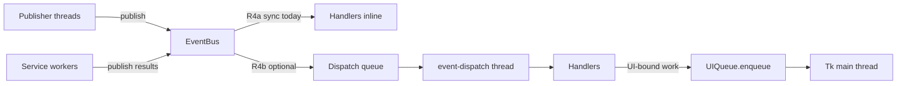

# Async EventBus Policy & Design (R4)

**Status:** R4b implemented (optional dispatch queue); R4c deferred  
**Authority:** Subordinate to [PROJECT_CONSTITUTION_V4.md](../../PROJECT_CONSTITUTION_V4.md)  
**Runtime reference:** `ai_command_center/core/event_bus.py`  
**Topic registry:** `ai_command_center/core/events/topics.py`  
**Classification hooks:** `ai_command_center/core/events/dispatch_policy.py`

---

## Problem statement

Today `EventBus.publish()` runs every subscriber **synchronously on the caller's thread**:

```155:186:ai_command_center/core/event_bus.py
    def publish(self, topic: str, payload: dict[str, Any] | None = None, *, source: str = "system") -> Event:
        event = Event(topic=topic, payload=dict(payload or {}), source=source)
        with self._lock:
            handlers = list(self._wildcard)
            handlers.extend(self._subscribers.get(topic, []))
            ...
        for handler in handlers:
            try:
                handler(event)
            except Exception as exc:
                ...
        return event
```

**Consequences:**

1. **Publisher blocking** — A slow handler delays all subsequent handlers on the same publish and blocks the publisher from returning.
2. **Accidental UI coupling** — Any handler that touches Tk widgets off the main thread risks undefined behavior; the bus does not enforce thread affinity.
3. **Per-service workarounds** — Services already spawn private worker threads to keep handlers fast:
   - `ObsidianService` — vault scan/index on `obsidian-index` worker; bus handlers only enqueue jobs and run SQLite FTS reads ([Phase 4A gate](../../scripts/verify_phase4a.py)).
   - `OllamaHttpService` — streaming HTTP on a dedicated asyncio loop thread; bus handlers schedule coroutines via `asyncio.run_coroutine_threadsafe`.
4. **Inconsistent patterns** — Each service invents its own queue/thread model instead of a shared dispatch policy.

R4 does **not** mandate replacing the bus with asyncio. It defines **policy, threading contracts, and a phased migration** so future implementation PRs converge on one model without breaking constitutional ownership flow:

```text
UI → AppState → EventBus → Services → Repositories → Storage
```

---

## Threading model

| Role | Thread | Responsibility |
|------|--------|----------------|
| **Publisher** | Any (UI main, service worker, asyncio bridge) | Calls `publish()`; must not assume handlers finish before return (future R4b+) |
| **Dispatch** (R4b+) | Dedicated `event-dispatch` thread | Dequeues events, invokes subscribers per dispatch policy |
| **Service workers** | Per-service daemon threads (current) | Heavy I/O, indexing, model HTTP — publish **results** back via bus |
| **UI main** | Tk main loop | **Only** thread that mutates widgets; fed by `UIQueue` |



### UIQueue relationship

`UIQueue` (`ai_command_center/ui/ui_queue.py`) is the **only** approved path from background threads to Tk:

- Handlers on non-main threads **must not** call `widget.configure()`, `insert()`, etc.
- They **may** call `ui_queue.enqueue(lambda: ...)` to run UI updates on the main loop.
- AppState reducers invoked from bus handlers should remain pure; UI reads AppState on the main thread after enqueue.

**Invariant (permanent):** UI never updates off the main thread, regardless of bus dispatch mode.

---

## Dispatch policy

Topic classification lives in `core/events/dispatch_policy.py` (constants only in R4a; enforcement in R4b+).

### MUST remain synchronous (R4a–R4c)

Handlers that must observe **immediate, ordered** side effects on the publisher thread:

| Category | Topics (examples) | Budget | Rationale |
|----------|-------------------|--------|-----------|
| Settings projection | `settings.snapshot`, `settings.changed` | ≤ 5 ms | AppState and services need consistent snapshot before next publish |
| Service lifecycle | `service.started`, `service.ready`, `service.stopped`, `service.state_changed` | ≤ 2 ms | Startup/shutdown ordering |
| Permission / gate | `permission.check`, `permission.denied` (when added) | ≤ 2 ms | Synchronous deny before side effects |
| Bus meta | `bus.handler_error` | ≤ 1 ms | Avoid recursive dispatch deadlock |
| UI intent (ingress) | `ui.command`, `ui.navigate`, `settings.set_request` | ≤ 5 ms | Router must ACK quickly; heavy work delegated |

### MAY be async-dispatched (R4b+)

Handlers where **eventual consistency** is acceptable; work is often I/O-bound or fan-out heavy:

| Category | Topics (examples) | Budget on bus thread | Worker |
|----------|-------------------|----------------------|--------|
| Notes / vault | `note.index_progress`, `note.index_complete`, `notes.indexed` | ≤ 1 ms enqueue | Obsidian index worker (existing) |
| Chat / LLM stream | `chat.chunk`, `llm.chunk`, `chat.complete` | ≤ 1 ms enqueue | Ollama asyncio thread (existing) |
| Tools | `tool.started`, `tool.completed`, `tool.failed` | ≤ 5 ms | ToolExecutor worker |
| Telemetry | `telemetry.event` | ≤ 1 ms enqueue | TelemetryService batch writer |
| Search / memory | `note.search_results`, `memory.lookup.result` | ≤ 10 ms | Service-local (FTS already on worker path) |
| Agents / workflows | `agent.*`, `workflow.*` | ≤ 5 ms enqueue | AgentRuntime / WorkflowEngine |

### Handler time budgets

| Tier | Max time on bus/dispatch thread | On exceed |
|------|----------------------------------|-----------|
| SYNC_CRITICAL | 5 ms | Log warning; future R4c metric |
| SYNC_STANDARD | 10 ms | Log warning |
| ASYNC_ELIGIBLE | 1 ms (enqueue only) | N/A — work runs on worker |

Budgets are **design targets** for R4b implementation and CI smoke tests, not enforced in R4a.

---

## Asyncio bridge design

Services that use async HTTP (e.g. `OllamaHttpService`) **must not** run coroutines on the bus thread.

**Approved pattern (existing):**

1. Service owns a dedicated thread with `asyncio.new_event_loop()`.
2. Bus handler validates payload and calls `asyncio.run_coroutine_threadsafe(coro, loop)`.
3. Coroutine streams results; each chunk **`publish()`es** `chat.chunk` / `llm.chunk` from the asyncio thread (subscribers must tolerate cross-thread publish).
4. Shutdown: cancel tasks, close session, join thread (see `_on_unload` in `ollama_http_service.py`).

**R4 bridge rules:**

| Rule | Detail |
|------|--------|
| No `asyncio` in `EventBus` core (R4a–R4b) | Keeps sync services unchanged |
| Optional `AsyncEventBridge` (R4c) | Adapter that posts coroutine results to dispatch queue |
| Single loop per async service | Do not share loops across services |
| Publish from worker threads | Allowed; R4b dispatch queue serializes handler invocation |

Sync services remain sync; the bridge is **opt-in per service**, not a global asyncio bus.

---

## Migration phases

### R4a — Policy & classification (this PR)

- [x] This document
- [x] `dispatch_policy.py` topic tiers (no runtime behavior change)
- [x] `event_bus.py` module docstring links here
- [ ] No change to `publish()` semantics

### R4b — Optional central dispatch queue

- [x] `DispatchQueue` + `event-dispatch` daemon thread
- [x] `publish()` enqueues `Event` for `ASYNC_ELIGIBLE` topics when flag enabled
- [x] Feature flag: `EventBus(async_dispatch=True)` or env `EVENTBUS_DISPATCH_QUEUE=1` (default **off**)
- [x] `EventBus.dispatch(event)` re-enters tier-aware dispatch
- [x] Tests: `tests/test_eventbus_dispatch_queue.py`
- [ ] Verification: `verify_phase4a` still passes; publish latency p99 < 1 ms for UI intent topics

### R4c — Full async adapters

- Per-handler registration metadata: `sync | async_queue | asyncio_bridge`
- Metrics: handler duration histogram, queue depth, dropped events
- Optional backpressure (see below)
- Deprecate ad-hoc per-service queues where central dispatch subsumes them

---

## Error handling

Current behavior (preserve):

```172:185:ai_command_center/core/event_bus.py
                if topic != BUS_HANDLER_ERROR:
                    try:
                        self.publish(
                            BUS_HANDLER_ERROR,
                            {
                                "topic": topic,
                                "source": event.source,
                                "error": str(exc),
                                "traceback": traceback.format_exc(limit=5),
                            },
                            source="event_bus",
                        )
```

**Policy:**

| Concern | Rule |
|---------|------|
| Handler exceptions | Never crash publisher; emit `bus.handler_error` |
| Recursive errors | `BUS_HANDLER_ERROR` handlers must not raise |
| AppState | Reducers catch/log; do not re-raise into bus |
| Observability | TelemetryService subscribes to `bus.handler_error` (future) |

---

## Backpressure

When dispatch queue depth exceeds threshold (R4c):

1. **Drop policy (telemetry only)** — `telemetry.event` may drop oldest with counter metric
2. **Block policy (never for UI ingress)** — `ui.command`, `settings.set_request` must not block publisher
3. **Coalesce policy (streaming)** — `chat.chunk` / `llm.chunk`: keep latest N per session in queue

Default: unbounded queue in R4b prototype; bounded queue required before production enablement.

---

## Shutdown

Order (align with `ApplicationCore` teardown):

1. Stop accepting new publishes (or drain flag)
2. Signal service workers (`ObsidianService._index_stop`, Ollama loop stop)
3. Join dispatch thread with timeout (R4b+)
4. Unsubscribe all / clear handlers
5. Join remaining daemon threads

Handlers must not publish after bus shutdown begins.

---

## Acceptance criteria (future implementation PR)

An R4b/R4c implementation PR is **done** when:

- [ ] Constitutional ownership flow unchanged; UCGS layer import PASS
- [ ] `scripts/verify_constitution.py` PASS
- [ ] `scripts/verify_phase4a.py` PASS (vault index off bus thread preserved)
- [ ] All chat streaming tests PASS; no Tk calls off main thread (grep/audit)
- [ ] `dispatch_policy.py` tiers enforced or logged in debug mode
- [ ] `bus.handler_error` emitted on handler failure; no silent swallow
- [ ] Dispatch queue depth metric exposed via `system.snapshot` or telemetry
- [ ] Feature flag defaults to **sync** (no behavior change for existing installs)
- [ ] ARCHITECTURE.md and this doc updated with "implemented" status

---

## Related documents

- [ARCHITECTURE.md](../ARCHITECTURE.md) — subsystem map, wildcard policy
- [TRANSFORMATION_ROADMAP.md](../development/TRANSFORMATION_ROADMAP.md) — R4 track status
- [PLATFORM_STRATEGY.md](PLATFORM_STRATEGY.md) — packaging (orthogonal)
