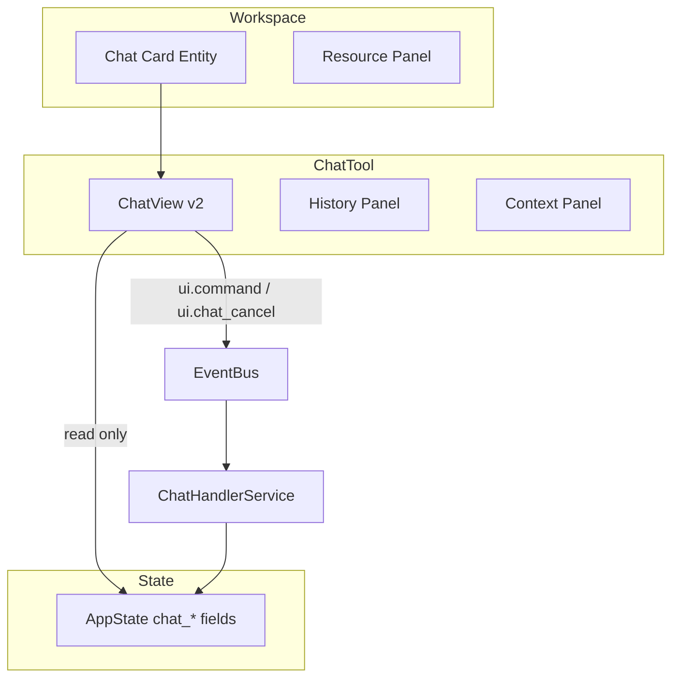

# Chat Modernization Spec

**Status:** Architecture Specification  
**Vision ref:** [WORKSPACE_VISION.md](WORKSPACE_VISION.md) — Chat-as-tool  
**Constitutional refs:** UI isolation; ContextManager gate; AppState projection

---

## Purpose

Modernize chat from the default application shell to a **workspace-attached tool** with improved streaming UX, while preserving EventBus/AppState governance.

---

## Current State

| Component | LOC | Issue |
|-----------|-----|-------|
| `ui/views/chat_view.py` | ~1077 | God view; mixed render + state |
| `ui/app.py` | ~844 | Direct bus subscriptions for chat events |
| ChatHandlerService | ~250 | Correct bus pattern |
| AppState chat fields | `core/app_state.py` | `chat_status`, `chat_streaming`, `request_id` |

Chat is the **default navigation target** after several commands (`app.py` navigate handlers).

---

## Target UX



### Principles

1. **AppState-first UI** — ChatView subscribes to AppState; remove duplicate bus taps from app.py
2. **Workspace attachment** — Chat sessions link to `entity_id` (card) when in workspace mode
3. **Streaming v2** — Token/chunk rendering via `chat.chunk` → AppState buffer → UIQueue flush
4. **Context transparency** — Show sources from `chat_context_sources`, token estimate
5. **Overlay mode** — Palette chat remains compact; full chat in workspace card

---

## Event Flow (unchanged contract)

```text
ui.command → command.routed (chat) → ChatHandlerService
  → model.resolve.request → ModelRouterService
  → context.snapshot_created → OllamaHttpService
  → chat.started / chat.chunk / chat.complete → AppState → ChatView
```

---

## Refactor Phases

| Phase | Task | Files | Acceptance |
|-------|------|-------|------------|
| **C0** | Document contract (this spec) | — | Approved |
| **C1** | Extract `ChatStreamController` from chat_view | `ui/views/chat/` | chat_view < 600 LOC |
| **C2** | Migrate app.py chat bus handlers to AppState listener | `ui/app.py` | Fewer bus imports in app.py |
| **C3** | Workspace card chat mode | `workspace_service` + ChatView | Session tied to entity_id |
| **C4** | Markdown stream renderer v2 | `markdown_view.py` | No flicker on chunk append |

---

## AppState Extensions (proposed)

| Field | Type | Source event |
|-------|------|--------------|
| `chat_stream_buffer` | `str` | `chat.chunk` reducer |
| `chat_workspace_entity_id` | `str` | `ui.workspace_os.open_chat` |
| `chat_model_used` | `str` | `model.selected` |

---

## Non-Goals

- Redesign design system tokens
- Replace CustomTkinter
- Add new LLM providers (see MODEL_ORCHESTRATION.md)

---

## Risks

| Risk | Mitigation |
|------|------------|
| Regression in streaming | Keep existing pytest chat lifecycle tests |
| Breaking export/regenerate | Preserve callback wiring tests |
| UI thread violations | UIQueue for all chunk appends |

---

## Acceptance Criteria (C2)

- [ ] `test_chat_workspace_v15.py` passes
- [ ] `test_chat_export_callback_wiring.py` passes
- [ ] ChatView receives updates only via AppState + UIQueue
- [ ] No new UI→service imports

---

## Rollback

Revert to monolithic `chat_view.py` and app.py bus subscriptions; no schema migration required.
