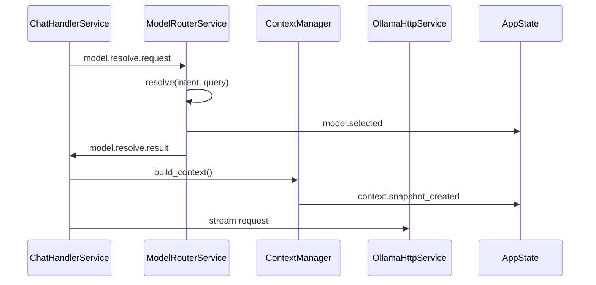

# Model Orchestration

**Status:** Architecture Specification  
**Vision ref:** [WORKSPACE_VISION.md](WORKSPACE_VISION.md) — Intelligence pillar  
**Constitutional refs:** ContextManager gate (ARCHITECTURE.md), Invariant 1 ownership flow

---

## Purpose

Define how AI Command Center selects, routes, and executes model requests without violating EventBus governance or introducing autonomous model switching.

---

## Current State

| Component | Location | Status |
|-----------|----------|--------|
| ModelRouterService | `services/model_router_service.py` | Implemented; **wired in service_factory** |
| Model registry / tiers | `platform/model_registry.py`, settings `model_tier_map` | Static classification plus task-hint model map |
| Chat integration | `services/chat_handler_service.py` | Publishes `model.resolve.request` and dispatches `llm.request` with provider |
| Ollama/OpenAI execution | `services/ollama_http_service.py`, `services/openai_http_service.py` | Provider-filtered `llm.request` subscribers |

---

## Target State

| Capability | Description |
|------------|-------------|
| Tier routing | fast / balanced / reasoning tiers from registry |
| Task hints | summarize, code, search intent → model map |
| Budget awareness | `context.over_budget` triggers trim or tier downgrade |
| Provider abstraction | Ollama today; OpenAI-compatible adapter future |
| Observability | `model.selected` + structured logs with `request_id` |

---

## Event Contract

| Topic | Direction | Payload |
|-------|-----------|---------|
| `model.resolve.request` | ChatHandler → ModelRouter | `{request_id, intent, query, workspace_task_hint?, workspace_entity_type?}` |
| `model.resolve.result` | ModelRouter → ChatHandler | `{request_id, model, provider}` |
| `model.selected` | ModelRouter → AppState/Telemetry | `{model, provider, intent, reason, tier}` |
| `settings.snapshot` | Settings → ModelRouter | `{default_model, summarize_model}` |

No service calls `ModelRouterService.resolve()` directly — only via bus request/result.

---

## Phases

| Phase | Scope | Acceptance |
|-------|-------|------------|
| **M0** | Static map; summarize keyword → summarize_model | Factory registration; tests pass |
| **M1** | Tier table in settings; registry-driven | **Complete:** settings-backed `model_tier_map` |
| **M2** | Context budget influences tier | Subscribe `context.over_budget` |
| **M3** | Multi-provider router | **Complete for Ollama/OpenAI provider dispatch** |

Program 4 may further extend this with context-budget tier downgrade after the
gate in `PROGRAM4_GATE_STATUS.md` remains satisfied.

---

## Risks

| Risk | Mitigation |
|------|------------|
| Autonomous model switching | Explicit `reason` in every `model.selected` |
| Service→service bypass | UCGS layer check + code review |
| Latency from extra bus hop | Single resolve per request; cache in ChatHandler pending map |

---

## Rollback

Remove ModelRouterService from `service_factory.py`; ChatHandler falls back to `_default_model` from settings snapshot.
