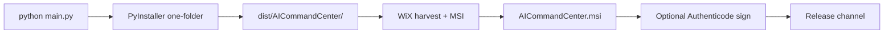

# Packaging & MSI Platform Design (Track 6)

**Status:** P0 design complete — MSI build implementation next  
**Authority:** Subordinate to [PROJECT_CONSTITUTION_V4.md](../../PROJECT_CONSTITUTION_V4.md)  
**Strategy summary:** [PLATFORM_STRATEGY.md](PLATFORM_STRATEGY.md)  
**Runtime paths:** `ai_command_center/platform/runtime_paths.py`  
**Hotkey boundary:** `ai_command_center/platform/hotkey_provider.py`

This document defines the **platform foundation** for Windows packaging. It does **not** change product identity, workspace/chat UX, or branding.

---

## Scope

| In scope | Out of scope |
|----------|--------------|
| Dev → PyInstaller → WiX/MSI pipeline design | macOS/Linux installers (deferred) |
| Install-time vs runtime directory layout | Ollama bundling (external dependency) |
| `runtime_paths` mapping for frozen/installed builds | UI redesign |
| `HotkeyProvider` platform boundary | Code signing production keys in repo |
| CI smoke build (unsigned artifact) | Auto-update channel |

---

## Build pipeline



### Stage 1 — Development (current)

```powershell
python main.py
```

Entry: `main.py` → `ApplicationCore` / CustomTkinter shell.  
Dependencies: Python 3.11+, local Ollama (HTTP), SQLite under user data dir.

### Stage 2 — PyInstaller one-folder (P0 prototype)

| Input | Output |
|-------|--------|
| `packaging/windows/ai_command_center.spec` (template) | `dist/AICommandCenter/` directory |
| Hidden imports from `ai_command_center.*` | `_internal/` bundle |
| `main.py` as entry script | `AICommandCenter.exe` |

**Bundled:**

- Python runtime + stdlib subset
- `ai_command_center` package and dependencies (CustomTkinter, etc.)
- Default assets referenced by code (themes, icons if present)

**Not bundled:**

- Ollama binary and models (user installs separately)
- User vault, SQLite DB, settings (created at runtime under data dir)
- Git, dev tools, test fixtures

**Ollama strategy:** App checks `ollama.status`; degraded mode when offline ([PLATFORM_STRATEGY.md](PLATFORM_STRATEGY.md)).

### Stage 3 — WiX MSI (P0 prototype)

| Component | Purpose |
|-----------|---------|
| `packaging/windows/Product.wxs` (future) | Product metadata, upgrade GUID |
| `heat.exe` or manual `File` refs | Harvest PyInstaller output |
| `ProgramFiles6432Folder` | Default install root |
| Start Menu shortcut | Launch `AICommandCenter.exe` |
| ARP entry | Add/Remove Programs |

Install layout (target):

```text
C:\Program Files\AI Command Center\
  AICommandCenter.exe
  _internal\          # PyInstaller deps
  LICENSE.txt
```

Per-user data (never in Program Files):

```text
%APPDATA%\AICommandCenter\
  settings.db
  logs\
  cache\
```

Mapping via `get_runtime_data_dir()` — see below.

### Stage 4 — Code signing (post-P0)

| Artifact | Sign with |
|----------|-----------|
| `AICommandCenter.exe` | Authenticode (SHA-256) |
| MSI | Sign outer cabinet |

**Posture:**

- Signing keys live in CI secret store / HSM — **never** in repository
- Timestamp server required for long-lived trust
- P0 CI produces **unsigned** artifacts only

---

## Runtime paths

Current implementation (Windows dev):

```9:16:ai_command_center/platform/runtime_paths.py
def get_runtime_data_dir() -> Path:
    """Application data directory (not in repo)."""
    appdata = os.environ.get("APPDATA")
    if not appdata:
        raise OSError("APPDATA environment variable is not set")
    path = Path(appdata) / "AICommandCenter"
    path.mkdir(parents=True, exist_ok=True)
    return path
```

**P0 extensions (implementation PR):**

| Function | Dev | Frozen (PyInstaller) | MSI installed |
|----------|-----|----------------------|---------------|
| `get_runtime_data_dir()` | `%APPDATA%\AICommandCenter` | Same | Same |
| `get_install_dir()` | repo root | `sys._MEIPASS` parent | Registry / exe dir |
| `is_frozen()` | `False` | `getattr(sys, "frozen", False)` | `True` |

**Rules:**

- No hardcoded `C:\` paths outside `platform/`
- UI and services import `runtime_paths` only via platform layer
- SQLite, settings, logs always under user data dir

---

## HotkeyProvider boundary

```10:29:ai_command_center/platform/hotkey_provider.py
class HotkeyProvider(Protocol):
    def register(self, combo: str, callback) -> tuple[bool, str]:
        ...

class WindowsHotkeyProvider:
    """Delegates to keyboard-based global hotkey utilities."""
    ...
```

| Layer | Allowed |
|-------|---------|
| UI / AppState | Publish settings changes only |
| Application shell | `get_hotkey_provider().register(...)` |
| `platform/hotkey_provider.py` | OS-specific hook |
| `utils/hotkey.py` | Windows implementation detail |

Default combo: `Alt+Space` from `SettingsSnapshot.overlay_hotkey`.  
macOS/Linux: interface ready; implementations deferred (P2/P3 in PLATFORM_STRATEGY).

Hotkey callback **must** marshal to UI via `UIQueue` if it triggers widget changes.

---

## AV false-positive mitigation

| Risk | Mitigation |
|------|------------|
| Unsigned PyInstaller exe | CI smoke only; signed release for users |
| `keyboard` / global hooks | Document in installer; Authenticode sign |
| Heuristic packers | One-folder (not one-file); avoid UPX |
| `shell=True` in tools | Forbidden default in ToolExecutor |

---

## CI smoke (P0)

**Goal:** Prove reproducible artifact build — not a signed release.

Proposed workflow (implementation PR): `.github/workflows/package-windows-smoke.yml`

```yaml
# Stub — see packaging/README.md
on: [workflow_dispatch, pull_request]
jobs:
  pyinstaller-smoke:
    runs-on: windows-latest
    steps:
      - uses: actions/checkout@v4
      - run: pip install -e ".[dev]" pyinstaller
      - run: pyinstaller packaging/windows/ai_command_center.spec --noconfirm
      - run: test -d dist/AICommandCenter
```

MSI step added after WiX files land; upload `dist/` as workflow artifact (retention 7 days).

---

## macOS / Linux deferral

| Platform | Format | Blocker | Horizon |
|----------|--------|---------|---------|
| macOS | `.dmg` + notarized app | CGEvent hotkey, notarization | 12 months |
| Linux | AppImage / flatpak | Wayland global shortcuts | 12–24 months |

Shared abstractions (`runtime_paths`, `HotkeyProvider`) must be extended without breaking Windows MSI path.

---

## Phases (Track 6)

| Phase | Deliverable | Status |
|-------|-------------|--------|
| P0 design | This document + build stubs | **Complete (this PR)** |
| P0 build | PyInstaller spec + CI smoke | Next PR |
| P0 MSI | WiX source + local MSI build | After P0 build |
| P1 | Signed release pipeline | Post-P0 |
| P2 | macOS hotkey spike | Deferred |

---

## Acceptance criteria (P0 build PR)

- [ ] `pyinstaller packaging/windows/ai_command_center.spec` succeeds on Windows
- [ ] Launched exe creates `%APPDATA%\AICommandCenter` and starts shell
- [ ] No hardcoded paths outside `platform/` (grep audit)
- [ ] Ollama offline → degraded mode (existing behavior)
- [ ] `HotkeyProvider` used for global shortcut registration
- [ ] CI workflow produces artifact on `workflow_dispatch`
- [ ] MSI build optional follow-up; not required for first P0 merge

---

## Related documents

- [PLATFORM_STRATEGY.md](PLATFORM_STRATEGY.md) — platform priority quadrant
- [ARCHITECTURE.md](../ARCHITECTURE.md) — Platform subsystem row
- [TRANSFORMATION_ROADMAP.md](../development/TRANSFORMATION_ROADMAP.md) — Track 6 status
- [packaging/README.md](../../packaging/README.md) — build commands stub
