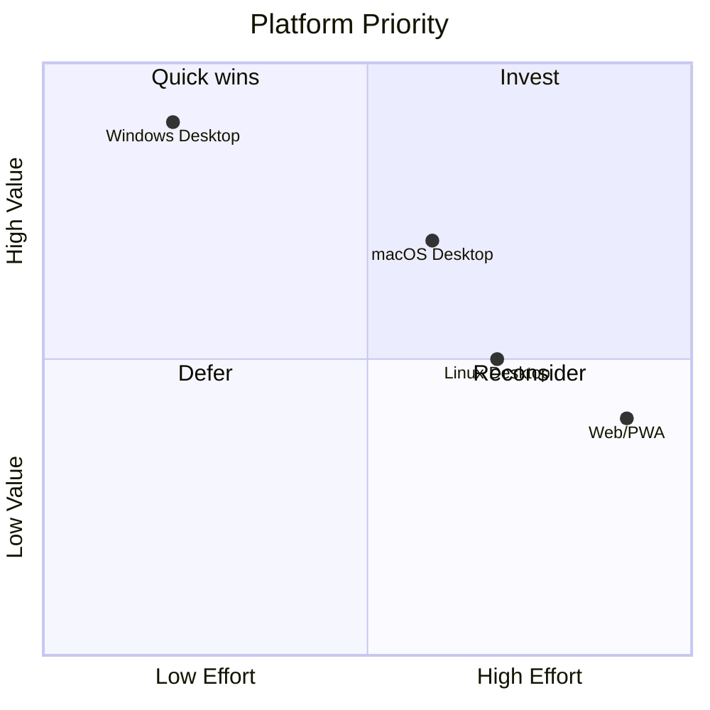

# Platform Strategy

**Status:** Architecture Specification  
**Vision ref:** [WORKSPACE_VISION.md](WORKSPACE_VISION.md) — Cross-platform  
**Constitutional refs:** SettingsSnapshot as single settings source

---

## Purpose

Define platform targets, packaging, runtime paths, and deployment posture for AI Command Center as a desktop Workspace OS.

---

## Current State

| Aspect | Implementation |
|--------|----------------|
| Primary OS | Windows 10/11 |
| UI toolkit | CustomTkinter (Tk) |
| Entry | `main.py` → `ApplicationCore` |
| Paths | `platform/runtime_paths.py` |
| Hotkey | `Alt+Space` via `utils/hotkey.py` |
| LLM backend | Ollama (local HTTP) |
| Persistence | SQLite + Obsidian vault (optional) |

---

## Target Platforms

| Platform | Horizon | Blockers |
|----------|---------|----------|
| Windows | Now | None — primary |
| macOS | 12 months | Global hotkey API, code signing |
| Linux | 12–24 months | Wayland global shortcuts, packaging |
| Web | 36+ months | Tk not portable; would require UI rewrite |

---

## Packaging

| Stage | Format | Notes |
|-------|--------|-------|
| Dev | `python main.py` | Current |
| Beta | PyInstaller one-folder | Bundle Ollama check, not Ollama itself |
| Stable | Signed MSI (Windows) | Auto-update channel TBD |

Settings and SQLite live under user data dir from `runtime_paths`.

---

## Cross-Platform Abstractions

| Concern | Interface | Windows | macOS (future) |
|---------|-----------|---------|----------------|
| Global hotkey | `HotkeyProvider` | keyboard hook | CGEvent tap |
| Shell open | Action registry | `os.startfile` | `open` |
| Paths | `runtime_paths` | `%APPDATA%` | `~/Library/Application Support` |

No platform checks in UI — platform code in `platform/` and action handlers only.

---

## Ollama Strategy

- **Local-first:** Default provider `ollama` in SettingsSnapshot
- **Health:** `ollama.status` → SystemSnapshot `ollama_online`
- **Future:** Optional cloud adapter behind ModelRouter provider field

---

## Telemetry & Privacy

Per ARCHITECTURE.md firewall: runtime telemetry is passive; no behavioral inference on device. Offline scripts only.

---

## Phases

| Phase | Deliverable |
|-------|-------------|
| P0 | Windows daily driver + MSI prototype |
| P1 | Extract `HotkeyProvider` interface |
| P2 | macOS hotkey spike (no release) |
| P3 | Linux AppImage experiment |

---

## Risks

| Risk | Mitigation |
|------|------------|
| Tk scaling on HiDPI | CustomTkinter scaling + theme tokens |
| Ollama not installed | Degraded mode in AppState; setup wizard |
| Antivirus false positives | Code signing; avoid shell=True default |

---

## Acceptance Criteria

- [ ] `runtime_paths` documented in ARCHITECTURE.md subsystem map
- [ ] No hardcoded `C:\` paths outside `platform/`
- [ ] Platform-specific code ≤ 5% of LOC (measured in audit)
