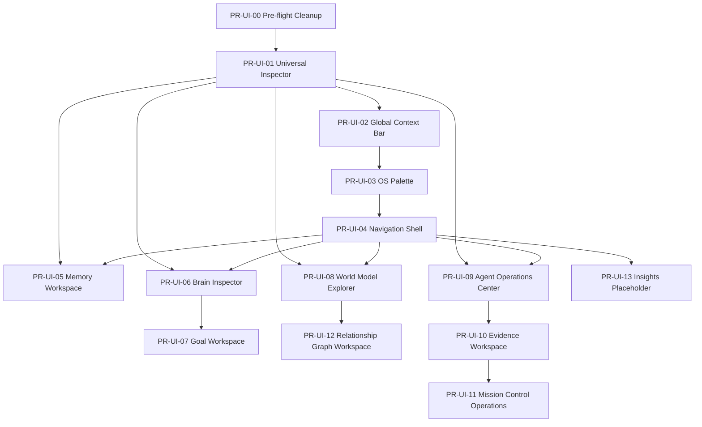

# UI Implementation Roadmap — Phase B

This roadmap covers the foundation work plus all Phase 2 Workspace OS PRs for the AI Command Center frontend. No implementation code is contained here; only PR boundaries, dependencies, file ownership, migration order, and risk.

---

## 1. Dependency Graph

### Mermaid

### Edges in plain text

- **PR-UI-01** depends on **PR-UI-00** (legacy inspector code removed, skeletons filled).
- **PR-UI-02** depends on **PR-UI-01** (uses `InspectorState`/`InspectorHost` plumbing; both touch `state_applier.py`).
- **PR-UI-03** depends on **PR-UI-02** (context bar and palette both edit `application_shell.py`; sequential reduces conflicts).
- **PR-UI-04** depends on **PR-UI-03** (sidebar regroup and palette command set are coupled).
- **PR-UI-05 / 06 / 08 / 09** depend on **PR-UI-01** (inspector dock) and **PR-UI-04** (sidebar/view registration).
- **PR-UI-07** depends on **PR-UI-06** (brain state projection adds goal/plan fields used by Goal Workspace).
- **PR-UI-10** depends on **PR-UI-09** (agent ops establishes run-history projection patterns; can be parallel but safer after).
- **PR-UI-11** depends on **PR-UI-10** (evidence establishes orchestration snapshot consumption).
- **PR-UI-12** depends on **PR-UI-08** (World Model Explorer owns the node/edge state and graph renderer).
- **PR-UI-13** depends only on **PR-UI-04**.

---

## 2. Migration Order

### Phase B.1 — Foundation (must land in this order)

| # | PR | Why sequential |
|---|----|----------------|
| 1 | PR-UI-00 Pre-flight Cleanup | Removes legacy chat UI paths and completes inspector skeletons. |
| 2 | PR-UI-01 Universal Inspector | Establishes the inspector rail used by every later workspace. |
| 3 | PR-UI-02 Global Context Bar | Adds global chrome; must edit `application_shell.py` after inspector. |
| 4 | PR-UI-03 OS Palette | Replaces the static command palette. |
| 5 | PR-UI-04 Navigation Shell | Finalizes sidebar, view registry, and default workspace routing. |

### Phase B.2 — Primary Workspaces (parallelizable after B.1)

| # | PR | Depends on |
|---|----|------------|
| 6 | PR-UI-05 Memory Workspace | PR-UI-01, PR-UI-04 |
| 7 | PR-UI-06 Brain Inspector | PR-UI-01, PR-UI-04 |
| 8 | PR-UI-08 World Model Explorer | PR-UI-01, PR-UI-04 |
| 9 | PR-UI-09 Agent Operations Center | PR-UI-01, PR-UI-04 |

### Phase B.3 — Derived Workspaces (parallel within B.3)

| # | PR | Depends on |
|---|----|------------|
| 10 | PR-UI-07 Goal Workspace | PR-UI-06 |
| 11 | PR-UI-10 Evidence Workspace | PR-UI-09 |
| 12 | PR-UI-11 Mission Control Operations | PR-UI-10 |
| 13 | PR-UI-12 Relationship Graph Workspace | PR-UI-08 |
| 14 | PR-UI-13 Insights Placeholder | PR-UI-04 |

---

## 3. File Impact Map

This table maps **existing files** to the PRs that will modify them. New files are listed in the PR breakdown.

| File | Modified by PRs | Notes |
|------|----------------|-------|
| `ai_command_center/ui/app.py` | 04 | default view, workspace-os flag |
| `ai_command_center/ui/controller.py` | 01, 02, 03, 05, 07, 08, 09, 10, 11, 12, 13 | adds intent publishers per PR |
| `ai_command_center/ui/shell/application_shell.py` | 00, 02, 03, 04 | layout, palette, context bar, sidebar integration |
| `ai_command_center/ui/shell/state_applier.py` | 00, 01, 02, 05, 06, 07, 08, 09, 10, 11, 12, 13 | applies each new state snapshot to views |
| `ai_command_center/ui/shell/view_manager.py` | 00, 01, 04, 05, 06, 07, 08, 09, 10, 11, 12, 13 | view registration and lazy factories |
| `ai_command_center/ui/shell/event_coordinator.py` | 05, 11 | memory toasts, operation toasts |
| `ai_command_center/ui/components/sidebar.py` | 04, 05, 06, 07, 08, 09, 10, 11, 12, 13 | navigation grouping |
| `ai_command_center/ui/components/command_box.py` | 00, 03 | placeholder, palette trigger |
| `ai_command_center/ui/components/top_bar.py` | 00 | live AppState wiring |
| `ai_command_center/ui/design_system/command.py` | 03 | refactored to OS palette |
| `ai_command_center/ui/design_system/theme_v2.py` | 00, 02, 04 | new tokens for context bar/sidebar |
| `ai_command_center/ui/components/inspector/inspector_host.py` | 01 | breadcrumb, navigate, default widget |
| `ai_command_center/ui/components/inspector/base_inspector.py` | 01 | formal contract |
| `ai_command_center/ui/components/inspector/message_inspector.py` | 01 | complete skeleton |
| `ai_command_center/ui/components/inspector/artifact_inspector.py` | 01 | complete skeleton |
| `ai_command_center/ui/components/inspector/decision_inspector.py` | 01 | complete skeleton |
| `ai_command_center/ui/components/inspector/provider_inspector.py` | 01 | complete skeleton |
| `ai_command_center/ui/components/inspector/execution_inspector.py` | 01 | fold chat inspector tabs |
| `ai_command_center/ui/components/inspector/payload_inspector.py` | 01 | extend payload display |
| `ai_command_center/ui/components/inspector/workflow_node_inspector.py` | 01 | extend node display |
| `ai_command_center/ui/components/docks/inspector_dock.py` | 01 | integrate into all workspaces |
| `ai_command_center/ui/views/chat/chat_view.py` | 00, 01 | remove legacy mode, switch to `InspectorDock` |
| `ai_command_center/ui/views/chat/stream_renderer.py` | 00 | remove legacy bubble renderers |
| `ai_command_center/ui/views/chat/chat_history_panel.py` | 00 | remove if superseded |
| `ai_command_center/ui/views/chat/inspector/inspector_artifacts_tab.py` | 00 | retire/merge into `ExecutionInspector` |
| `ai_command_center/ui/views/chat/inspector/inspector_metrics_tab.py` | 00 | retire/merge into `ExecutionInspector` |
| `ai_command_center/ui/views/chat/inspector/inspector_provider_tab.py` | 00 | retire/merge into `ExecutionInspector` |
| `ai_command_center/ui/views/chat/inspector/inspector_trace_tab.py` | 00 | retire/merge into `ExecutionInspector` |
| `ai_command_center/ui/views/home_view.py` | 00 | merge into `command_center_view.py` |
| `ai_command_center/ui/views/command_center_view.py` | 00 | absorb home stats/activity |
| `ai_command_center/ui/views/settings_view.py` | 00 | off-page projection fix |
| `ai_command_center/ui/views/approvals_view.py` | 00 | real approval queue |
| `ai_command_center/ui/views/goal_view.py` | 07 | rewrite to full workspace |
| `ai_command_center/ui/views/agents_view.py` | 09 | rewrite to operations center |
| `ai_command_center/ui/views/world_explorer_view.py` | 08 | add graph canvas and inspector |
| `ai_command_center/ui/views/relationship_view.py` | 08, 12 | integrated into world/graph workspace |
| `ai_command_center/ui/views/memory_view.py` | 05 | promote to workspace |
| `ai_command_center/ui/views/executions_view.py` | 01, 11 | inspector integration, operations reuse |
| `ai_command_center/ui/views/execution_timeline_view.py` | 01, 11 | inspector integration, operations reuse |
| `ai_command_center/ui/views/automation_workspace_view.py` | 01 | inspector integration |
| `ai_command_center/ui/views/workflow_graph_view.py` | 01, 03, 12 | inspector, palette run commands, graph canvas |
| `ai_command_center/ui/components/graph_canvas.py` | 08, 12 | generalize or add world-renderer |
| `ai_command_center/core/app_state.py` | 02, 05, 06, 07, 08, 09, 10, 11, 12, 13 | adds snapshot projections |
| `ai_command_center/core/events/topics.py` | 01, 02, 03, 05, 06, 07, 08, 09, 10, 11, 12, 13 | adds UI topics per PR |
| `ai_command_center/core/state/inspector_state.py` | 01 | kind-to-view navigation map |
| `ai_command_center/core/state/chat_state.py` | 02 | context sources/tokens now global |
| `ai_command_center/core/state/world_model_state.py` | 08, 12 | selected node, layout, full graph |
| `ai_command_center/core/state/execution_event_state.py` | 11 | operation pipeline state |
| `ai_command_center/core/state/execution_timeline_state.py` | 11 | operation scrubber state |
| `ai_command_center/domain/inspectable.py` | 01 | factory helpers per kind |
| `ai_command_center/domain/brain_state_snapshot.py` | 06, 07 | extended fields if needed |
| `ai_command_center/domain/world_model_snapshot.py` | 08, 12 | graph layout fields |
| `ai_command_center/domain/goal.py` | 07 | UI projections |
| `ai_command_center/domain/agent_pipeline_snapshot.py` | 09 | additional run metrics |
| `ai_command_center/domain/orchestration_run_snapshot.py` | 10, 11 | truth/receipt exposure |
| `ai_command_center/orchestration/verification/truth_boundary.py` | 10 | ensure snapshotable results |
| `ai_command_center/domain/action_receipt.py` | 10 | evidence chain |
| `ai_command_center/domain/memory_item.py` | 05 | catalog projection |
| `docs/architecture/ACC_UI_REFURBISHMENT.md` | 00, 04 | update plan and nav design |
| `docs/UI_CONSTITUTION.md` | 00, 01, 04 | inspector and nav rules |

### Hot spots

- `core/app_state.py` and `ui/shell/state_applier.py` are touched by **almost every PR**. Plan sequential foundation work to avoid merge conflicts.
- `ui/shell/application_shell.py` is edited by the first four PRs only; after that it should be stable.
- `core/events/topics.py` grows with each PR but is low-conflict because additions are append-only.

---

## 4. Risk Analysis

| # | Risk | Affected PRs | Severity | Probability | Mitigation |
|---|------|--------------|----------|-------------|------------|
| 1 | `core/app_state.py` / `state_applier.py` churn and merge conflicts | 02, 05–13 | High | High | Land foundation PRs first; make each PR’s AppState change additive; avoid parallel edits to the same reducer. |
| 2 | `application_shell.py` layout conflicts across context bar, palette, and sidebar | 02, 03, 04 | High | Medium | Strict sequential order 02 → 03 → 04. |
| 3 | Chat inspector retirement breaks `chat_view.py` before universal inspector is complete | 00, 01 | High | Medium | Keep chat inspector tabs until `ExecutionInspector` + `MessageInspector` pass chat tests; feature-flag removal. |
| 4 | `graph_canvas.py` is workflow-specific; reusing it for world model forces big refactor | 08, 12 | High | Medium | Build `WorldGraphCanvas` as a separate renderer first; generalize `GraphCanvas` only if cost is justified. |
| 5 | `home_view.py` removal/merge loses dashboard stats | 00 | Medium | Medium | Port all `home_view.py` widgets into `command_center_view.py`; add redirect from `home` → `command_center`. |
| 6 | Headless test gap: GUI cannot run on x86_64 Linux CI; layout bugs slip through | all | Medium | High | Increase `tests/ui/` unit tests; run `APPDATA=/tmp/aicc_appdata python3 -m pytest -m "not slow"`; manual Windows-ARM64 smoke. |
| 7 | Two goal models diverge (`domain/goal.py` vs `BrainStateSnapshot`) | 06, 07 | Medium | Medium | Define a single `GoalProjection` in `core/state` sourced from `BrainStateSnapshot`. |
| 8 | Evidence workspace depends on `OrchestrationRunSnapshot.run_history` which may not be fully populated | 10, 11 | Medium | Medium | Verify orchestration service publishes run entries; add `EvidenceState` reducer as fallback. |
| 9 | OS Palette dynamic providers cause duplicate/slow commands | 03 | Medium | Low | Cap providers, cache command list, dedupe by id. |
| 10 | 13 PRs create schedule/scope creep | all | High | High | Use feature flags; ship foundation first; stub new views and fill incrementally. |

---

## 5. PR Breakdown

### PR-UI-00 — Pre-flight Cleanup

- **Purpose**: Remove chat-centric legacy surfaces, complete inspector skeletons, fix settings projection, and consolidate `home` into `command_center` so later PRs build on stable ground.
- **Files**:
  - Modify:
    - `ai_command_center/ui/views/home_view.py`
    - `ai_command_center/ui/views/command_center_view.py`
    - `ai_command_center/ui/views/chat/chat_view.py`
    - `ai_command_center/ui/views/chat/stream_renderer.py`
    - `ai_command_center/ui/views/chat/chat_history_panel.py`
    - `ai_command_center/ui/views/chat/inspector/inspector_artifacts_tab.py`
    - `ai_command_center/ui/views/chat/inspector/inspector_metrics_tab.py`
    - `ai_command_center/ui/views/chat/inspector/inspector_provider_tab.py`
    - `ai_command_center/ui/views/chat/inspector/inspector_trace_tab.py`
    - `ai_command_center/ui/components/inspector/message_inspector.py`
    - `ai_command_center/ui/components/inspector/artifact_inspector.py`
    - `ai_command_center/ui/components/inspector/decision_inspector.py`
    - `ai_command_center/ui/components/inspector/provider_inspector.py`
    - `ai_command_center/ui/components/inspector/workflow_node_inspector.py`
    - `ai_command_center/ui/components/top_bar.py`
    - `ai_command_center/ui/views/settings_view.py`
    - `ai_command_center/ui/shell/state_applier.py`
    - `ai_command_center/ui/views/approvals_view.py`
  - Tests:
    - `tests/ui/test_command_center_projection.py`
    - `tests/ui/test_top_bar_projection.py`
- **Dependencies**: none.
- **Acceptance**: `python3 -m pytest -m "not slow"` green; `home` view still reachable but redirects to `command_center`; inspector skeletons render without error.
- **Risk**: High (removes legacy paths).
- **Size**: Large.

---

### PR-UI-01 — Universal Inspector

- **Purpose**: Make every object inspectable from any workspace via a single `InspectorHost`/`InspectorDock` pair; retire chat-local inspector tabs.
- **Files**:
  - Modify:
    - `ai_command_center/domain/inspectable.py`
    - `ai_command_center/ui/components/inspector/base_inspector.py`
    - `ai_command_center/ui/components/inspector/inspector_host.py`
    - `ai_command_center/ui/components/inspector/message_inspector.py`
    - `ai_command_center/ui/components/inspector/artifact_inspector.py`
    - `ai_command_center/ui/components/inspector/decision_inspector.py`
    - `ai_command_center/ui/components/inspector/provider_inspector.py`
    - `ai_command_center/ui/components/inspector/execution_inspector.py`
    - `ai_command_center/ui/components/inspector/payload_inspector.py`
    - `ai_command_center/ui/components/inspector/workflow_node_inspector.py`
    - `ai_command_center/ui/components/docks/inspector_dock.py`
    - `ai_command_center/core/state/inspector_state.py`
    - `ai_command_center/core/events/topics.py`
    - `ai_command_center/ui/controller.py`
    - `ai_command_center/ui/shell/state_applier.py`
    - `ai_command_center/ui/shell/view_manager.py`
    - `ai_command_center/ui/views/chat/chat_view.py`
    - `ai_command_center/ui/views/workflow_graph_view.py`
    - `ai_command_center/ui/views/automation_workspace_view.py`
    - `ai_command_center/ui/views/executions_view.py`
    - `ai_command_center/ui/views/execution_timeline_view.py`
  - New:
    - `ai_command_center/ui/components/inspector/goal_inspector.py`
    - `ai_command_center/ui/components/inspector/task_inspector.py`
    - `ai_command_center/ui/components/inspector/memory_inspector.py`
    - `ai_command_center/ui/components/inspector/agent_inspector.py`
    - `ai_command_center/ui/components/inspector/note_inspector.py`
    - `ai_command_center/ui/components/inspector/world_node_inspector.py`
    - `ai_command_center/ui/components/inspector/execution_event_inspector.py`
    - `tests/ui/components/test_inspector_host.py`
    - `tests/ui/components/test_inspector_dock.py`
- **Dependencies**: PR-UI-00.
- **Acceptance**: every registered `InspectableRef` kind renders an inspector; double-click navigates to owning workspace; chat inspector still works.
- **Risk**: High.
- **Size**: Large.

---

### PR-UI-02 — Global Context Bar

- **Purpose**: Move context from chat-local to a shell-wide bar visible in every workspace.
- **Files**:
  - Modify:
    - `ai_command_center/ui/shell/application_shell.py`
    - `ai_command_center/ui/views/chat/chat_view.py`
    - `ai_command_center/core/app_state.py`
    - `ai_command_center/core/state/chat_state.py`
    - `ai_command_center/core/events/topics.py`
    - `ai_command_center/ui/shell/state_applier.py`
    - `ai_command_center/ui/controller.py`
    - `ai_command_center/ui/design_system/theme_v2.py`
  - New:
    - `ai_command_center/ui/components/global_context_bar.py`
    - `ai_command_center/core/state/global_context_state.py` (optional)
    - `tests/ui/components/test_global_context_bar.py`
- **Dependencies**: PR-UI-01.
- **Acceptance**: context bar shows active goal, selected entity, injected memories, model/provider, token budget; updates from AppState across all views.
- **Risk**: Medium.
- **Size**: Medium.

---

### PR-UI-03 — OS Palette

- **Purpose**: Turn the static `CommandPalette` into the primary OS kernel surface: extensible, context-aware, and capable of creating/running/navigating.
- **Files**:
  - Modify:
    - `ai_command_center/ui/design_system/command.py`
    - `ai_command_center/ui/components/command_box.py`
    - `ai_command_center/ui/shell/application_shell.py`
    - `ai_command_center/ui/controller.py`
    - `ai_command_center/core/events/topics.py`
  - New:
    - `ai_command_center/ui/design_system/palette_provider.py`
    - `ai_command_center/ui/design_system/os_palette.py` (optional split from `command.py`)
    - `tests/ui/test_os_palette.py`
- **Dependencies**: PR-UI-02.
- **Acceptance**: `Ctrl+K` shows context sections; static fallback works; registered providers can add commands.
- **Risk**: Medium.
- **Size**: Large.

---

### PR-UI-04 — Navigation Shell

- **Purpose**: Reorganize the sidebar into workspace groups, set `command_center` as default, and register placeholder views.
- **Files**:
  - Modify:
    - `ai_command_center/ui/components/sidebar.py`
    - `ai_command_center/ui/shell/application_shell.py`
    - `ai_command_center/ui/shell/view_manager.py`
    - `ai_command_center/ui/app.py`
    - `ai_command_center/ui/components/keyboard_shortcuts_overlay.py`
    - `ai_command_center/core/events/topics.py`
    - `docs/architecture/ACC_UI_REFURBISHMENT.md`
  - New:
    - `ai_command_center/ui/components/nav_group.py` (optional)
- **Dependencies**: PR-UI-03.
- **Acceptance**: sidebar grouped as designed; `home` removed from default; all `VIEW_IDS` still resolvable.
- **Risk**: Medium.
- **Size**: Medium.

---

### PR-UI-05 — Memory Workspace

- **Purpose**: Promote `memory_view.py` from a list into a full workspace with search, detail, injection badges, and inspector.
- **Files**:
  - Modify:
    - `ai_command_center/ui/views/memory_view.py`
    - `ai_command_center/ui/shell/view_manager.py`
    - `ai_command_center/ui/shell/state_applier.py`
    - `ai_command_center/core/app_state.py`
    - `ai_command_center/core/events/topics.py`
    - `ai_command_center/ui/controller.py`
    - `ai_command_center/ui/components/sidebar.py`
  - New:
    - `ai_command_center/ui/views/memory_workspace_view.py`
    - `ai_command_center/ui/components/memory/memory_card.py`
    - `ai_command_center/ui/components/memory/memory_detail.py`
    - `ai_command_center/core/state/memory_state.py`
    - `tests/ui/views/test_memory_workspace_view.py`
- **Dependencies**: PR-UI-01, PR-UI-04.
- **Acceptance**: memory workspace renders catalog and detail; injection indicator matches global context bar.
- **Risk**: Medium.
- **Size**: Medium.

---

### PR-UI-06 — Brain Inspector

- **Purpose**: Add a dedicated workspace that exposes `BrainStateSnapshot` (kernel state, goals, observations, runtime actions, current plan).
- **Files**:
  - Modify:
    - `ai_command_center/core/app_state.py`
    - `ai_command_center/core/events/topics.py`
    - `ai_command_center/ui/shell/state_applier.py`
    - `ai_command_center/ui/shell/view_manager.py`
    - `ai_command_center/ui/components/sidebar.py`
    - `ai_command_center/ui/controller.py`
    - `ai_command_center/domain/brain_state_snapshot.py`
  - New:
    - `ai_command_center/ui/views/brain_view.py`
    - `ai_command_center/ui/components/brain/goal_card.py`
    - `ai_command_center/ui/components/brain/observation_card.py`
    - `ai_command_center/ui/components/brain/action_card.py`
    - `ai_command_center/ui/components/brain/plan_card.py`
    - `tests/ui/views/test_brain_view.py`
- **Dependencies**: PR-UI-01, PR-UI-04.
- **Acceptance**: brain view shows kernel state, active goal, observations, actions, and plan from `AppState`.
- **Risk**: Medium.
- **Size**: Medium.

---

### PR-UI-07 — Goal Workspace

- **Purpose**: Rewrite `goal_view.py` into a full goal operations center with tree, task detail, success criteria, and inspector.
- **Files**:
  - Modify:
    - `ai_command_center/ui/views/goal_view.py`
    - `ai_command_center/core/app_state.py`
    - `ai_command_center/core/events/topics.py`
    - `ai_command_center/ui/shell/state_applier.py`
    - `ai_command_center/ui/shell/view_manager.py`
    - `ai_command_center/ui/controller.py`
    - `ai_command_center/ui/components/sidebar.py`
    - `ai_command_center/domain/goal.py`
    - `ai_command_center/domain/brain_state_snapshot.py`
  - New:
    - `ai_command_center/ui/components/goal/goal_tree.py`
    - `ai_command_center/ui/components/goal/task_row.py`
    - `ai_command_center/ui/components/goal/success_criteria_card.py`
    - `ai_command_center/ui/components/goal/goal_detail.py`
    - `tests/ui/views/test_goal_workspace_view.py`
- **Dependencies**: PR-UI-01, PR-UI-04, PR-UI-06.
- **Acceptance**: goal workspace shows goal tree, tasks, success criteria; inspector shows selected goal/task; actions publish `UI_GOAL_*` events.
- **Risk**: High.
- **Size**: Large.

---

### PR-UI-08 — World Model Explorer

- **Purpose**: Upgrade `world_explorer_view.py` into an interactive browser with filters, graph canvas, and inspector.
- **Files**:
  - Modify:
    - `ai_command_center/ui/views/world_explorer_view.py`
    - `ai_command_center/ui/views/relationship_view.py`
    - `ai_command_center/core/state/world_model_state.py`
    - `ai_command_center/core/app_state.py`
    - `ai_command_center/core/events/topics.py`
    - `ai_command_center/ui/controller.py`
    - `ai_command_center/ui/shell/state_applier.py`
    - `ai_command_center/ui/shell/view_manager.py`
    - `ai_command_center/ui/components/sidebar.py`
    - `ai_command_center/domain/world_model_snapshot.py`
    - `ai_command_center/ui/components/graph_canvas.py`
  - New:
    - `ai_command_center/ui/components/world_model/node_filters.py`
    - `ai_command_center/ui/components/world_model/world_graph_canvas.py`
    - `tests/ui/views/test_world_explorer_view.py`
- **Dependencies**: PR-UI-01, PR-UI-04.
- **Acceptance**: world explorer shows node list, filters, graph; selecting a node shows inspector and edges.
- **Risk**: High.
- **Size**: Large.

---

### PR-UI-09 — Agent Operations Center

- **Purpose**: Rewrite `agents_view.py` into a mission-control roster with run timelines, pipeline stage, and inspector.
- **Files**:
  - Modify:
    - `ai_command_center/ui/views/agents_view.py`
    - `ai_command_center/core/app_state.py`
    - `ai_command_center/core/events/topics.py`
    - `ai_command_center/ui/shell/state_applier.py`
    - `ai_command_center/ui/shell/view_manager.py`
    - `ai_command_center/ui/controller.py`
    - `ai_command_center/ui/components/sidebar.py`
    - `ai_command_center/domain/agent_pipeline_snapshot.py`
  - New:
    - `ai_command_center/ui/components/agent/agent_card.py`
    - `ai_command_center/ui/components/agent/run_timeline.py`
    - `ai_command_center/ui/components/agent/pipeline_stage.py`
    - `tests/ui/views/test_agent_operations_view.py`
- **Dependencies**: PR-UI-01, PR-UI-04.
- **Acceptance**: agent ops shows active runs, pipeline stage, planned tools; inspector shows selected run.
- **Risk**: Medium-High.
- **Size**: Large.

---

### PR-UI-10 — Evidence Workspace

- **Purpose**: New workspace that exposes claims, truth validation, execution facts, and receipts from `OrchestrationRunSnapshot`.
- **Files**:
  - Modify:
    - `ai_command_center/core/app_state.py`
    - `ai_command_center/core/events/topics.py`
    - `ai_command_center/ui/shell/state_applier.py`
    - `ai_command_center/ui/shell/view_manager.py`
    - `ai_command_center/ui/controller.py`
    - `ai_command_center/ui/components/sidebar.py`
    - `ai_command_center/domain/orchestration_run_snapshot.py`
    - `ai_command_center/orchestration/verification/truth_boundary.py`
    - `ai_command_center/domain/action_receipt.py`
  - New:
    - `ai_command_center/ui/views/evidence_view.py`
    - `ai_command_center/ui/components/evidence/claim_card.py`
    - `ai_command_center/ui/components/evidence/truth_badge.py`
    - `ai_command_center/ui/components/evidence/receipt_chain.py`
    - `ai_command_center/core/state/evidence_state.py`
    - `tests/ui/views/test_evidence_view.py`
- **Dependencies**: PR-UI-01, PR-UI-04, PR-UI-09.
- **Acceptance**: evidence list shows claims with truth status; selecting a claim shows facts, receipt, trace.
- **Risk**: Medium.
- **Size**: Large.

---

### PR-UI-11 — Mission Control Operations View

- **Purpose**: New workspace showing the live `Planner → Router → Executor → Verifier → Receipt` pipeline with timeline scrubber.
- **Files**:
  - Modify:
    - `ai_command_center/core/app_state.py`
    - `ai_command_center/core/events/topics.py`
    - `ai_command_center/ui/shell/state_applier.py`
    - `ai_command_center/ui/shell/view_manager.py`
    - `ai_command_center/ui/controller.py`
    - `ai_command_center/ui/components/sidebar.py`
    - `ai_command_center/ui/components/docks/execution_timeline_dock.py`
    - `ai_command_center/core/state/execution_event_state.py`
    - `ai_command_center/core/state/execution_timeline_state.py`
  - New:
    - `ai_command_center/ui/views/operations_view.py`
    - `ai_command_center/ui/components/operations/pipeline_stage.py`
    - `ai_command_center/ui/components/operations/operation_card.py`
    - `tests/ui/views/test_operations_view.py`
- **Dependencies**: PR-UI-01, PR-UI-04, PR-UI-10.
- **Acceptance**: operations view shows pipeline stages and timeline; scrubber updates inspector.
- **Risk**: Medium-High.
- **Size**: Large.

---

### PR-UI-12 — Relationship Graph Workspace

- **Purpose**: New full-graph workspace for the world model with search, filters, and double-click navigation.
- **Files**:
  - Modify:
    - `ai_command_center/ui/views/relationship_view.py`
    - `ai_command_center/core/app_state.py`
    - `ai_command_center/core/state/world_model_state.py`
    - `ai_command_center/core/events/topics.py`
    - `ai_command_center/ui/shell/state_applier.py`
    - `ai_command_center/ui/shell/view_manager.py`
    - `ai_command_center/ui/controller.py`
    - `ai_command_center/ui/components/sidebar.py`
    - `ai_command_center/ui/components/graph_canvas.py`
    - `ai_command_center/domain/world_model_snapshot.py`
  - New:
    - `ai_command_center/ui/views/graph_workspace_view.py`
    - `ai_command_center/ui/components/world_model/graph_renderer.py`
    - `tests/ui/views/test_graph_workspace_view.py`
- **Dependencies**: PR-UI-01, PR-UI-04, PR-UI-08.
- **Acceptance**: full graph renders all nodes/edges; filters and search work; double-click navigates.
- **Risk**: High.
- **Size**: Large.

---

### PR-UI-13 — Insights Placeholder

- **Purpose**: Reserve the `insights` workspace for Phase 10 with a stub view, sidebar entry, topics, and state file.
- **Files**:
  - Modify:
    - `ai_command_center/ui/shell/view_manager.py`
    - `ai_command_center/ui/components/sidebar.py`
    - `ai_command_center/core/events/topics.py`
    - `ai_command_center/core/app_state.py`
  - New:
    - `ai_command_center/ui/views/insights_view.py`
    - `ai_command_center/core/state/insights_state.py`
    - `tests/ui/views/test_insights_view.py`
- **Dependencies**: PR-UI-04.
- **Acceptance**: `insights` view registered, reachable from sidebar, shows Phase 10 placeholder.
- **Risk**: Low.
- **Size**: Small.

---

This roadmap is ready to freeze. Each PR is scoped, dependencies are explicit, and the high-risk hot spots (`app_state.py`, `state_applier.py`, `application_shell.py`) are front-loaded and sequential.
