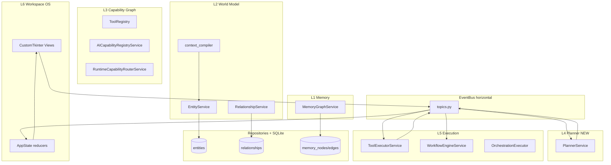
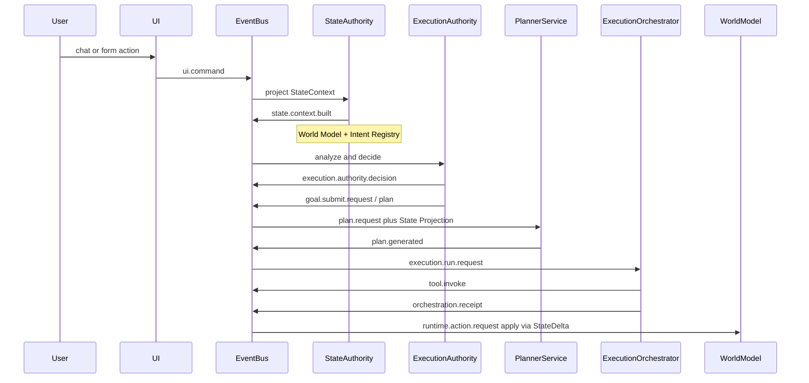

# ACC vNext — State-Driven Workspace Operating System

**Status:** North-star cognitive architecture (subordinate to Constitution)  
**Authority:** Derived from `PROJECT_CONSTITUTION_V4.md`; peer to [WORKSPACE_VISION.md](WORKSPACE_VISION.md)  
**Backlog:** Program 5 in [ARCHITECTURE_TRANSITION_PLAN.md](ARCHITECTURE_TRANSITION_PLAN.md)  
**Branch:** `feature/vnext-state-driven-blueprint`

---

## Architectural principle

### Rejected model

```text
User → Chat → LLM → Text Response
```

Conversation history drives state. The model reasons about *messages*, not *things*.

### Target model

```text
User → Workspace State → Reasoning Layer → Execution Layer → Workspace Mutation → UI Sync
```

State drives reasoning. Chat is one input surface and one output channel — not the system architecture.

**Reference inspiration:**

| External project | ACC borrows |
|------------------|-------------|
| OpenLoaf | Planner + workspace state snapshots |
| Open Cowork | Capability graph + execution orchestration |
| AnythingLLM | Durable memory from transient chat |
| llmbasedos | Files-as-entities (not filesystem-as-SoT) |
| OpenHands | Supervised execution runtime patterns |

---

## Two layer models (do not conflate)

ACC uses **two** six-layer models. They are complementary, not competing.

### Constitutional flow (ownership — supreme)

```text
UI → AppState → EventBus → Services → Repositories → Storage
```

Defined in `PROJECT_CONSTITUTION_V4.md` and [ARCHITECTURE.md](../ARCHITECTURE.md). Every vNext service must live inside this flow.

### Cognitive stack (reasoning — this document)

```text
L6  Workspace OS     (presentation)
L5  Execution         (orchestrator)
L4  Planner           (goal → plan DAG)
L3  Capability Graph  (stable action vocabulary)
L2  World Model       (entity graph)
L1  Memory            (durable knowledge)
```

`EventBus` is **horizontal infrastructure** across L4–L6, not a cognitive layer.

### Mapping table

| Cognitive layer | Constitutional home | Primary ACC modules |
|-----------------|---------------------|---------------------|
| L6 Workspace OS | UI + AppState | `ui/`, `core/app_state.py`, `core/workspace_os_service.py` |
| L5 Execution | Services | `services/tool_executor_service.py`, `services/workflow_engine_service.py`, `orchestration/execution/executor.py` |
| L4 Planner | Services (new) | `services/orchestration_service.py` (intents only); **gap:** `PlannerService` |
| L3 Capability Graph | Services | `tools/tool_registry.py`, `core/ai/capability_registry_service.py`, `services/runtime_capability_router_service.py` |
| L2 World Model | Services → Repositories | `core/entity/`, `core/relationship/`, `core/world_model/context_compiler.py` |
| L1 Memory | Services → Repositories | `services/memory_graph_service.py`, `repositories/memory_repository.py` |

---

## System architecture



---

## Layer 1 — Memory

**Purpose:** Convert transient interactions into durable, queryable knowledge.

**Owner:** `MemoryGraphService` (`ai_command_center/services/memory_graph_service.py`)

**Storage:** `memory_nodes`, `memory_edges` via `repositories/memory_repository.py`

**EventBus topics:** `memory.remember`, `memory.stored`, `memory.select`, `memory.lookup.*` — see `core/events/topics.py`

**Context integration:** `CapabilityContextAssembler` publishes `MEMORY_LOOKUP_REQUEST`; snippets flow to `ContextManager` as `memory_graph_*` sections.

**AppState projections:** `memory_catalog`, `memory_selected` in `core/app_state.py`

**Phase 1 rule:** SQLite + entity graph only. No LanceDB/embeddings until Program 4 constitutional gate (`ucgs.profiles/ai-command-center.yaml` S5).

---

## Layer 2 — World Model

**Purpose:** Persistent representation of workspace reality — the brain's primary context object.

**Not a separate `WorldModelService`.** Invariant 11 forbids duplicating `EntityService` + `RelationshipService`. The world model *is* the entity graph.

### Entity contract

Frozen in `core/entity/entity.py`:

- Workspace, Project, Task, Card, Agent, Workflow, Resource (file/folder/url/command), Knowledge Object, …

### Storage

| Table | Owner |
|-------|-------|
| `entities` | `core/entity/entity_repository.py` |
| `relationships` | `core/relationship/relationship_repository.py` |
| `timeline_events` | `core/timeline/timeline_repository.py` |

### Relationship vocabulary

Governed enum in `core/relationship/relationship.py`: `CONTAINS`, `DEPENDS_ON`, `REFERENCES`, `DERIVED_FROM`, `ASSIGNED_TO` (as `MANAGES`/`OWNS`), etc.

### Context compiler (Milestone 1 — implemented)

`core/world_model/context_compiler.py` transforms entity graph rows into dense structural prompt text:

```text
[WORKSPACE] Home (id=...)
  ENTITIES:
    task: "Shopping List" (id=...)
  FOCUS:
    task: "Shopping List" (id=...)
  GRAPH:
    depth-1: note "Bread" (...)
```

**Bus path:** `WORKSPACE_CONTEXT_REQUEST` → `entity_bus_handlers.on_workspace_context_request` → compiler → `WORKSPACE_CONTEXT_RESULT` → `CapabilityContextAssembler` → `ContextManager` (`workspace_state` section, priority 1).

**Rule:** Files are entities (`ENTITY_TYPE_FILE`, `ENTITY_TYPE_RESOURCE`). Filesystem ⊂ World Model. Never filesystem = World Model.

---

## Layer 3 — Capability Graph

**Purpose:** Stable action vocabulary. The planner never sees shell commands, Python functions, or MCP endpoints — only capability metadata.

**Current state:** Fragmented across four registries:

| Registry | Module | Role |
|----------|--------|------|
| Tool runtime | `tools/tool_registry.py` + `services/tool_registry_service.py` | Register/describe tools; execution in `ToolExecutorService` |
| AI capabilities | `core/ai/capability_registry_service.py` | Per-entity-type actions (palette, context menu) |
| Runtime providers | `services/runtime_capability_router_service.py` | ARI `CapabilityKind` routing (planning/coding/research) |
| Orchestration providers | `orchestration/providers/provider_registry.py` | Truth-bound intents (calendar, system facts, MCP) |

**Phase B deliverable:** `CapabilityPromptCatalogService` — unified `get_available_prompt_specs(entity_types)` for the planner, stripping internal handlers. **Status: complete** (`capability.catalog.request` / `capability.catalog.result` topics).

**Capability metadata shape (planner-facing):**

```json
{
  "name": "create_note",
  "description": "Creates a note entity",
  "risk": "low",
  "requires_approval": false,
  "parameters": { }
}
```

**Constitutional rule:** Capabilities register on the bus. Execution publishes `tool.invoke` / `action.invoked` — never direct `handler()` calls from UI or planner.

---

## Layer 4 — Planner

**Purpose:** Convert user goals into validated execution manifests. **Does not execute.**

**Current state:**

| Component | Status |
|-----------|--------|
| `OrchestrationService` | Deterministic intent classification only |
| `RuntimeCapabilityRouterService` | Routes `CapabilityKind.PLANNING` to native/QwenPaw |
| `AgentRuntimeService` | Stub pipeline (`"planner": "stub"` on `agent.pipeline.planned`) |
| `PlannerService` | **Complete** — deterministic skeleton on EventBus |

**Phase C deliverable:** `PlannerService` on EventBus:

1. Receives goal + workspace scope via `plan.request`
2. Fetches world model context via `WORKSPACE_CONTEXT_REQUEST` (not direct SQLite)
3. Fetches capability specs via `CapabilityPromptCatalogService`
4. Calls LLM through `ContextManager.build_context()` (Invariant 6)
5. Publishes `plan.generated` with `{ goal, steps: [{ step_id, capability, args, require_approval }] }`

**Restrictions:** No file mutation, no command execution, no API calls. Plan only.

---

## Layer 5 — Execution Orchestrator

**Purpose:** Execute approved plans deterministically. LLM has exited the stack.

**Current state (strong):**

| Executor | Module |
|----------|--------|
| Tool execution | `services/tool_executor_service.py` |
| Linear workflows | `services/workflow_engine_service.py` |
| Orchestration | `orchestration/execution/executor.py` |
| Execution persistence | `services/execution_run_service.py`, `execution_event_service.py` |

**Phase D deliverable:** `ExecutionOrchestratorService` runs approved planner manifests with risk-tier gates via EventBus (`execution.run.*`, `execution.step.*`). `PermissionService` backs high-risk pre-checks; `WorkflowEngineService` remains for linear tool workflows.

| Risk tier | Examples | Gate |
|-----------|----------|------|
| Low | Create note, search files | Auto-approved |
| Medium | Modify files, send email | User confirmation (`execution.step.awaiting_approval`) |
| High | Delete files, git push, system settings | Explicit approval + permission check |

**EventBus topics:** `execution.run.request`, `execution.run.started`, `execution.run.complete`, `execution.run.failed`, `execution.step.started`, `execution.step.awaiting_approval`, `execution.step.approved`, `execution.step.completed`, `execution.step.failed`

**UI:** `ui/views/executions_view.py`, `execution_timeline_view.py`, `ExecutionTimelineDock`

---

## Layer 6 — Workspace OS

**Purpose:** Presentation and orchestration. State visualization, not reasoning.

**Existing assets (keep):**

- `EventBus`, `AppState`, Inspector system, Artifacts, Workspace canvas
- Views: Chat, Workspace, Executions, Workflow Graph, Automation Workspace

**Target UI layout (coexisting views — do not replace chat):**

| View | Role |
|------|------|
| Workspace View | Entity graph / kanban |
| Chat View | Streaming conversation (input surface) |
| Execution View | Active plan step checklist |
| Artifact View | Generated outputs |

**North star:** [WORKSPACE_VISION.md](WORKSPACE_VISION.md) — chat-as-tool, workspace-as-product.

---

## End-to-end flow

**User:** "Add milk to my shopping list"



**Current spine:** State Authority → Authority → Plan → Run → Receipt → Truth → State Delta → World Model.
`command.routed` is historical only. See [PHASE_12_STATE_INTELLIGENCE_PLAN.md](../plans/PHASE_12_STATE_INTELLIGENCE_PLAN.md).

---

## Implementation roadmap

Aligned with [ARCHITECTURE_TRANSITION_PLAN.md](ARCHITECTURE_TRANSITION_PLAN.md). Program 5 begins after Program 3 exit (workspace adoption >60%).

| Phase | Scope | Deliverable | Depends on |
|-------|-------|-------------|------------|
| **A — Foundation** | World model → prompt | `context_compiler.py`, `workspace_state` context priority | Complete (Milestone 1) |
| **B — Capability facade** | Planner-facing registry API | `CapabilityPromptCatalogService` | Phase A |
| **C — Planner** | LLM plan DAG | `PlannerService`, `plan.request` / `plan.generated` topics | Phase B |
| **D — Execution gates** | Approval across capabilities | `ExecutionOrchestratorService`, `execution.run.*` / `execution.step.*` topics | Phase C — complete |
| **E — Integrations** | MCP, email, calendar | `ExternalCapabilityBridgeService` + ARI bus topics (**in progress**) | Phase D |

**Phase E deliverable (scaffold):** `ExternalCapabilityBridgeService` registers MCP/external manifests on `external.capability.register`; `CapabilityPromptCatalogService` aggregates them for the planner; `ExecutionOrchestratorService` routes `mcp.*` capabilities via `capability.runtime.request`. Full MCP wire-up, email, and calendar providers remain future work.

**Explicit non-goals (Phase A–C):**

- No CustomTkinter → React/Svelte port
- No vector DB / embeddings without constitutional amendment
- No autonomous ReAct loops (User Goal → Plan → Execute → Stop only)
- No multi-agent orchestration (Appendix C gate in transition plan)
- No new `WorldModelService` duplicating entity ownership

---

## Architectural rules

1. **State drives reasoning** — never Conversation → State; prefer State → Conversation
2. **Files are entities** — filesystem ⊂ world model
3. **Capabilities are stable** — add only when the system gains a genuinely new power
4. **Planner never executes; executor never plans**
5. **Chat is an interface** — not the architecture
6. **All AI requests pass through ContextManager** (Invariant 6)
7. **External runtimes are capabilities only** (Invariant 13) — integrate via `runtime/` providers

---

## Governance

Before Tier B changes:

1. Constitutional pre-flight: `governance/constitutional_preflight.md`
2. UCGS: `python tools/ucgs_runner.py`
3. Architecture lint: `python scripts/arch_lint.py --baseline tests/arch_lint_baseline.json`
4. Register new topics in `core/events/topics.py` and contracts in `core/contracts.py`

---

## References

| Document | Role |
|----------|------|
| `PROJECT_CONSTITUTION_V4.md` | Supreme authority |
| `docs/ARCHITECTURE.md` | Runtime architecture |
| `docs/architecture/WORKSPACE_VISION.md` | Product north star |
| `docs/architecture/ARCHITECTURE_TRANSITION_PLAN.md` | Execution backlog (Programs 1–5) |
| `docs/architecture/AGENT_RUNTIME_INTERFACE.md` | External runtime integration |
| `docs/architecture/WORKFLOW_ENGINE.md` | Workflow executor spec |
| `docs/architecture/AGENT_FRAMEWORK.md` | Agent runtime spec |
| `AGENTS.md` | Agent implementation directives |

---

## Revision history

| Date | Change |
|------|--------|
| 2026-07-09 | Initial vNext blueprint + Milestone 1 context compiler |
