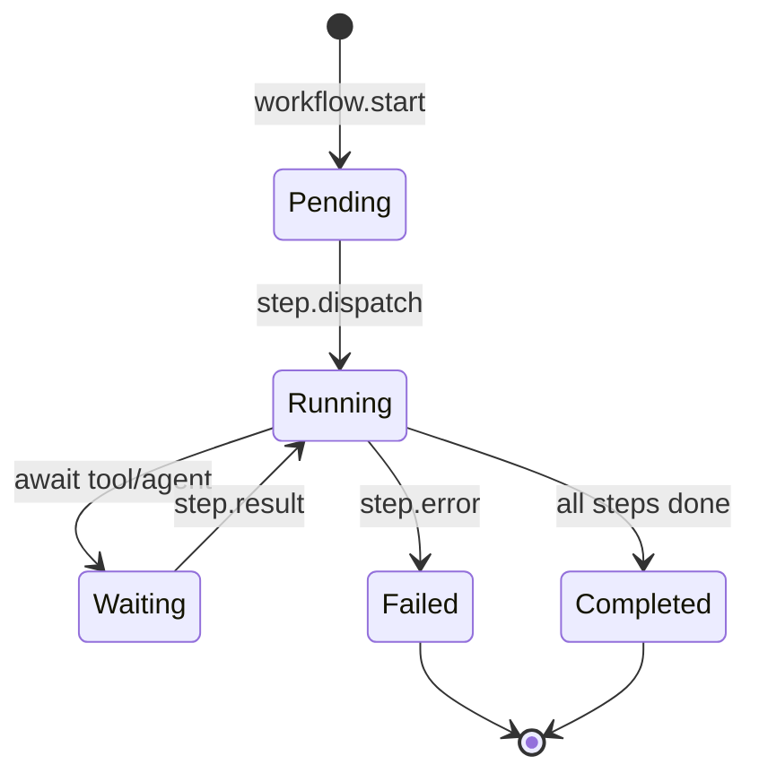

# Workflow Engine

**Status:** Architecture Specification  
**Vision ref:** [WORKSPACE_VISION.md](WORKSPACE_VISION.md) — Automation pillar  
**Constitutional refs:** Tool runtime separation (registry vs executor)

---

## Purpose

Define a declarative, EventBus-driven workflow engine for multi-step automation combining tools, agents, and workspace actions.

---

## Current State

| Asset | Location | Status |
|-------|----------|--------|
| Workflow dataclass | `core/workflow/workflow.py` | Stub |
| Action registry | `core/action/action_registry.py` | Workspace OS actions registered |
| Tool pipeline | `tool.invoke` → ToolExecutorService | Production |
| Workflow engine service | — | Not implemented |

---

## Target Architecture



### Step Types

| Type | Bus interaction |
|------|-----------------|
| `tool` | Publish `tool.invoke`; await `tool.result` |
| `agent` | Publish `agent.task.request`; await `agent.task.complete` |
| `action` | Publish `action.invoked`; await `action.completed` |
| `delay` | Timer service; no external I/O |
| `branch` | Evaluate AppState snapshot; no service call |

---

## Workflow Definition

YAML or JSON manifest (future: `workflows/*.yaml`):

```yaml
id: daily-vault-sync
trigger:
  type: schedule
  cron: "0 9 * * *"
steps:
  - id: index
    type: tool
    tool: note_index
  - id: summarize
    type: agent
    capability: summarize_vault
```

Stored in SQLite via `WorkflowRepository` (to be created).

---

## Phases

| Phase | Scope | Acceptance |
|-------|-------|------------|
| **W0** | Domain model + topics | `workflow.started`, `workflow.step.*`, `workflow.completed` |
| **W1** | Manual trigger from command palette | 2-step tool chain |
| **W2** | Schedule trigger | Daily driver integration |
| **W3** | Workspace event triggers | `entity.created` → workflow |

---

## Event Topics (proposed)

| Topic | Producer | Consumers |
|-------|----------|-----------|
| `workflow.start` | UI / scheduler | WorkflowEngineService |
| `workflow.step.started` | Engine | AppState, telemetry |
| `workflow.step.completed` | Engine | Engine (advance) |
| `workflow.failed` | Engine | AppState, app.error |
| `workflow.completed` | Engine | Timeline |

Add to `core/events/topics.py` when W0 begins.

---

## Risks

| Risk | Mitigation |
|------|------------|
| Infinite loops | Max steps per run; DAG validation at load |
| Duplicate execution | Idempotency key per trigger |
| Service coupling | Engine only publishes; never calls handlers |

---

## Acceptance Criteria (W1)

- [ ] WorkflowEngineService in service_factory
- [ ] Two-step shell + note workflow demonstrable
- [ ] State visible in AppState `workflow_runs` projection
- [ ] Rollback: disable service registration
