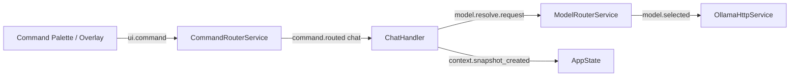
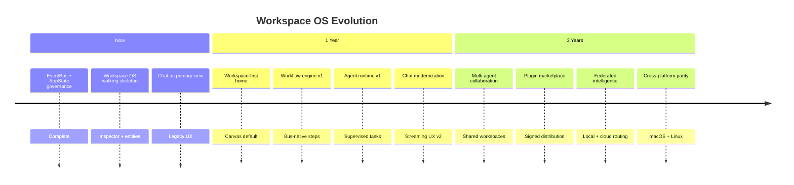

# Workspace Vision

**Status:** North Star Document  
**Authority:** Derived from PROJECT_CONSTITUTION_V4.md; subordinate to ARCHITECTURE.md for implementation detail.

---

## Mission

AI Command Center is a **Workspace OS** — an ambient command surface where chat, agents, tools, knowledge, and automation orbit a persistent workspace. It is **not** a chatbot with sidebar features.

Chat is one tool among many. The workspace is the product.

---

## Pillars

| Pillar | Definition | Current (2026) | 1-Year | 3-Year |
|--------|------------|----------------|--------|--------|
| **Workspace** | Entities, layouts, resources, timelines | Walking skeleton; inspector (Ctrl+Shift+W) | Workspace canvas as default home | Multi-workspace, sync, collaboration |
| **Intelligence** | Context, memory, model routing | ContextManager + MemoryGraph + ModelRouter | Tiered model orchestration | Federated models, local+cloud blend |
| **Automation** | Tools, shell, workflows | ShellTool + ToolExecutor | Workflow engine v1 | Scheduled + event-driven automation |
| **Knowledge** | Notes, vault, graph | Obsidian integration | Vector search + graph UI | Cross-source knowledge federation |
| **Extensibility** | Plugins, actions, views | Plugin registry v2 | Agent + workflow plugins | Marketplace, signed manifests |

---

## Chat-as-Tool

Chat is an **intent handler**, not the application shell.

Users invoke chat; they **live** in the workspace.

---

## Agents

Future agents are **EventBus citizens**:

- Spawn via `agent.spawned` / terminate via `agent.terminated`
- No direct service calls — publish intents, subscribe to results
- Permission-gated via `PermissionService`
- See `AGENT_FRAMEWORK.md`

---

## Workflows

Composable multi-step automation over the same bus:

- Trigger: command, schedule, workspace event
- Steps: tool invoke, agent task, note write
- See `WORKFLOW_ENGINE.md`

---

## Plugins

Manifest-driven (`plugins/manifests/*.yaml`):

- Register entities, actions, views, search providers
- State persists in SQLite
- Core plugins protected; extensions restart services on toggle

---

## Memory & Model Routing

| Concern | Owner | Topic flow |
|---------|-------|------------|
| Memory graph | MemoryGraphService | `memory.remember` → `memory.stored` |
| Context assembly | ContextManager | `context.snapshot_created` |
| Model selection | ModelRouterService | `model.resolve.request` → `model.selected` |

Constitutional invariant: **every AI request passes through ContextManager before Ollama**.

---

## Cross-Platform

| Platform | Phase | Notes |
|----------|-------|-------|
| Windows | Now | Primary; global hotkey `Alt+Space` |
| macOS | Year 1 | Hotkey + tray parity |
| Linux | Year 1–2 | Wayland hotkey constraints |

See `PLATFORM_STRATEGY.md`.

---

## Vision Timeline

---

## Constitutional Invariants (preserved)

1. Ownership flow: UI → AppState → EventBus → Services → Repositories → Storage  
2. No UI direct storage / Ollama / tool access  
3. No global module state for model/vault/settings  
4. No direct service-to-service calls  
5. Telemetry passive at runtime  

---

## Success Criteria

- [ ] Default launch view is workspace canvas, not chat
- [ ] All features reachable via command palette without view switching
- [ ] Chat sessions attach to workspace entities (cards, resources)
- [ ] Agents and workflows visible in system monitor / timeline
- [ ] Plugin catalog exposes workspace extensions

---

## Related Documents

| Document | Purpose |
|----------|---------|
| `MODEL_ORCHESTRATION.md` | Model tiers and routing |
| `AGENT_FRAMEWORK.md` | Agent lifecycle on EventBus |
| `WORKFLOW_ENGINE.md` | Multi-step automation |
| `PLATFORM_STRATEGY.md` | OS targets and packaging |
| `CHAT_MODERNIZATION_SPEC.md` | Chat-as-tool UX |
| `ARCHITECTURE_TRANSITION_PLAN.md` | Execution backlog (Programs 1–4) |
