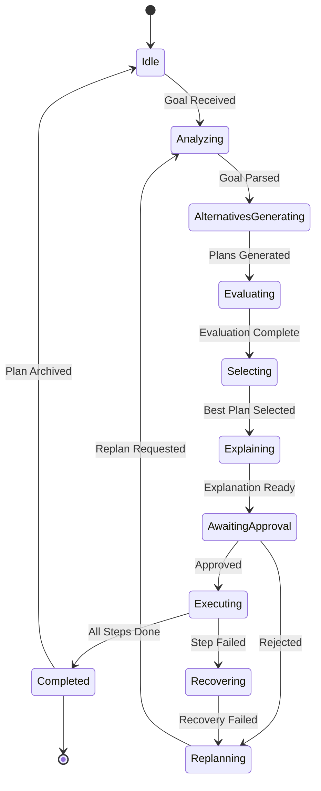
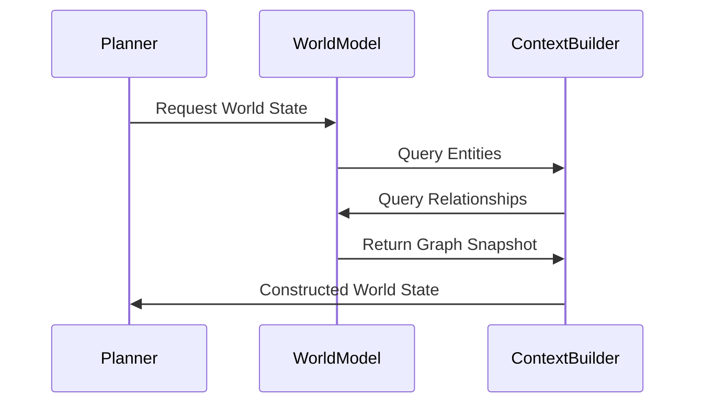
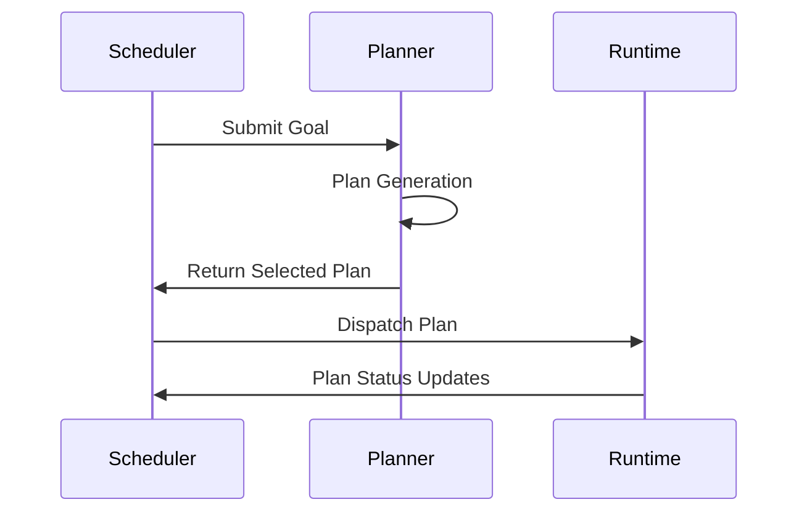
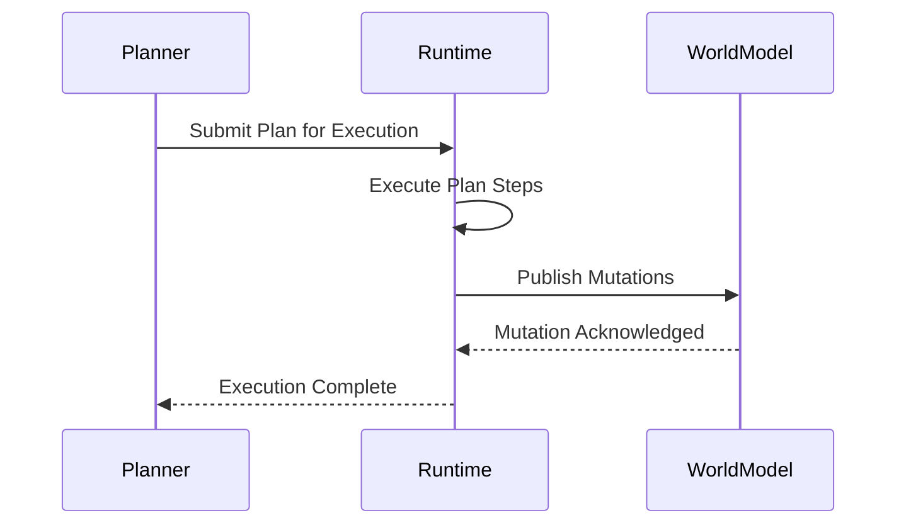
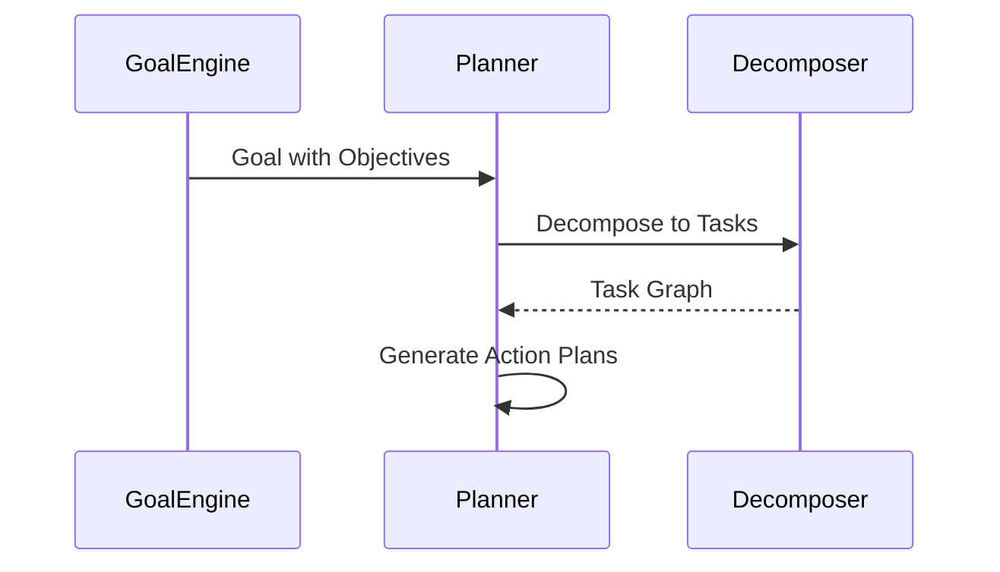
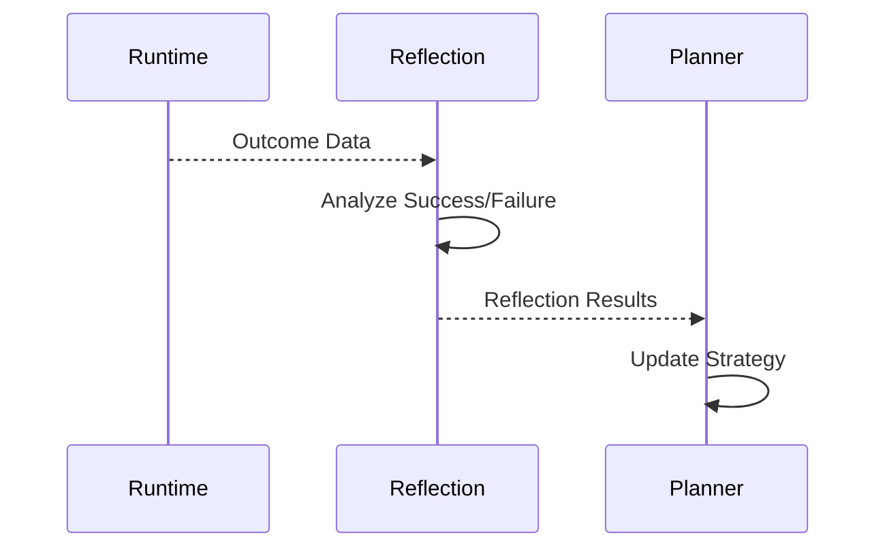
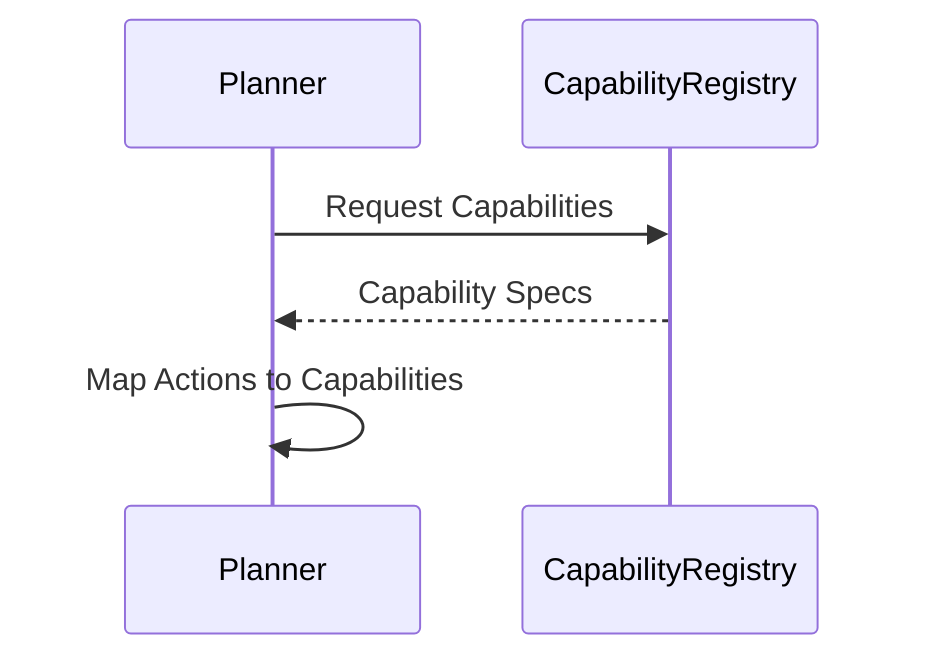

# 01 — Planner Architecture

**Status:** Phase C0 — Constitution (Authoritative Specification)  
**Authority:** Subordinate to `PROJECT_CONSTITUTION_V4.md`  
**Role:** Principal Systems Architect / Cognitive Systems Engineer  
**Output:** Architecture specifications only — no implementation code

---

## Purpose

Define the authoritative ACC Planner Architecture for the VNext evolution program. This document establishes the Planner as a first-class subsystem on the same level of rigor as the Brain.

The Planner transforms ACC from a reliable automation engine into a state-aware reasoning system.

---

## Responsibilities

### Core Responsibilities

The Planner **OWNS**:

1. **Goal Analysis** — Understanding what the user wants to achieve
2. **Plan Generation** — Producing candidate plans from goals
3. **Alternative Generation** — Creating multiple candidate plans for comparison
4. **Plan Evaluation** — Assessing plans against safety, cost, and success criteria
5. **Plan Selection** — Choosing the optimal plan from candidates
6. **Constraint Compliance** — Ensuring plans respect all constraints
7. **Explainability** — Providing reasoning for all planning decisions

### Outputs

The Planner produces:

- `CandidatePlans[]` — Multiple generated plan options
- `SelectedPlan` — The chosen plan for execution
- `PlanExplanation` — Why this plan, why not alternatives
- `ConfidenceScore` — Planner's confidence in success
- `ReplanRequest` — When replanning is needed

---

## Non-Responsibilities

The Planner **MUST NOT**:

| Forbidden Action | Reason |
|-----------------|--------|
| Execute Actions | Runtime owns execution |
| Mutate World Model | World Model owns truth |
| Call Capabilities | Runtime owns capability invocation |
| Access Databases Directly | Repositories own persistence |
| Write Files | Workspace OS owns file operations |
| Delete Files | Workspace OS owns destructive operations |
| Modify State | World Model owns state mutations |
| Bypass Runtime | Constitutional separation |
| Bypass Scheduler | Constitutional separation |
| Bypass Approval Gates | Safety requirement |
| Publish World Mutations | World Model owns mutations |

**The Planner is a Pure Reasoning Component.**

---

## Ownership Boundaries

```
┌─────────────────────────────────────────────────────────────────┐
│                        ACC SYSTEM                               │
├─────────────────────────────────────────────────────────────────┤
│                                                                 │
│  ┌──────────┐     ┌──────────┐     ┌──────────┐              │
│  │ Planner  │────▶│ Evaluator│────▶│ Runtime  │              │
│  │ (Reason) │     │ (Assess) │     │ (Act)    │              │
│  └──────────┘     └──────────┘     └──────────┘              │
│        │                                  │                    │
│        │                                  │                    │
│        ▼                                  ▼                    │
│  ┌──────────────────────────────────────────────────┐         │
│  │                   World Model                    │         │
│  │                   (Truth)                        │         │
│  └──────────────────────────────────────────────────┘         │
│                                                                 │
│  ┌──────────┐     ┌──────────┐     ┌──────────┐              │
│  │ Reflection│────▶│  Memory  │────▶│ Planner  │              │
│  │ (Learn)  │     │ (Store)  │     │ (Improve)│              │
│  └──────────┘     └──────────┘     └──────────┘              │
│                                                                 │
└─────────────────────────────────────────────────────────────────┘
```

**Separation of Concerns:**

| Component | Produces | Consumes |
|-----------|----------|----------|
| Planner | Decisions | World State, Goals, Constraints |
| Evaluator | Assessments | Plans, Constraints, Historical Data |
| Runtime | Actions | Approved Plans, Capabilities |
| World Model | Truth | Mutations from Runtime |
| Reflection | Learning | Outcomes, Failures |
| Memory | Experience | Plans, Reflections |

---

## Inputs

### Required Inputs

```json
{
  "goal": {
    "id": "goal_uuid",
    "description": "User's intent",
    "constraints": ["constraint_refs"],
    "priority": "high",
    "deadline": "timestamp"
  },
  "worldState": {
    "entities": [...],
    "relationships": [...],
    "confidence": 0.95
  },
  "workspaceState": {
    "files": [...],
    "projects": [...],
    "context": "..."
  },
  "userContext": {
    "preferences": {...},
    "history": [...],
    "permissions": [...]
  },
  "constraints": {
    "hard": [...],
    "soft": [...]
  }
}
```

### Optional Inputs

```json
{
  "temporalContext": {
    "currentTime": "timestamp",
    "deadlines": [...]
  },
  "capabilityCatalog": [...],
  "plannerMemory": {...}
}
```

---

## Outputs

### Plan Output

```json
{
  "planId": "plan_uuid",
  "goalId": "goal_uuid",
  "graph": {
    "nodes": [...],
    "edges": [...]
  },
  "explanation": {
    "why": "...",
    "whyNow": "...",
    "whyThisPlan": "...",
    "whyNotAlternatives": [...]
  },
  "metrics": {
    "safetyScore": 0.9,
    "costEstimate": 5.0,
    "complexityScore": 0.4,
    "confidenceLevel": 0.85,
    "goalAlignment": 0.95
  },
  "constraintsApplied": [...],
  "assumptions": [...],
  "uncertaintyFlagged": [...],
  "approvalRequirements": [...]
}
```

---

## Lifecycle

### Planning Loop

```
┌─────────────────────────────────────────────────────────────────┐
│                    PLANNING LOOP                                │
├─────────────────────────────────────────────────────────────────┤
│                                                                 │
│  ┌─────────┐    ┌─────────────┐    ┌──────────┐              │
│  │  GOAL   │───▶│   ANALYZE  │───▶│  STATE   │              │
│  │ RECEIVE │    │   GOAL      │    │  ANALYSIS│              │
│  └─────────┘    └─────────────┘    └──────────┘              │
│                                            │                    │
│                                            ▼                    │
│  ┌─────────────┐    ┌─────────────┐    ┌──────────┐          │
│  │   SELECT    │◀───│  CONSTRAINT │◀───│  ALTERN  │          │
│  │   BEST      │    │  EVALUATE   │    │  GENERATE│          │
│  │   PLAN      │    └─────────────┘    └──────────┘          │
│  └─────────────┘                                                   │
│         │                                                          │
│         ▼                                                          │
│  ┌─────────────┐                                                   │
│  │   EXPLAIN   │                                                   │
│  │   PLAN      │                                                   │
│  └─────────────┘                                                   │
│         │                                                          │
│         ▼                                                          │
│  ┌─────────────┐                                                   │
│  │  EVALUATOR  │                                                   │
│  │   REVIEW    │                                                   │
│  └─────────────┘                                                   │
│         │                                                          │
│         ▼                                                          │
│  ┌─────────────┐                                                   │
│  │   APPROVAL  │                                                   │
│  │    GATE     │                                                   │
│  └─────────────┘                                                   │
│         │                                                          │
│         ▼                                                          │
│  ┌─────────────┐                                                   │
│  │   RUNTIME   │                                                   │
│  │  EXECUTE    │                                                   │
│  └─────────────┘                                                   │
│                                                                 │
└─────────────────────────────────────────────────────────────────┘
```

### State Diagram



---

## Interactions

### With World Model



### With Scheduler



### With Runtime



### With Goal Engine



### With Reflection Engine



### With Capability Registry



---

## Required Decisions

### What Constitutes a Valid Plan?

A plan is valid when:

```json
{
  "valid": true,
  "criteria": [
    "goalId present and valid",
    "graph has at least one node",
    "all nodes have required fields",
    "no cycles in execution path (unless explicitly allowed)",
    "all constraints satisfied",
    "all dependencies resolvable",
    "approval requirements identified",
    "explanation provided"
  ]
}
```

### What Constitutes Planner Failure?

| Failure Type | Definition | Response |
|-------------|------------|----------|
| No Valid Plans | Cannot generate any valid plan | Escalate to human |
| Constraint Violation | Generated plan violates hard constraint | Reject, regenerate |
| Timeout | Exceeded planning budget | Use best partial plan |
| State Stale | World state confidence < threshold | Refresh state |
| Confidence Too Low | Overall confidence < 0.3 | Escalate to human |

### When Should Planning Terminate?

| Condition | Action |
|-----------|--------|
| Valid plan found, within budget | Terminate, select best |
| Budget exhausted | Terminate, use best available |
| Max iterations reached | Terminate, escalate |
| Human intervention requested | Terminate, defer |

---

## Constitutional Rules

### Rule 1: Planner Purity

Planning and execution must remain separate.

```text
Planner: Produces decisions
Runtime: Produces actions
World Model: Produces truth
Reflection: Produces learning
```

### Rule 2: State Before Action

Every plan must be derived from observed state.

```text
No action may be proposed without referencing current state.
```

### Rule 3: Alternatives Before Commitment

The planner must be capable of generating multiple candidate plans before selecting one.

### Rule 4: Evaluation Before Execution

No plan proceeds directly to runtime.

```text
Planner → Evaluator → Runtime
```

### Rule 5: Reflection Before Replanning

Failure alone is not sufficient to trigger replanning.

```text
Reflection → Diagnosis → Replanning
```

### Rule 6: Governance Before Intelligence

Every planner capability must remain:

- Explainable
- Auditable
- Testable
- Recoverable

**If a capability cannot be audited, it must not be implemented.**

---

## Decision Log

| Date | Decision | Rationale |
|------|----------|------------|
| C0-001 | Planner is pure reasoning | Constitutional separation preserves auditability |
| C0-002 | Plans must have explanations | Enables debugging and trust |
| C0-003 | Multiple alternatives required | Prevents premature commitment |
| C0-004 | Evaluator is mandatory gate | Safety and quality control |
| C0-005 | Memory feeds improvement | Enables learning without retraining |

---

## Tradeoffs

### Benefits

1. **Auditability** — Every decision is traceable
2. **Safety** — Mandatory evaluation prevents dangerous actions
3. **Determinism** — Same state → same plan (within confidence)
4. **Recoverability** — Plans can be replayed, analyzed, improved
5. **Testability** — Each component can be unit tested

### Costs

1. **Latency** — Multiple passes add planning time
2. **Complexity** — More components to maintain
3. **Context Requirements** — Needs full world state
4. **Memory Overhead** — Storing alternatives and explanations

---

## Failure Modes

| Mode | Detection | Impact | Recovery |
|------|-----------|--------|----------|
| World state stale | Confidence < threshold | Invalid plans | Refresh state |
| No valid alternatives | Generation returns empty | Cannot plan | Escalate |
| Evaluator timeout | Budget exhausted | Partial evaluation | Use best available |
| Explanation generation fails | Missing required field | Cannot audit | Block plan |
| Circular dependency | Cycle detected | Invalid graph | Reject plan |

---

## Recovery Strategy

```python
def recovery_strategy(failure_mode):
    if failure_mode == "WORLD_STATE_STALE":
        return refresh_world_state()
    elif failure_mode == "NO_VALID_ALTERNATIVES":
        return escalate_to_human()
    elif failure_mode == "EVALUATOR_TIMEOUT":
        return use_best_partial_plan()
    elif failure_mode == "CIRCULAR_DEPENDENCY":
        return flatten_and_reject()
    else:
        return escalate_to_human()
```

---

## Future Evolution Path

### Phase C1: Learning Integration

- Integrate reflection results into planning strategy
- Enable planner to learn from past successes/failures
- Add historical pattern matching

### Phase C2: Advanced Reasoning

- Enable conditional branching in plans
- Support parallel plan generation
- Add uncertainty quantification

### Phase C3: Multi-Modal Planning

- Support goal decomposition across modalities
- Enable cross-domain planning
- Add meta-planning capabilities

---

## Constitutional Validation Checklist

Before implementation is authorized, the architecture must prove:

- [ ] Planner cannot execute actions
- [ ] Planner cannot mutate state
- [ ] Runtime remains sole execution authority
- [ ] World Model remains sole truth authority
- [ ] Reflection remains sole learning authority
- [ ] Evaluation remains mandatory
- [ ] Approval gates remain enforceable
- [ ] Recovery remains deterministic
- [ ] Every decision remains auditable

**Any architecture violating these principles must be rejected.**

---

## References

| Document | Role |
|----------|------|
| `PROJECT_CONSTITUTION_V4.md` | Supreme authority |
| `VNEXT_STATE_DRIVEN_BLUEPRINT.md` | Cognitive stack architecture |
| `02_WORLD_STATE_MODEL.md` | State input specification |
| `03_PLAN_GRAPH_SPECIFICATION.md` | Plan structure |
| `05_PLAN_EVALUATION_FRAMEWORK.md` | Evaluation metrics |
| `06_GOAL_DECOMPOSITION_ENGINE.md` | Goal handling |

---

## Revision History

| Date | Change | Author |
|------|--------|--------|
| 2026-07-10 | Initial C0 Constitution | ACC Planner Evolution Program |
