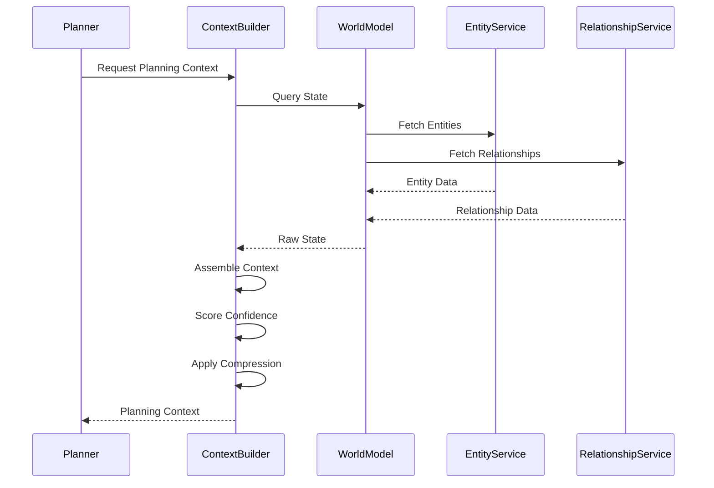

# 02 — World State Model

**Status:** Phase C0 — Constitution (Authoritative Specification)  
**Authority:** Subordinate to `PROJECT_CONSTITUTION_V4.md` and `01_PLANNER_ARCHITECTURE.md`  
**Purpose:** Define how the planner perceives and reasons about the world

---

## Purpose

Define the structures and mechanisms by which the Planner perceives the world. The World State Model transforms raw world data into planning-ready state representations.

**The Planner reasons about the world through these structures, not raw data.**

---

## Responsibilities

### Core Responsibilities

1. **State Abstraction** — Convert raw world data into planning-relevant representations
2. **Confidence Scoring** — Assess state reliability and staleness
3. **Relationship Modeling** — Maintain entity relationships for traversal
4. **Temporal Tracking** — Track time-varying state
5. **Context Assembly** — Construct planner-readable context

### Non-Responsibilities

| Not Owned By | Owned By |
|-------------|----------|
| Raw entity storage | World Model (EntityService) |
| Relationship persistence | World Model (RelationshipService) |
| File system access | Workspace OS |
| External API data | Capability providers |
| Mutation application | Runtime |

---

## State Structures

### WorldState

The top-level state container.

```json
{
  "worldStateId": "uuid",
  "timestamp": "ISO8601",
  "confidence": 0.95,
  "environment": { ... },
  "workspace": { ... },
  "temporal": { ... },
  "relationships": [ ... ]
}
```

### EnvironmentState

System-level state.

```json
{
  "environmentState": {
    "hostname": "string",
    "platform": "windows|mac|linux",
    "osVersion": "string",
    "architecture": "arm64|x86_64",
    "memory": {
      "totalMb": 16384,
      "availableMb": 8192
    },
    "cpu": {
      "cores": 8,
      "usagePercent": 45.2
    },
    "network": {
      "connected": true,
      "latencyMs": 23
    }
  }
}
```

### WorkspaceState

Workspace-level state.

```json
{
  "workspaceState": {
    "workspaceRoot": "/path/to/workspace",
    "projects": [
      {
        "id": "uuid",
        "name": "project-name",
        "path": "/path/to/project",
        "type": "python|javascript|rust|...",
        "entities": [
          {
            "id": "uuid",
            "type": "file|directory|module|package",
            "name": "entity-name",
            "path": "/relative/path",
            "lastModified": "ISO8601",
            "sizeBytes": 4096
          }
        ],
        "dependencies": ["dependency-refs"],
        "configFiles": ["config-refs"]
      }
    ],
    "files": [
      {
        "id": "uuid",
        "path": "/path/to/file",
        "type": "source|config|data|doc",
        "format": "json|yaml|toml|...",
        "sizeBytes": 1024,
        "lastModified": "ISO8601",
        "language": "python|javascript|...",
        "imports": ["entity-refs"],
        "exports": ["entity-refs"]
      }
    ],
    "secrets": [
      {
        "id": "uuid",
        "name": "secret-name",
        "type": "api_key|token|credential",
        "hasValue": true
      }
    ],
    "activeProcesses": [
      {
        "pid": 1234,
        "name": "process-name",
        "cpuPercent": 5.2,
        "memoryMb": 256
      }
    ]
  }
}
```

### UserContext

User-specific context.

```json
{
  "userContext": {
    "userId": "uuid",
    "userName": "string",
    "preferences": {
      "style": "concise|detailed",
      "confirmationLevel": "minimal|normal|strict",
      "timezone": "UTC|...",
      "notificationPreferences": { ... }
    },
    "permissions": [
      {
        "scope": "read|write|admin",
        "resources": ["resource-patterns"]
      }
    ],
    "recentActivity": [
      {
        "action": "edit|create|delete|...",
        "entityId": "uuid",
        "timestamp": "ISO8601"
      }
    ],
    "skills": ["skill-names"],
    "knowledgeDomains": ["domain-names"]
  }
}
```

### TemporalContext

Time-related state.

```json
{
  "temporalContext": {
    "currentTime": "ISO8601",
    "timezone": "UTC|...",
    "deadlines": [
      {
        "id": "uuid",
        "description": "string",
        "dueTime": "ISO8601",
        "urgency": "critical|high|normal|low",
        "associatedGoalId": "uuid"
      }
    ],
    "scheduledEvents": [
      {
        "id": "uuid",
        "title": "string",
        "startTime": "ISO8601",
        "endTime": "ISO8601",
        "recurring": true|false
      }
    ],
    "historicalPatterns": [
      {
        "pattern": "morning|afternoon|evening|...",
        "productivityScore": 0.8,
        "typicalTasks": ["task-types"]
      }
    ]
  }
}
```

### RelationshipContext

Relationship graph context.

```json
{
  "relationshipContext": {
    "graph": {
      "nodes": [
        {
          "entityId": "uuid",
          "entityType": "file|project|module|...",
          "metadata": { ... }
        }
      ],
      "edges": [
        {
          "sourceId": "uuid",
          "targetId": "uuid",
          "relationshipType": "imports|depends_on|contains|...",
          "strength": 0.9,
          "metadata": { ... }
        }
      ]
    },
    "traversalPaths": [
      {
        "fromId": "uuid",
        "toId": "uuid",
        "path": ["uuid", "uuid", "uuid"],
        "distance": 3
      }
    ],
    "communities": [
      {
        "id": "uuid",
        "entities": ["uuid", "uuid"],
        "cohesion": 0.85
      }
    ]
  }
}
```

---

## Context Builder Integration

### How Context Builder Constructs State



### State Construction Pipeline

```python
def construct_planning_context(goal, scope):
    # 1. Fetch raw state from World Model
    raw_state = world_model.query(
        entities=scope.entities,
        relationships=scope.relationships
    )
    
    # 2. Build state structures
    world_state = WorldState(
        environment=build_environment_state(raw_state),
        workspace=build_workspace_state(raw_state),
        temporal=build_temporal_context(raw_state),
        relationships=build_relationship_context(raw_state)
    )
    
    # 3. Score confidence
    confidence = score_state_confidence(raw_state)
    
    # 4. Compress if needed
    if exceeds_token_budget(world_state):
        world_state = compress_state(world_state)
    
    # 5. Return planning-ready context
    return PlanningContext(
        state=world_state,
        confidence=confidence,
        staleness=calculate_staleness(raw_state)
    )
```

---

## Graph Relationships in Planning

### Relationship Types

| Type | Planning Significance |
|------|----------------------|
| `CONTAINS` | Hierarchy awareness |
| `DEPENDS_ON` | Execution order constraints |
| `REFERENCES` | Impact analysis |
| `IMPLEMENTS` | Abstraction awareness |
| `CONFLICTS_WITH` | Conflict detection |
| `BLOCKS` | Dependency chains |

### Traversal for Planning

```python
def get_relevant_entities(goal, world_state):
    # 1. Find entities directly related to goal
    seed_entities = find_goal_entities(goal, world_state)
    
    # 2. Expand to related entities
    related_entities = set()
    for entity in seed_entities:
        # Traverse relationships
        related = traverse_relationships(
            entity,
            max_depth=3,
            relationship_types=[DEPENDS_ON, REFERENCES, IMPLEMENTS]
        )
        related_entities.update(related)
    
    # 3. Return context-relevant subset
    return filter_by_relevance(related_entities, goal)
```

---

## State Confidence Scoring

### Confidence Factors

```json
{
  "confidenceScore": {
    "overall": 0.92,
    "factors": {
      "dataFreshness": {
        "score": 0.95,
        "lastRefresh": "ISO8601",
        "age": "5m"
      },
      "dataCompleteness": {
        "score": 0.90,
        "coveredEntities": 450,
        "totalEntities": 500
      },
      "sourceReliability": {
        "score": 0.95,
        "sources": ["world_model", "workspace_scanner"]
      },
      "temporalRelevance": {
        "score": 0.88,
        "currentTime": "ISO8601"
      }
    }
  }
}
```

### Confidence Thresholds

| Score Range | Interpretation | Planner Action |
|-------------|---------------|----------------|
| 0.95-1.0 | Highly reliable | Proceed normally |
| 0.80-0.94 | Reliable | Proceed with minor caution |
| 0.60-0.79 | Uncertain | Flag uncertainty, proceed |
| 0.40-0.59 | Unreliable | Refresh recommended |
| < 0.40 | Unusable | Block planning, refresh required |

---

## Required Decisions

### Maximum State Size

```yaml
state_limits:
  max_entities: 1000
  max_relationships: 10000
  max_context_tokens: 32000
  max_file_size_bytes: 1048576  # 1MB
  
action_on_limit:
  strategy: compress_then_truncate
  compression_priority:
    - low_relevance_entities
    - large_file_contents
    - historical_timestamps
```

### Staleness Thresholds

```yaml
staleness_thresholds:
  file_metadata: 60s      # File counts, sizes
  file_content: 300s       # File contents
  process_list: 30s         # Running processes
  environment: 3600s        # System info
  user_context: 600s        # User activity
  relationship_graph: 120s  # Entity relationships
  
action_on_stale:
  below_confidence_threshold: refresh_required
  above_confidence_threshold: warn_and_proceed
```

### Missing Data Behavior

```yaml
missing_data_handling:
  optional_field_missing:
    action: omit_with_marker
    example: "field: null  # unavailable"
  
  required_field_missing:
    action: escalate
    response: "Cannot plan: required field [X] missing"
  
  entity_not_found:
    action: flag_and_search_alternatives
    if_no_alternatives: escalate
  
  relationship_not_found:
    action: assume_independence
    flag: "Assumed no relationship between X and Y"
```

---

## Decision Log

| Date | Decision | Rationale |
|------|----------|------------|
| WSM-001 | State is read-only from Planner | Ensures World Model authority |
| WSM-002 | Confidence scoring required | Enables uncertainty handling |
| WSM-003 | Compression is lossy | Tradeoff for context limits |
| WSM-004 | Relationships are first-class | Enables graph reasoning |
| WSM-005 | Temporal context is required | Deadline-aware planning |

---

## Tradeoffs

### Benefits

1. **Planner Isolation** — Protected from raw data complexity
2. **Confidence Awareness** — Planner knows state reliability
3. **Compression Efficiency** — Fits in context windows
4. **Graph Reasoning** — Enables relationship-based planning
5. **Temporal Awareness** — Enables deadline-aware planning

### Costs

1. **Latency** — Context building takes time
2. **Staleness Risk** — State may lag reality
3. **Compression Loss** — Some detail may be lost
4. **Complexity** — Multiple state structures to maintain

---

## Failure Modes

| Mode | Detection | Impact | Recovery |
|------|-----------|--------|----------|
| World Model unreachable | Timeout | No planning | Use cached state |
| Entity not found | Query returns null | Invalid plan | Flag, search alternatives |
| Confidence too low | Score < threshold | Unreliable plan | Refresh state |
| Compression fails | Exception | Context too large | Truncate aggressively |
| Graph cycle detected | Cycle detection | Infinite loop | Break cycle, continue |

---

## Recovery Strategy

```python
def recover_from_state_failure(failure):
    if failure == "WORLD_MODEL_UNREACHABLE":
        return use_cached_state()
    elif failure == "ENTITY_NOT_FOUND":
        return search_alternative_entities()
    elif failure == "CONFIDENCE_TOO_LOW":
        return request_state_refresh()
    elif failure == "CONTEXT_TOO_LARGE":
        return aggressive_compress()
    elif failure == "GRAPH_CYCLE":
        return break_cycle_detect()
    else:
        return escalate_to_human()
```

---

## Future Evolution Path

### Phase C1: Real-time Streaming

- Stream state updates to planner
- Enable reactive planning
- Reduce staleness

### Phase C2: Predictive State

- Predict future state changes
- Enable proactive planning
- Anticipate conflicts

### Phase C3: Distributed State

- Support multi-workspace planning
- Enable cross-workspace reasoning
- Coordinate state across instances

---

## References

| Document | Role |
|----------|------|
| `PROJECT_CONSTITUTION_V4.md` | Supreme authority |
| `01_PLANNER_ARCHITECTURE.md` | Planner requirements |
| `PERSISTENCE_ABSTRACTION.md` | World Model foundation |
| `ADR-005_WORLD_MODEL_AUTHORITY.md` | World Model ownership |

---

## Revision History

| Date | Change | Author |
|------|--------|--------|
| 2026-07-10 | Initial C0 Constitution | ACC Planner Evolution Program |
