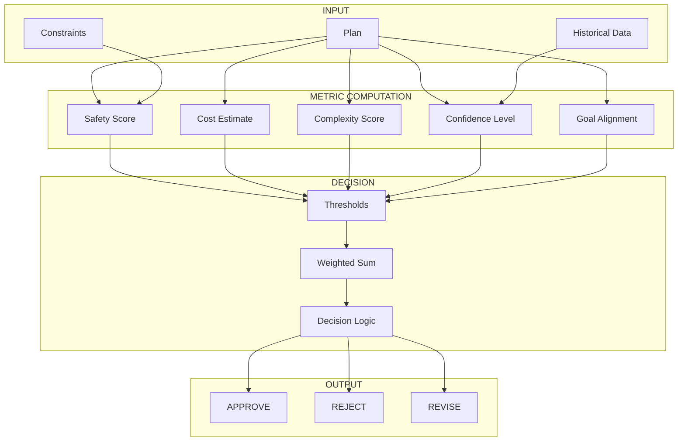

# 05 — Plan Evaluation Framework

**Status:** Phase C0 — Constitution (Authoritative Specification)  
**Authority:** Subordinate to `PROJECT_CONSTITUTION_V4.md` and `01_PLANNER_ARCHITECTURE.md`  
**Purpose:** Define formal evaluation metrics and decision criteria for plan assessment

---

## Purpose

Define the formal evaluation framework that assesses plan quality across multiple dimensions. Every plan must pass through evaluation before reaching the Runtime.

---

## Responsibilities

### Core Responsibilities

1. **Metric Computation** — Calculate evaluation metrics for plans
2. **Decision Determination** — Produce APPROVE/REJECT/REVISE decisions
3. **Comparison** — Enable comparison between alternative plans
4. **Feedback** — Provide actionable feedback for plan improvement

### Non-Responsibilities

| Not Owned By | Owned By |
|-------------|----------|
| Plan generation | Planner |
| Plan execution | Runtime |
| Constraint enforcement | Constraint Engine |
| Approval decisions | Human/Approval Gate |

---

## Evaluation Metrics

### SafetyScore

Measures the safety profile of a plan.

```json
{
  "safetyScore": {
    "score": 0.92,
    "range": [0.0, 1.0],
    "components": {
      "destructivePotential": {
        "score": 0.85,
        "weight": 0.4,
        "details": {
          "destructiveActions": 2,
          "totalActions": 15,
          "canRevert": true
        }
      },
      "reversibility": {
        "score": 0.95,
        "weight": 0.3,
        "details": {
          "reversibleActions": 14,
          "irreversibleActions": 1,
          "hasRollback": true
        }
      },
      "approvalRequirements": {
        "score": 0.88,
        "weight": 0.3,
        "details": {
          "requiredApprovals": 3,
          "automatableActions": 12
        }
      }
    },
    "thresholds": {
      "critical": 0.5,
      "acceptable": 0.75,
      "excellent": 0.9
    }
  }
}
```

**Formula:**

```python
safety_score = (
    destructive_potential * 0.4 +
    reversibility * 0.3 +
    approval_requirements * 0.3
)
```

### CostEstimate

Measures the expected cost of executing a plan.

```json
{
  "costEstimate": {
    "total": 45.0,
    "currency": "USD",
    "breakdown": {
      "time": {
        "estimated": "15m",
        "costPerMinute": 0.50,
        "total": 7.50
      },
      "resources": {
        "compute": 5.00,
        "network": 2.50,
        "storage": 0.00
      },
      "risk": {
        "potentialLoss": 100.00,
        "probability": 0.05,
        "expectedCost": 5.00
      },
      "userEffort": {
        "minutes": 10,
        "costPerMinute": 2.50,
        "total": 25.00
      }
    },
    "confidence": 0.85
  }
}
```

**Formula:**

```python
total_cost = time_cost + resource_cost + risk_cost + user_effort_cost
```

### ComplexityScore

Measures the complexity of a plan.

```json
{
  "complexityScore": {
    "score": 0.45,
    "range": [0.0, 1.0],
    "components": {
      "actionCount": {
        "score": 0.6,
        "weight": 0.25,
        "details": {
          "totalActions": 15,
          "threshold": 10
        }
      },
      "dependencyDepth": {
        "score": 0.5,
        "weight": 0.25,
        "details": {
          "maxDepth": 5,
          "threshold": 3
        }
      },
      "branchingFactor": {
        "score": 0.7,
        "weight": 0.25,
        "details": {
          "maxBranches": 3,
          "threshold": 5
        }
      },
      "failurePoints": {
        "score": 0.4,
        "weight": 0.25,
        "details": {
          "criticalPoints": 2,
          "totalPoints": 15
        }
      }
    },
    "thresholds": {
      "simple": 0.3,
      "moderate": 0.5,
      "complex": 0.7,
      "very_complex": 0.9
    }
  }
}
```

**Formula:**

```python
complexity_score = (
    action_count_score * 0.25 +
    dependency_depth_score * 0.25 +
    branching_factor_score * 0.25 +
    failure_points_score * 0.25
)
```

### ConfidenceLevel

Measures the planner's confidence in plan success.

```json
{
  "confidenceLevel": {
    "score": 0.85,
    "range": [0.0, 1.0],
    "components": {
      "stateCertainty": {
        "score": 0.90,
        "weight": 0.3,
        "details": {
          "worldStateConfidence": 0.95,
          "workspaceStateConfidence": 0.88,
          "constraintConfidence": 0.85
        }
      },
      "historicalSuccess": {
        "score": 0.82,
        "weight": 0.3,
        "details": {
          "similarPlansCount": 23,
          "successRate": 0.87,
          "avgConfidence": 0.85
        }
      },
      "plannerCertainty": {
        "score": 0.83,
        "weight": 0.4,
        "details": {
          "modelConfidence": 0.88,
          "alternativeCount": 3,
          "bestAlternativeMargin": 0.15
        }
      }
    },
    "thresholds": {
      "very_high": 0.9,
      "high": 0.75,
      "moderate": 0.6,
      "low": 0.4
    }
  }
}
```

**Formula:**

```python
confidence = (
    state_certainty * 0.3 +
    historical_success * 0.3 +
    planner_certainty * 0.4
)
```

### GoalAlignment

Measures how well the plan achieves the stated goal.

```json
{
  "goalAlignment": {
    "score": 0.92,
    "range": [0.0, 1.0],
    "components": {
      "directContribution": {
        "score": 0.95,
        "weight": 0.5,
        "details": {
          "goalElementsCovered": 8,
          "totalGoalElements": 8
        }
      },
      "expectedOutcomeQuality": {
        "score": 0.88,
        "weight": 0.3,
        "details": {
          "predictedQuality": 0.9,
          "historicalQuality": 0.87
        }
      },
      "scopeCompleteness": {
        "score": 0.93,
        "weight": 0.2,
        "details": {
          "inScopeElements": 10,
          "totalElements": 11
        }
      }
    },
    "thresholds": {
      "excellent": 0.9,
      "good": 0.75,
      "adequate": 0.6,
      "poor": 0.4
    }
  }
}
```

**Formula:**

```python
goal_alignment = (
    direct_contribution * 0.5 +
    expected_outcome_quality * 0.3 +
    scope_completeness * 0.2
)
```

---

## Decision Outcomes

### APPROVE

The plan meets all criteria and may proceed.

```json
{
  "decision": "APPROVE",
  "reason": "Plan meets all evaluation criteria",
  "metrics": {
    "safetyScore": 0.92,
    "costEstimate": 45.0,
    "complexityScore": 0.45,
    "confidenceLevel": 0.85,
    "goalAlignment": 0.92
  },
  "overallScore": 0.86,
  "approvalLevel": "standard"
}
```

### REJECT

The plan fails critical criteria and cannot proceed.

```json
{
  "decision": "REJECT",
  "reason": "Plan fails critical evaluation criteria",
  "metrics": {
    "safetyScore": 0.35,
    "costEstimate": 500.0,
    "complexityScore": 0.95,
    "confidenceLevel": 0.25,
    "goalAlignment": 0.40
  },
  "failures": [
    {
      "criterion": "safetyScore",
      "expected": ">0.5",
      "actual": 0.35,
      "severity": "critical"
    },
    {
      "criterion": "confidenceLevel",
      "expected": ">0.4",
      "actual": 0.25,
      "severity": "critical"
    }
  ],
  "recommendation": "replan_with_constrained_scope"
}
```

### REVISE

The plan may proceed but requires modifications.

```json
{
  "decision": "REVISE",
  "reason": "Plan meets minimum criteria but has improvement opportunities",
  "metrics": {
    "safetyScore": 0.68,
    "costEstimate": 75.0,
    "complexityScore": 0.65,
    "confidenceLevel": 0.70,
    "goalAlignment": 0.85
  },
  "improvements": [
    {
      "type": "reduce_complexity",
      "current": 0.65,
      "target": 0.5,
      "suggestion": "Consider breaking into two sequential plans"
    },
    {
      "type": "increase_safety",
      "current": 0.68,
      "target": 0.75,
      "suggestion": "Add rollback checkpoints before critical actions"
    }
  ],
  "approvalLevel": "conditional"
}
```

---

## Evaluation Flow



---

## Threshold Configuration

```yaml
evaluation_thresholds:
  safety_score:
    min_approve: 0.75
    min_revice: 0.5
    max_reject: 0.5
  
  cost_estimate:
    max_approve: 100.0
    max_revice: 250.0
  
  complexity_score:
    max_approve: 0.6
    max_revice: 0.8
  
  confidence_level:
    min_approve: 0.7
    min_revice: 0.4
  
  goal_alignment:
    min_approve: 0.8
    min_revice: 0.6
  
  overall_score:
    min_approve: 0.75
    min_revice: 0.5
```

### Weight Configuration

```yaml
evaluation_weights:
  safety_score: 0.30
  cost_estimate: 0.15
  complexity_score: 0.15
  confidence_level: 0.20
  goal_alignment: 0.20

overall_score_formula: |
  overall = (
    safety_score * 0.30 +
    normalized_cost * 0.15 +
    (1 - complexity_score) * 0.15 +
    confidence_level * 0.20 +
    goal_alignment * 0.20
  )
```

---

## Plan Comparison

### Multi-Plan Evaluation

```python
def compare_plans(plans, weights):
    evaluations = []
    
    for plan in plans:
        eval_result = evaluate_plan(plan)
        evaluations.append({
            "plan": plan,
            "metrics": eval_result.metrics,
            "overall_score": compute_weighted_score(
                eval_result.metrics,
                weights
            )
        })
    
    # Sort by overall score
    sorted_plans = sorted(
        evaluations,
        key=lambda x: x["overall_score"],
        reverse=True
    )
    
    return sorted_plans
```

### Comparison Output

```json
{
  "comparison": {
    "plans": [
      {
        "planId": "plan_a",
        "overallScore": 0.86,
        "rank": 1,
        "selected": true,
        "metrics": {
          "safetyScore": 0.92,
          "costEstimate": 45.0,
          "complexityScore": 0.45,
          "confidenceLevel": 0.85,
          "goalAlignment": 0.92
        }
      },
      {
        "planId": "plan_b",
        "overallScore": 0.78,
        "rank": 2,
        "selected": false,
        "metrics": {
          "safetyScore": 0.75,
          "costEstimate": 60.0,
          "complexityScore": 0.55,
          "confidenceLevel": 0.72,
          "goalAlignment": 0.88
        }
      }
    ],
    "recommendation": {
      "selectedPlan": "plan_a",
      "reason": "Highest overall score with balanced metrics",
      "confidence": 0.85
    }
  }
}
```

---

## Decision Log

| Date | Decision | Rationale |
|------|----------|------------|
| PEF-001 | Safety is weighted highest (0.30) | Safety is paramount |
| PEF-002 | Confidence weighted 0.20 | Planner certainty matters |
| PEF-003 | Goal alignment weighted 0.20 | Must achieve objectives |
| PEF-004 | Complexity penalized (1-score) | Lower complexity preferred |
| PEF-005 | REJECT requires critical failure | Safety threshold breach |

---

## Tradeoffs

### Benefits

1. **Objective Assessment** — Metrics provide quantifiable plan quality
2. **Consistency** — Same evaluation criteria every time
3. **Comparability** — Alternative plans can be ranked
4. **Transparency** — Clear rationale for decisions
5. **Auditability** — All metrics logged

### Costs

1. **Complexity** — Multiple metrics to compute
2. **Calibration** — Thresholds need tuning
3. **Weight Sensitivity** — Results depend on weights
4. **False Precision** — Metrics may give false confidence

---

## Failure Modes

| Mode | Detection | Impact | Recovery |
|------|-----------|--------|----------|
| Metric computation error | Exception | Cannot evaluate | Use defaults |
| Insufficient data | Missing fields | Lower confidence | Warn, continue |
| Threshold not configured | Config error | Use defaults | Log warning |
| Timeout | Time limit | Partial evaluation | Use partial results |

---

## Recovery Strategy

```python
def recover_from_evaluation_failure(failure):
    if failure == "METRIC_COMPUTATION_ERROR":
        return use_default_metric()
    elif failure == "INSUFFICIENT_DATA":
        return evaluate_with_warnings()
    elif failure == "THRESHOLD_NOT_CONFIGURED":
        return use_default_thresholds()
    elif failure == "TIMEOUT":
        return use_partial_results()
    else:
        return escalate_to_human()
```

---

## Future Evolution Path

### Phase C1: Learned Weights

- Adjust weights based on outcomes
- Learn from successful vs failed plans
- Personalize to user preferences

### Phase C2: Ensemble Evaluation

- Multiple evaluator models
- Consensus-based decisions
- Confidence through agreement

### Phase C3: Real-time Adjustment

- Adjust thresholds dynamically
- Respond to context changes
- Adaptive evaluation criteria

---

## References

| Document | Role |
|----------|------|
| `PROJECT_CONSTITUTION_V4.md` | Supreme authority |
| `01_PLANNER_ARCHITECTURE.md` | Planner requirements |
| `04_CONSTRAINT_ENGINE_SPEC.md` | Constraint evaluation |
| `16_SUCCESS_METRICS_AND_INTELLIGENCE_BENCHMARKS.md` | Metrics tracking |

---

## Revision History

| Date | Change | Author |
|------|--------|--------|
| 2026-07-10 | Initial C0 Constitution | ACC Planner Evolution Program |
