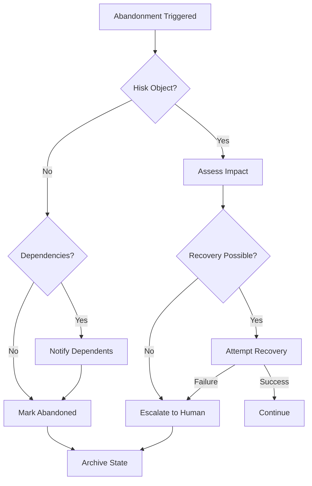

# 06 — Goal Decomposition Engine

**Status:** Phase C0 — Constitution (Authoritative Specification)  
**Authority:** Subordinate to `PROJECT_CONSTITUTION_V4.md` and `01_PLANNER_ARCHITECTURE.md`  
**Purpose:** Define how goals are decomposed into executable plans

---

## Purpose

Define the hierarchy and mechanisms for decomposing user goals into actionable plans. Goal Decomposition transforms high-level intent into structured work.

---

## Responsibilities

### Core Responsibilities

1. **Goal Parsing** — Understand user's stated and implied goals
2. **Objective Extraction** — Identify discrete objectives from goals
3. **Task Decomposition** — Break objectives into manageable tasks
4. **Action Mapping** — Map tasks to executable actions
5. **Dependency Analysis** — Identify inter-task dependencies

### Non-Responsibilities

| Not Owned By | Owned By |
|-------------|----------|
| Goal prioritization | Scheduler |
| Goal scheduling | Scheduler |
| Task execution | Runtime |
| Action capability resolution | Capability Registry |

---

## Goal Hierarchy

### Layer 1: Goal

The user's top-level intent.

```json
{
  "goal": {
    "goalId": "uuid",
    "description": "Deploy the application to production",
    "type": "task|project|lifecycle|maintenance",
    "priority": "critical|high|normal|low",
    "deadline": "ISO8601",
    "origin": "user|scheduler|autonomous",
    "constraints": ["constraint_refs"],
    "context": {
      "userId": "uuid",
      "workspaceId": "uuid",
      "projectId": "uuid"
    },
    "successCriteria": ["criteria"],
    "objectives": ["objective_refs"]
  }
}
```

### Layer 2: Objective

A discrete outcome contributing to the goal.

```json
{
  "objective": {
    "objectiveId": "uuid",
    "goalRef": "goal_uuid",
    "description": "Build and test the application",
    "type": "prerequisite|primary|verification|cleanup",
    "priority": "high|normal|low",
    "dependsOn": ["objective_refs"],
    "tasks": ["task_refs"],
    "successCriteria": ["criteria"],
    "estimatedDuration": "duration",
    "canFailIndependently": true
  }
}
```

### Layer 3: Task

A unit of work contributing to an objective.

```json
{
  "task": {
    "taskId": "uuid",
    "objectiveRef": "objective_uuid",
    "description": "Run the build pipeline",
    "type": "automated|manual|approval",
    "requiredCapabilities": ["capability_refs"],
    "dependsOn": ["task_refs"],
    "actions": ["action_refs"],
    "estimatedDuration": "duration",
    "retryPolicy": {
      "maxRetries": 3,
      "backoff": "exponential"
    },
    "canBeParallelized": false,
    "rollbackOnFailure": true
  }
}
```

### Layer 4: Action

An atomic executable step.

```json
{
  "action": {
    "actionId": "uuid",
    "taskRef": "task_uuid",
    "description": "Execute npm build",
    "capability": "shell_execute",
    "parameters": {...},
    "requiresApproval": false,
    "riskLevel": "low|medium|high|critical",
    "estimatedDuration": "duration",
    "rollbackAction": {
      "capability": "shell_execute",
      "parameters": {"command": "npm run clean"}
    }
  }
}
```

---

## Decomposition Rules

### Goal Granularity

```yaml
goal_granularity:
  min_description_length: 10
  max_objectives_per_goal: 10
  max_tasks_per_objective: 20
  max_actions_per_task: 15
  
validation:
  require_success_criteria: true
  require_deadline: false
  require_priority: true
```

### Maximum Decomposition Depth

```yaml
max_decomposition:
  levels: 4
  level_1: Goal
  level_2: Objective
  level_3: Task
  level_4: Action
  
reasoning:
  "Depth > 4 indicates goal is too broad"
  "Consider breaking into multiple goals"
```

### Task Reuse

```json
{
  "taskReuse": {
    "can_actions_be_reused": true,
    "reuse_threshold": 0.85,
    "reuse_criteria": [
      "same_capability",
      "similar_parameters",
      "same_environment"
    ],
    "reuse_benefits": [
      "faster_planning",
      "proven_actions",
      "consistency"
    ]
  }
}
```

### Independent Failure

```json
{
  "independentFailure": {
    "can_objectives_fail_independently": true,
    "failure_propagation": "configurable",
    "modes": {
      "isolated": "Objective failure doesn't affect siblings",
      "cascading": "Objective failure affects dependents",
      "partial": "Mixed behavior based on failure type"
    }
  }
}
```

### Completion Propagation

```python
def propagate_completion(completion_event):
    # Action completed
    if completion_event.level == "ACTION":
        task = get_task(completion_event.task_ref)
        if all_actions_complete(task):
            complete_task(task)
    
    # Task completed
    if completion_event.level == "TASK":
        objective = get_objective(completion_event.objective_ref)
        if all_tasks_complete(objective):
            complete_objective(objective)
    
    # Objective completed
    if completion_event.level == "OBJECTIVE":
        goal = get_goal(completion_event.goal_ref)
        if all_objectives_complete(goal):
            complete_goal(goal)
```

---

## Goal Abandonment Rules

```yaml
abandonment_rules:
  conditions:
    - name: user_requested
      trigger: user_requests_abandonment
      action: immediate_abandonment
      
    - name: max_retries_exceeded
      trigger: task.exceeds_max_retries
      action: escalate_then_abandon
      
    - name: deadline_missed
      trigger: deadline_passed_without_completion
      action: partial_completion_report_then_abandon
      
    - name: resource_exhausted
      trigger: resources_unavailable_for_extended_period
      action: suspend_then_abandon
      
    - name: cascade_failure
      trigger: critical_objective_fails
      action: assess_then_abandon_or_recover
```

### Abandonment Decision Flow



---

## Decomposition Algorithm

```python
class GoalDecomposer:
    def decompose(self, goal):
        # Phase 1: Parse goal
        parsed = self.parse_goal(goal)
        
        # Phase 2: Extract objectives
        objectives = self.extract_objectives(parsed)
        
        # Phase 3: Decompose to tasks
        tasks = []
        for obj in objectives:
            obj_tasks = self.decompose_objective(obj)
            tasks.extend(obj_tasks)
        
        # Phase 4: Map to actions
        actions = []
        for task in tasks:
            task_actions = self.map_to_actions(task)
            actions.extend(task_actions)
        
        # Phase 5: Analyze dependencies
        dependencies = self.analyze_dependencies(
            objectives, tasks, actions
        )
        
        # Phase 6: Generate plan graph
        graph = self.generate_graph(
            objectives, tasks, actions, dependencies
        )
        
        return DecompositionResult(
            objectives=objectives,
            tasks=tasks,
            actions=actions,
            dependencies=dependencies,
            graph=graph
        )
    
    def parse_goal(self, goal):
        # Extract structured information from goal description
        pass
    
    def extract_objectives(self, parsed_goal):
        # Identify discrete objectives
        pass
    
    def decompose_objective(self, objective):
        # Break objective into tasks
        pass
    
    def map_to_actions(self, task):
        # Map task to executable actions
        pass
    
    def analyze_dependencies(self, objectives, tasks, actions):
        # Identify inter-element dependencies
        pass
    
    def generate_graph(self, objectives, tasks, actions, deps):
        # Generate executable graph
        pass
```

---

## Required Decisions

### Goal Granularity Standards

```yaml
goal_granularity_standards:
  too_coarse:
    symptoms: ["multi-month timeline", "100+ actions", "multiple teams"]
    action: split_into_multiple_goals
    
  appropriate:
    criteria: ["single sprint scope", "<50 actions", "single team"]
    
  too_fine:
    symptoms: ["single action goals", "no meaningful decomposition"]
    action: merge_into_coarser_goal
```

### Dependency Detection

```python
def detect_dependencies(objectives, tasks, actions):
    dependencies = []
    
    for obj in objectives:
        # Check objective dependencies
        for other in objectives:
            if obj.depends_on(other):
                dependencies.append({
                    "type": "objective",
                    "from": other.id,
                    "to": obj.id
                })
    
    for task in tasks:
        # Check task dependencies
        for other in tasks:
            if task.depends_on(other):
                dependencies.append({
                    "type": "task",
                    "from": other.id,
                    "to": task.id
                })
    
    for action in actions:
        # Check action dependencies
        for other in actions:
            if action.depends_on(other):
                dependencies.append({
                    "type": "action",
                    "from": other.id,
                    "to": action.id
                })
    
    return dependencies
```

---

## Decision Log

| Date | Decision | Rationale |
|------|----------|------------|
| GDE-001 | 4-layer hierarchy | Balances expressiveness with complexity |
| GDE-002 | Actions can be reused | Efficiency and consistency |
| GDE-003 | Objectives can fail independently | Modular error handling |
| GDE-004 | Abandonment rules defined | Clear failure semantics |
| GDE-005 | Dependency propagation automatic | Ensures consistency |

---

## Tradeoffs

### Benefits

1. **Clarity** — Clear structure from goal to action
2. **Modularity** — Independent components
3. **Reusability** — Actions can be reused across goals
4. **Debuggability** — Clear failure points
5. **Parallelization** — Independent branches can run in parallel

### Costs

1. **Overhead** — Decomposition adds latency
2. **Complexity** — Multiple layers to manage
3. **Granularity Sensitivity** — Wrong granularity hurts efficiency
4. **Dependency Management** — Complex dependency graphs

---

## Failure Modes

| Mode | Detection | Impact | Recovery |
|------|-----------|--------|----------|
| Goal too broad | >50 actions | Slow planning | Suggest split |
| Goal too narrow | <3 actions | Overhead | Suggest merge |
| Cycle detected | Dependency analysis | Invalid graph | Break cycle |
| Dependency missing | Runtime failure | Task cannot run | Add dependency |
| Decomposition timeout | Time limit | Partial decomposition | Use partial |

---

## Recovery Strategy

```python
def recover_from_decomposition_failure(failure):
    if failure == "GOAL_TOO_BROAD":
        return suggest_goal_split()
    elif failure == "GOAL_TOO_NARROW":
        return merge_with_related_goals()
    elif failure == "CYCLE_DETECTED":
        return break_cycle_heuristically()
    elif failure == "DEPENDENCY_MISSING":
        return add_missing_dependency()
    elif failure == "TIMEOUT":
        return use_partial_decomposition()
    else:
        return escalate_to_human()
```

---

## Future Evolution Path

### Phase C1: Hierarchical Planning

- Multi-level goal hierarchies
- Goal inheritance
- Cross-goal optimization

### Phase C2: Learning Decomposition

- Learn decomposition patterns
- Adapt to user style
- Optimize based on outcomes

### Phase C3: Dynamic Re-decomposition

- Re-decompose on failure
- Adapt to context changes
- Continuous optimization

---

## References

| Document | Role |
|----------|------|
| `PROJECT_CONSTITUTION_V4.md` | Supreme authority |
| `01_PLANNER_ARCHITECTURE.md` | Planner requirements |
| `03_PLAN_GRAPH_SPECIFICATION.md` | Graph structure |
| `SCHEDULER_ABSTRACTION.md` | Scheduling integration |

---

## Revision History

| Date | Change | Author |
|------|--------|--------|
| 2026-07-10 | Initial C0 Constitution | ACC Planner Evolution Program |
