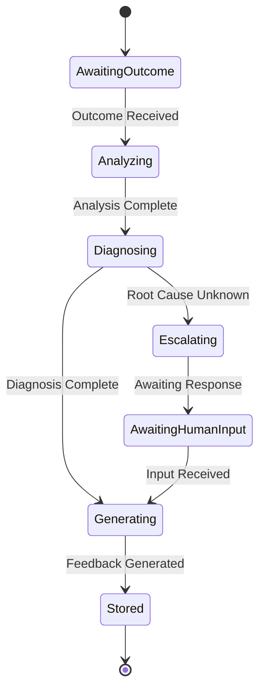

# 07 — Reflection Engine Specification

**Status:** Phase C0 — Constitution (Authoritative Specification)  
**Authority:** Subordinate to `PROJECT_CONSTITUTION_V4.md` and `01_PLANNER_ARCHITECTURE.md`  
**Purpose:** Define how the system learns from execution outcomes

---

## Purpose

Define the reflection mechanisms that enable the planner to learn from past outcomes and improve future planning. Reflection is the sole learning authority in the ACC system.

---

## Responsibilities

### Core Responsibilities

1. **Outcome Analysis** — Analyze execution results (success/failure/partial)
2. **Root Cause Detection** — Identify why outcomes occurred
3. **Feedback Generation** — Produce actionable feedback for planner
4. **Learning Storage** — Store insights in planner memory
5. **Strategy Update** — Update planning strategy based on insights

### Non-Responsibilities

| Not Owned By | Owned By |
|-------------|----------|
| Plan execution | Runtime |
| Memory persistence | Planner Memory |
| Capability changes | Capability Registry |
| User feedback | Human Collaboration Model |

---

## Reflection Lifecycle

### Lifecycle States



### Lifecycle Phases

```json
{
  "reflectionLifecycle": {
    "phases": [
      {
        "phase": "OUTCOME_RECEIVED",
        "description": "Execution outcome received from Runtime",
        "outputs": ["raw_outcome"]
      },
      {
        "phase": "ANALYZING",
        "description": "Analyze what happened",
        "outputs": ["outcome_summary"]
      },
      {
        "phase": "DIAGNOSING",
        "description": "Determine why it happened",
        "outputs": ["root_cause"]
      },
      {
        "phase": "GENERATING",
        "description": "Generate actionable feedback",
        "outputs": ["feedback"]
      },
      {
        "phase": "STORING",
        "description": "Store in planner memory",
        "outputs": ["learned_insight"]
      }
    ],
    "transition_rules": {
      "analyzing_to_diagnosing": "analysis_complete",
      "diagnosing_to_generating": "diagnosis_complete OR escalation_needed",
      "diagnosing_to_escalating": "root_cause_unknown",
      "escalating_to_generating": "human_input_received",
      "generating_to_storing": "feedback_generated"
    }
  }
}
```

---

## Analysis Types

### Success Analysis

```json
{
  "successAnalysis": {
    "outcome": "SUCCESS",
    "goalId": "uuid",
    "planId": "uuid",
    "summary": {
      "actionsExecuted": 15,
      "actionsSucceeded": 15,
      "actionsFailed": 0,
      "duration": "5m",
      "resourcesUsed": {...}
    },
    "successFactors": [
      {
        "factor": "Clear goal definition",
        "confidence": 0.95
      },
      {
        "factor": "Appropriate capabilities used",
        "confidence": 0.92
      },
      {
        "factor": "Good state understanding",
        "confidence": 0.88
      }
    ],
    "reproduciblePatterns": [
      "Same approach worked for similar goals"
    ],
    "potentialOptimizations": [
      "Could have used fewer actions",
      "Some steps could be parallelized"
    ]
  }
}
```

### Failure Analysis

```json
{
  "failureAnalysis": {
    "outcome": "FAILURE",
    "goalId": "uuid",
    "planId": "uuid",
    "failurePoint": {
      "actionId": "action_uuid",
      "actionLabel": "Execute build command",
      "failureType": "EXECUTION_ERROR",
      "errorMessage": "Command exited with code 1"
    },
    "rootCause": {
      "category": "STATE_MISUNDERSTANDING",
      "description": "Build failed because dependency was outdated",
      "confidence": 0.85,
      "evidence": [
        "Dependency version was 1.0",
        "Code requires version 1.5",
        "Error occurred in dependency resolution"
      ]
    },
    "contributingFactors": [
      {
        "factor": "Stale workspace state",
        "confidence": 0.75,
        "impact": "medium"
      },
      {
        "factor": "Missing pre-execution check",
        "confidence": 0.80,
        "impact": "high"
      }
    ],
    "lesson": "Always verify dependency versions before build",
    "plannerImprovement": "Add dependency version check to pre-execution"
  }
}
```

### Partial Success Analysis

```json
{
  "partialSuccessAnalysis": {
    "outcome": "PARTIAL",
    "goalId": "uuid",
    "planId": "uuid",
    "completion": {
      "actionsCompleted": 12,
      "actionsTotal": 15,
      "completionPercentage": 80,
      "uncompletedActions": ["action_uuid_1", "action_uuid_2"]
    },
    "analysis": {
      "whatWorked": [
        "Configuration steps",
        "Setup actions"
      ],
      "whatFailed": [
        "Deployment action due to permission error"
      ],
      "whyPartiallyCompleted": "Deployment step required elevated permissions"
    },
    "impact": {
      "goalAchieved": false,
      "partialValue": "Application is built and tested",
      "remainingValue": "Deployment to production pending"
    },
    "recoverySuggestions": [
      "Request elevated permissions",
      "Deploy with user approval",
      "Skip deployment for now"
    ]
  }
}
```

---

## Root Cause Detection

### Root Cause Categories

```json
{
  "rootCauseCategories": {
    "STATE_MISUNDERSTANDING": {
      "description": "Planner had incorrect or incomplete state",
      "indicators": [
        "Action failed due to unexpected state",
        "Assumed state did not match reality"
      ],
      "resolution": "Refresh state before replanning"
    },
    "CONSTRAINT_VIOLATION": {
      "description": "Plan violated a constraint that wasn't detected",
      "indicators": [
        "Action rejected by runtime",
        "Safety system intervened"
      ],
      "resolution": "Improve constraint checking"
    },
    "CAPABILITY_LIMITATION": {
      "description": "Capability failed or was insufficient",
      "indicators": [
        "Action execution failed",
        "Capability returned error"
      ],
      "resolution": "Update capability catalog"
    },
    "DEPENDENCY_ISSUE": {
      "description": "Missing or incorrect dependency",
      "indicators": [
        "Action failed due to missing prerequisite",
        "Dependency resolution failed"
      ],
      "resolution": "Add dependency to plan"
    },
    "ENVIRONMENTAL": {
      "description": "External factors caused failure",
      "indicators": [
        "Network failure",
        "Resource exhaustion",
        "External service down"
      ],
      "resolution": "Retry or wait for environment recovery"
    },
    "UNKNOWN": {
      "description": "Root cause could not be determined",
      "indicators": [
        "Multiple potential causes",
        "Insufficient evidence"
      ],
      "resolution": "Escalate to human"
    }
  }
}
```

### Root Cause Detection Algorithm

```python
def detect_root_cause(outcome):
    # Collect evidence
    evidence = collect_evidence(outcome)
    
    # Generate hypotheses
    hypotheses = generate_hypotheses(evidence)
    
    # Score hypotheses
    scored_hypotheses = []
    for hypothesis in hypotheses:
        score = calculate_confidence(hypothesis, evidence)
        scored_hypotheses.append((hypothesis, score))
    
    # Sort by confidence
    scored_hypotheses.sort(key=lambda x: x[1], reverse=True)
    
    # Select best hypothesis
    best_hypothesis, confidence = scored_hypotheses[0]
    
    if confidence < MIN_CONFIDENCE_THRESHOLD:
        return RootCause(
            category="UNKNOWN",
            confidence=confidence,
            needs_escalation=True
        )
    
    return RootCause(
        category=best_hypothesis.category,
        description=best_hypothesis.description,
        confidence=confidence,
        evidence=evidence,
        needs_escalation=False
    )
```

---

## Triggers

### What Triggers Reflection?

```json
{
  "reflectionTriggers": {
    "always": [
      "goal_completed",
      "goal_failed",
      "goal_abandoned"
    ],
    "on_request": [
      "planner_requests_reflection",
      "human_requests_reflection"
    ],
    "periodic": [
      "session_summary"
    ]
  }
}
```

### What Triggers Replanning?

```json
{
  "replanTriggers": {
    "immediate": [
      "root_cause_identified",
      "corrective_action_known"
    ],
    "after_reflection": [
      "improvement_identified",
      "strategy_change_needed"
    ],
    "escalate": [
      "root_cause_unknown",
      "repeated_failure",
      "multiple_failures"
    ]
  }
}
```

### Maximum Replan Attempts

```yaml
replan_limits:
  max_replan_attempts: 3
  max_reflection_cycles: 5
  
behavior_on_limit:
  action: escalate
  target: human_reviewer
  reason: "Maximum replan attempts exceeded"
```

### Goal Abandonment Thresholds

```yaml
abandonment_thresholds:
  repeated_failure:
    condition: "same_goal fails 3+ times"
    action: escalate
    
  diminishing_returns:
    condition: "each replan improves <5%"
    action: escalate
    
  extended_duration:
    condition: "goal exceeds 10x estimated duration"
    action: partial_report_then_abandon
    
human_escalation_thresholds:
  - "Root cause unknown"
  - "User intervention required"
  - "Capability limitation identified"
  - "Repeated failures"
```

---

## Feedback Generation

### Feedback Structure

```json
{
  "feedback": {
    "feedbackId": "uuid",
    "goalId": "uuid",
    "planId": "uuid",
    "reflectionType": "success|failure|partial",
    "rootCause": {
      "category": "...",
      "description": "...",
      "confidence": 0.85
    },
    "insights": [
      {
        "type": "what_went_well",
        "description": "...",
        "applicability": ["similar_goals"]
      },
      {
        "type": "what_to_improve",
        "description": "...",
        "applicability": ["similar_goals"]
      },
      {
        "type": "actionable_change",
        "description": "...",
        "target": "planner",
        "implementation": "..."
      }
    ],
    "recommendations": [
      {
        "type": "replan_with_changes",
        "changes": [...],
        "rationale": "..."
      },
      {
        "type": "add_precondition",
        "precondition": "...",
        "rationale": "..."
      }
    ],
    "memoryUpdate": {
      "successfulPattern": {...},
      "failedPattern": {...},
      "strategyAdjustment": {...}
    }
  }
}
```

### Machine-Readable Output

```python
class ReflectionOutput:
    def to_dict(self):
        return {
            "feedback_id": self.feedback_id,
            "goal_id": self.goal_id,
            "outcome": self.outcome,
            "root_cause": {
                "category": self.root_cause.category,
                "description": self.root_cause.description,
                "confidence": self.root_cause.confidence
            },
            "insights": [
                {
                    "type": i.type,
                    "description": i.description,
                    "applicability": i.applicability
                }
                for i in self.insights
            ],
            "recommendations": [
                {
                    "type": r.type,
                    "changes": r.changes
                }
                for r in self.recommendations
            ],
            "memory_update": {
                "store_pattern": r.store_pattern,
                "update_strategy": r.update_strategy
            }
        }
```

---

## EventBus Topics

```json
{
  "reflection_topics": {
    "published": [
      "reflection.outcome_received",
      "reflection.analysis_complete",
      "reflection.diagnosis_complete",
      "reflection.feedback_generated",
      "reflection.stored",
      "reflection.escalated"
    ],
    "subscribed": [
      "execution.complete",
      "execution.failed",
      "planner.reflection_request"
    ]
  }
}
```

---

## Decision Log

| Date | Decision | Rationale |
|------|----------|------------|
| RE-001 | Reflection is mandatory on all outcomes | Learning requires data |
| RE-002 | Root cause must be machine-readable | Enables automation |
| RE-003 | Escalation for unknown root cause | Human judgment needed |
| RE-004 | Maximum replan limits defined | Prevent infinite loops |
| RE-005 | Feedback is actionable | Vague feedback is useless |

---

## Tradeoffs

### Benefits

1. **Learning** — System improves over time
2. **Adaptation** — Responds to changing conditions
3. **Debugging** — Clear understanding of failures
4. **Optimization** — Identifies improvement opportunities
5. **Memory Integration** — Insights persist

### Costs

1. **Latency** — Reflection takes time
2. **Storage** — Storing all outcomes
3. **Complexity** — Multiple analysis types
4. **False Positives** — Incorrect root causes
5. **Maintenance** — Updating reflection logic

---

## Failure Modes

| Mode | Detection | Impact | Recovery |
|------|-----------|--------|----------|
| No outcome received | Timeout | No reflection | Skip, log |
| Analysis fails | Exception | No feedback | Use minimal feedback |
| Root cause unknown | Low confidence | Escalation needed | Escalate |
| Memory write fails | Persistence error | Insight lost | Retry, log |
| Infinite loop detected | Cycle detection | Stop reflection | Break, escalate |

---

## Recovery Strategy

```python
def recover_from_reflection_failure(failure):
    if failure == "NO_OUTCOME":
        return skip_reflection()
    elif failure == "ANALYSIS_FAILED":
        return use_minimal_feedback()
    elif failure == "ROOT_CAUSE_UNKNOWN":
        return escalate_to_human()
    elif failure == "MEMORY_WRITE_FAILED":
        return retry_or_log()
    elif failure == "INFINITE_LOOP":
        return break_and_escalate()
    else:
        return escalate_to_human()
```

---

## Future Evolution Path

### Phase C1: Deep Learning Integration

- Neural network-based root cause detection
- Learned patterns from historical data
- Predictive reflection

### Phase C2: Collaborative Reflection

- Multi-agent reflection
- Shared learning across instances
- Collective intelligence

### Phase C3: Real-time Reflection

- Streaming outcome analysis
- Continuous improvement
- Dynamic strategy adjustment

---

## References

| Document | Role |
|----------|------|
| `PROJECT_CONSTITUTION_V4.md` | Supreme authority |
| `01_PLANNER_ARCHITECTURE.md` | Planner requirements |
| `08_PLANNER_MEMORY_SPEC.md` | Memory integration |
| `16_SUCCESS_METRICS_AND_INTELLIGENCE_BENCHMARKS.md` | Metrics tracking |

---

## Revision History

| Date | Change | Author |
|------|--------|--------|
| 2026-07-10 | Initial C0 Constitution | ACC Planner Evolution Program |
