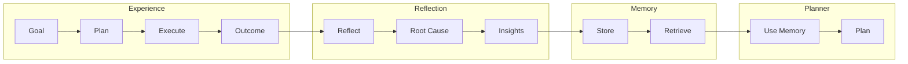

# 08 — Planner Memory Specification

**Status:** Phase C0 — Constitution (Authoritative Specification)  
**Authority:** Subordinate to `PROJECT_CONSTITUTION_V4.md` and `01_PLANNER_ARCHITECTURE.md`  
**Purpose:** Define how the planner learns from experience over time

---

## Purpose

Define the long-term memory system that enables the planner to improve through experience. Planner Memory is how ACC becomes smarter over time without retraining foundation models.

---

## Responsibilities

### Core Responsibilities

1. **Pattern Storage** — Store successful and failed plan patterns
2. **Experience Retention** — Maintain historical outcomes
3. **Retrieval Optimization** — Enable efficient memory retrieval
4. **Decay Management** — Age out obsolete memories
5. **Learning Integration** — Feed insights to planner

### Non-Responsibilities

| Not Owned By | Owned By |
|-------------|----------|
| Reflection execution | Reflection Engine |
| Plan generation | Planner |
| Memory persistence | Storage Layer |
| World Model data | World Model |

---

## Memory Structures

### Successful Plans

```json
{
  "successfulPlan": {
    "patternId": "uuid",
    "planType": "deployment|configuration|maintenance|...",
    "goalPattern": "Deploy * to * when *",
    "graphStructure": {
      "nodeCount": 15,
      "depth": 5,
      "branchingFactor": 2
    },
    "contextSnapshot": {
      "workspaceType": "python",
      "hasTests": true,
      "hasCI": true
    },
    "successRate": 1.0,
    "usageCount": 5,
    "lastUsed": "ISO8601",
    "createdAt": "ISO8601",
    "effectiveness": 0.92
  }
}
```

### Failed Plans

```json
{
  "failedPlan": {
    "patternId": "uuid",
    "planType": "deployment",
    "goalPattern": "Deploy * to * without tests",
    "failureMode": "deployment_failed",
    "rootCauses": ["missing_tests", "insufficient_validation"],
    "graphStructure": {
      "nodeCount": 12,
      "depth": 4,
      "branchingFactor": 2
    },
    "failureCount": 3,
    "lastFailed": "ISO8601",
    "lessons": [
      "Always include test step before deployment",
      "Add validation checkpoint"
    ]
  }
}
```

### Goal Outcomes

```json
{
  "goalOutcome": {
    "outcomeId": "uuid",
    "goalId": "uuid",
    "goalDescription": "Deploy application",
    "outcome": "success|partial|failure",
    "metrics": {
      "duration": "5m",
      "cost": 2.50,
      "retries": 0
    },
    "contextSnapshot": {...},
    "planId": "uuid",
    "completedAt": "ISO8601",
    "reflectionId": "uuid"
  }
}
```

### Reflection Results

```json
{
  "reflectionResult": {
    "resultId": "uuid",
    "reflectionId": "uuid",
    "outcomeId": "uuid",
    "rootCause": {
      "category": "state_misunderstanding",
      "confidence": 0.85
    },
    "insights": [
      {
        "type": "pattern",
        "description": "Stale state causes build failures",
        "applicability": "similar_goals"
      }
    ],
    "plannerAdjustments": [
      {
        "type": "precondition",
        "description": "Verify dependency freshness",
        "confidence": 0.80
      }
    ],
    "storedAt": "ISO8601"
  }
}
```

### Evaluation Scores

```json
{
  "evaluationScore": {
    "scoreId": "uuid",
    "planId": "uuid",
    "scores": {
      "safetyScore": 0.92,
      "costEstimate": 45.0,
      "complexityScore": 0.45,
      "confidenceLevel": 0.85,
      "goalAlignment": 0.92
    },
    "outcomeScore": 0.88,
    "predictionAccuracy": 0.78,
    "storedAt": "ISO8601"
  }
}
```

### Replanning History

```json
{
  "replanHistory": {
    "replanId": "uuid",
    "originalPlanId": "uuid",
    "newPlanId": "uuid",
    "replanReason": "action_failed|constraint_violated|...",
    "attemptNumber": 2,
    "maxAttempts": 3,
    "outcome": "success",
    "improvement": 0.15,
    "storedAt": "ISO8601"
  }
}
```

---

## Retention Policies

### Time-Based Retention

```yaml
retention_time:
  recent_goals: 90d
  successful_patterns: 365d
  failed_patterns: 180d
  evaluation_scores: 180d
  reflection_insights: 365d
  
reasoning:
  "Keep recent goals for pattern matching"
  "Retain successful patterns longer"
  "Short retention for failed patterns (avoid bias)"
```

### Usage-Based Retention

```yaml
retention_usage:
  min_usage_count: 1
  max_age_without_usage: 180d
  decay_rate: 0.95 per quarter
  
action_on_decay:
  if below_threshold: archive
  if still_referenced: preserve
```

### Value-Based Retention

```yaml
retention_value:
  high_value_patterns:
    criteria: "success_rate > 0.9 AND usage_count > 10"
    retention: permanent
    
  medium_value_patterns:
    criteria: "success_rate > 0.7"
    retention: 365d
    
  low_value_patterns:
    criteria: "success_rate < 0.7"
    retention: 90d
```

---

## Decay Rules

### Information Decay

```python
class MemoryDecay:
    def calculate_decay(self, memory, current_time):
        age_days = (current_time - memory.created_at).days
        
        # Base decay
        base_decay = 0.95 ** (age_days / 90)
        
        # Usage boost
        usage_boost = min(1.0, 1 + (memory.usage_count * 0.01))
        
        # Success boost
        success_boost = 0.5 + (memory.success_rate * 0.5)
        
        # Final decay
        final_decay = base_decay * usage_boost * success_boost
        
        return max(0.1, min(1.0, final_decay))
    
    def should_evict(self, memory, current_time):
        decay = self.calculate_decay(memory, current_time)
        return decay < DECAY_THRESHOLD
```

### Decay Thresholds

```yaml
decay_thresholds:
  eviction_threshold: 0.1
  warning_threshold: 0.3
  refresh_threshold: 0.5
  
action_on_threshold:
  eviction: "Remove from active memory"
  warning: "Flag for review"
  refresh: "Consider reinforcement"
```

---

## Retrieval Rules

### Memory Retrieval

```python
class MemoryRetriever:
    def retrieve(self, query):
        # 1. Compute query embedding
        query_embedding = self.embed(query)
        
        # 2. Find similar memories
        candidates = self.vector_search(
            query_embedding,
            top_k=MAX_CANDIDATES
        )
        
        # 3. Filter by recency
        recent = self.filter_by_recency(candidates, RECENCY_THRESHOLD)
        
        # 4. Filter by relevance
        relevant = self.filter_by_relevance(recent, RELEVANCE_THRESHOLD)
        
        # 5. Rank by combined score
        ranked = self.rank_memories(relevant, query)
        
        return ranked[:MAX_RESULTS]
    
    def rank_memories(self, memories, query):
        for memory in memories:
            # Relevance score
            relevance = memory.similarity_score
            
            # Recency score
            recency = self.compute_recency_score(memory)
            
            # Usage score
            usage = self.compute_usage_score(memory)
            
            # Success score
            success = memory.success_rate
            
            # Combined score
            memory.combined_score = (
                relevance * 0.4 +
                recency * 0.2 +
                usage * 0.2 +
                success * 0.2
            )
        
        return sorted(memories, key=lambda m: m.combined_score, reverse=True)
```

### Retrieval Criteria

```yaml
retrieval:
  similarity_threshold: 0.7
  max_results: 10
  recency_boost_days: 30
  
ranking_weights:
  similarity: 0.4
  recency: 0.2
  usage: 0.2
  success: 0.2
```

---

## Ranking Algorithms

### Pattern Ranking

```python
def rank_patterns(patterns, query_context):
    scored_patterns = []
    
    for pattern in patterns:
        # Compute various scores
        similarity = compute_similarity(pattern.goal_pattern, query_context.goal)
        recency = compute_recency(pattern.last_used)
        success = pattern.success_rate
        usage = compute_usage_frequency(pattern)
        
        # Context match bonus
        context_bonus = compute_context_match(
            pattern.context_snapshot,
            query_context
        )
        
        # Combined score
        score = (
            similarity * 0.35 +
            success * 0.25 +
            recency * 0.15 +
            usage * 0.10 +
            context_bonus * 0.15
        )
        
        scored_patterns.append((pattern, score))
    
    return sorted(scored_patterns, key=lambda x: x[1], reverse=True)
```

---

## How ACC Becomes Smarter

### Learning Loop



### Capability Growth

```
Version 1: Basic deployment planning
    ↓ (100 deployments)
Version 2: Understands test requirements
    ↓ (200 deployments)
Version 3: Knows when to add validation
    ↓ (500 deployments)
Version 4: Predicts failure modes
    ↓ (1000+ deployments)
Version N: Expert deployment planner
```

---

## Memory Limits

```yaml
memory_limits:
  max_patterns: 10000
  max_goal_outcomes: 50000
  max_reflection_results: 25000
  max_evaluation_scores: 50000
  
total_storage_mb: 500

eviction_policy:
  when_limit_reached:
    strategy: lru_with_decay
    preserve_high_value: true
```

---

## Eviction Policies

```yaml
eviction_policies:
  lru:
    description: "Least recently used evicted first"
    use_case: "General purpose"
    
  lfu:
    description: "Least frequently used evicted first"
    use_case: "Usage-based importance"
    
  decay_based:
    description: "Low decay scores evicted first"
    use_case: "Value-based importance"
    
  value_based:
    description: "Low value scores evicted first"
    use_case: "Success-rate based"
```

---

## Similarity Matching

### Pattern Matching

```python
class PatternMatcher:
    def find_similar(self, goal, context):
        # 1. Parse goal into components
        goal_components = self.parse_goal(goal)
        
        # 2. Build match query
        query = {
            "action_types": goal_components.actions,
            "workspace_type": context.workspace_type,
            "has_tests": context.has_tests,
            "has_ci": context.has_ci
        }
        
        # 3. Find patterns
        patterns = self.memory.find_patterns(query)
        
        # 4. Score by match quality
        scored = []
        for pattern in patterns:
            score = self.score_match(pattern, goal_components, context)
            scored.append((pattern, score))
        
        return sorted(scored, key=lambda x: x[1], reverse=True)
```

### Similarity Metrics

```json
{
  "similarityMetrics": {
    "goal_similarity": {
      "method": "embedding_similarity",
      "weight": 0.4
    },
    "context_similarity": {
      "method": "feature_overlap",
      "weight": 0.3
    },
    "structure_similarity": {
      "method": "graph_similarity",
      "weight": 0.2
    },
    "outcome_similarity": {
      "method": "success_rate_comparison",
      "weight": 0.1
    }
  }
}
```

---

## Decision Log

| Date | Decision | Rationale |
|------|----------|------------|
| PM-001 | Memory is separate from World Model | Different purposes |
| PM-002 | Decay-based retention | Prevents stale data |
| PM-003 | Value-based preservation | Keep high-value patterns |
| PM-004 | Pattern-based storage | Enables generalization |
| PM-005 | Separate from Foundation Model | No retraining needed |

---

## Tradeoffs

### Benefits

1. **Learning** — System improves without retraining
2. **Adaptation** — Responds to user patterns
3. **Efficiency** — Reuses proven approaches
4. **Personalization** — Adapts to user preferences
5. **Resilience** — Avoids repeated mistakes

### Costs

1. **Storage** — Memory grows over time
2. **Retrieval Latency** — Search overhead
3. **Bias Risk** — Past success may not apply
4. **Decay Complexity** — Multiple decay policies
5. **Maintenance** — Memory management overhead

---

## Failure Modes

| Mode | Detection | Impact | Recovery |
|------|-----------|--------|----------|
| Memory unavailable | Storage error | No retrieval | Use defaults |
| Retrieval timeout | Time limit | Delayed planning | Skip memory |
| Storage full | Limit reached | Cannot store | Evict old |
| Corruption | Integrity check | Invalid patterns | Purge, rebuild |
| Decay failure | Exception | Stale data | Force refresh |

---

## Recovery Strategy

```python
def recover_from_memory_failure(failure):
    if failure == "MEMORY_UNAVAILABLE":
        return use_default_patterns()
    elif failure == "RETRIEVAL_TIMEOUT":
        return plan_without_memory()
    elif failure == "STORAGE_FULL":
        return evict_and_retry()
    elif failure == "CORRUPTION":
        return purge_and_rebuild()
    elif failure == "DECAY_FAILURE":
        return force_refresh()
    else:
        return escalate_to_human()
```

---

## Future Evolution Path

### Phase C1: Deep Memory Integration

- Neural memory networks
- Learned representations
- Predictive retrieval

### Phase C2: Cross-Instance Memory

- Shared memory across instances
- Federated learning
- Collaborative intelligence

### Phase C3: Meta-Learning

- Learning to learn
- Strategy adaptation
- Self-optimizing memory

---

## References

| Document | Role |
|----------|------|
| `PROJECT_CONSTITUTION_V4.md` | Supreme authority |
| `01_PLANNER_ARCHITECTURE.md` | Planner requirements |
| `07_REFLECTION_ENGINE_SPEC.md` | Reflection integration |
| `16_SUCCESS_METRICS_AND_INTELLIGENCE_BENCHMARKS.md` | Metrics tracking |

---

## Revision History

| Date | Change | Author |
|------|--------|--------|
| 2026-07-10 | Initial C0 Constitution | ACC Planner Evolution Program |
