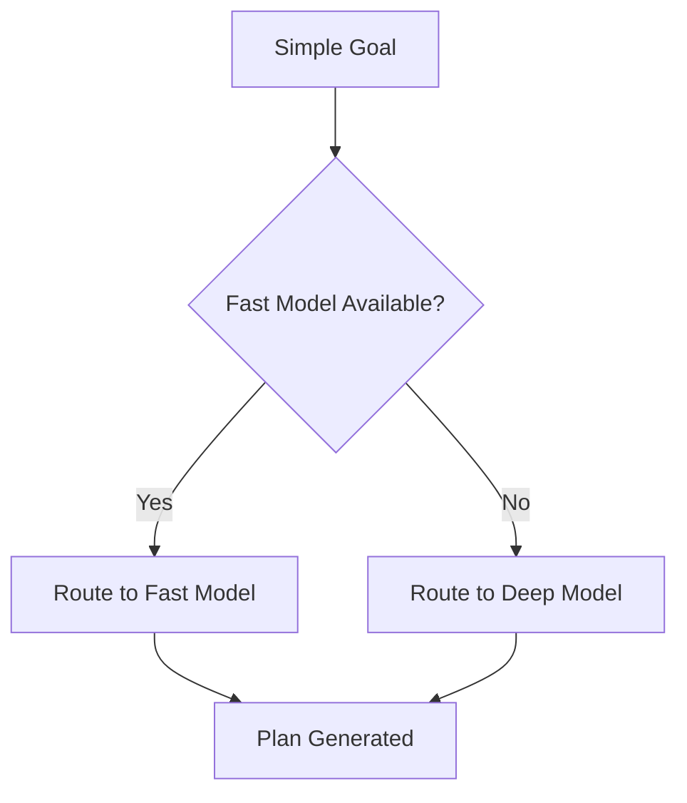
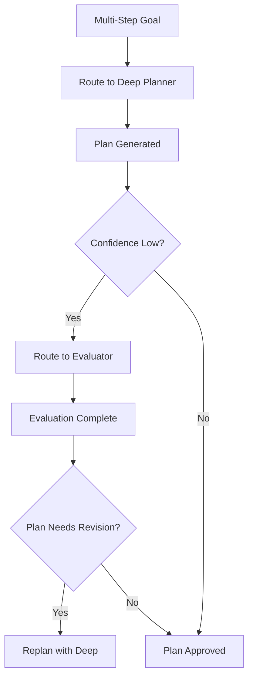
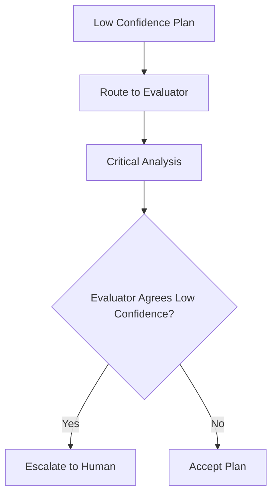
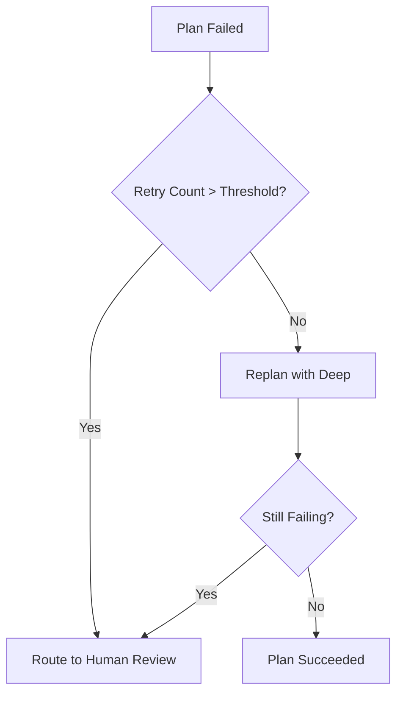

# 09 — Model Routing Specification

**Status:** Phase C0 — Constitution (Authoritative Specification)  
**Authority:** Subordinate to `PROJECT_CONSTITUTION_V4.md` and `01_PLANNER_ARCHITECTURE.md`  
**Purpose:** Define how different planning tasks are routed to appropriate models

---

## Purpose

Define the model routing system that selects the appropriate AI model for different planning tasks. Different models are optimal for different complexity levels.

---

## Responsibilities

### Core Responsibilities

1. **Model Selection** — Select optimal model for each task
2. **Cost Control** — Manage compute costs
3. **Latency Management** — Meet response time targets
4. **Fallback Management** — Handle model failures
5. **Escalation** — Route to higher-capability models when needed

### Non-Responsibilities

| Not Owned By | Owned By |
|-------------|----------|
| Model hosting | Infrastructure |
| Model training | Model providers |
| Capability catalog | Capability Registry |
| Token counting | Context Builder |

---

## Model Types

### Fast Planner

Purpose: Simple goals, fast decisions, low cost.

```json
{
  "model": {
    "modelId": "fast_planner",
    "name": "Qwen 2.5",
    "type": "fast",
    "capabilities": [
      "simple_planning",
      "pattern_matching",
      "quick_responses"
    ],
    "limitations": [
      "complex_reasoning",
      "multi_step_planning",
      "deep_analysis"
    ],
    "performance": {
      "avg_latency_ms": 500,
      "p95_latency_ms": 1000,
      "cost_per_1k_tokens": 0.001
    },
    "use_cases": [
      "single_action_goals",
      "pattern_based_planning",
      "routine_tasks"
    ]
  }
}
```

### Deep Planner

Purpose: Complex reasoning, DAG generation, goal decomposition.

```json
{
  "model": {
    "modelId": "deep_planner",
    "name": "Claude 3.5 Sonnet",
    "type": "deep",
    "capabilities": [
      "complex_reasoning",
      "multi_step_planning",
      "goal_decomposition",
      "constraint_reasoning",
      "risk_assessment"
    ],
    "limitations": [
      "latency",
      "cost"
    ],
    "performance": {
      "avg_latency_ms": 3000,
      "p95_latency_ms": 8000,
      "cost_per_1k_tokens": 0.015
    },
    "use_cases": [
      "complex_deployment_plans",
      "multi_objective_optimization",
      "novel_situations"
    ]
  }
}
```

### Evaluator Model

Purpose: Independent critique, risk analysis, validation.

```json
{
  "model": {
    "modelId": "evaluator",
    "name": "Claude 3.5 Sonnet",
    "type": "evaluator",
    "capabilities": [
      "critical_analysis",
      "risk_assessment",
      "validation",
      "quality_assessment"
    ],
    "limitations": [
      "planning",
      "generation"
    ],
    "performance": {
      "avg_latency_ms": 2000,
      "p95_latency_ms": 5000,
      "cost_per_1k_tokens": 0.015
    },
    "use_cases": [
      "plan_evaluation",
      "safety_assessment",
      "constraint_validation"
    ]
  }
}
```

---

## Routing Rules

### Simple Goal Routing



```python
def route_simple_goal(goal):
    if is_simple_goal(goal):
        if fast_model_available():
            return RouteDecision(
                model="fast_planner",
                rationale="Simple goal, fast response desired"
            )
        else:
            return RouteDecision(
                model="deep_planner",
                rationale="Fast model unavailable, use deep"
            )
```

### Multi-Step Goal Routing



### Low Confidence Routing



### Repeated Failure Routing



---

## Routing Decision Matrix

| Goal Type | Primary Model | Evaluator | Fallback |
|-----------|--------------|-----------|----------|
| Single Action | Fast | Never | Deep |
| Routine Pattern | Fast | Never | Deep |
| Multi-Step | Deep | Optional | Human |
| Complex | Deep | Always | Human |
| Novel | Deep | Always | Human |
| High Risk | Deep | Always | Human |
| Repeated Failure | Deep | Always | Human |

---

## Escalation Rules

### When to Escalate

```json
{
  "escalationRules": {
    "confidence_threshold": {
      "value": 0.4,
      "action": "escalate",
      "target": "human_reviewer"
    },
    "complexity_threshold": {
      "value": 0.8,
      "action": "escalate",
      "target": "deep_planner_with_evaluator"
    },
    "failure_threshold": {
      "value": 3,
      "action": "escalate",
      "target": "human_reviewer"
    },
    "cost_threshold": {
      "value": 10.0,
      "action": "warn_then_escalate",
      "target": "user_confirmation"
    }
  }
}
```

### Escalation Flow

```python
def escalate(decision_context):
    if decision_context.confidence < ESCALATION_CONFIDENCE_THRESHOLD:
        return EscalationDecision(
            reason="low_confidence",
            target="human_reviewer",
            urgency="high"
        )
    
    if decision_context.retry_count > MAX_RETRIES:
        return EscalationDecision(
            reason="repeated_failure",
            target="human_reviewer",
            urgency="high"
        )
    
    if decision_context.complexity > COMPLEXITY_THRESHOLD:
        return EscalationDecision(
            reason="high_complexity",
            target="deep_planner_with_evaluator",
            urgency="normal"
        )
    
    return None
```

---

## Fallback Rules

### Model Fallback

```json
{
  "fallbackRules": {
    "fast_model_unavailable": {
      "primary": "fast_planner",
      "fallback": "deep_planner",
      "fallback_rationale": "Deep model can handle all fast model tasks"
    },
    "deep_model_unavailable": {
      "primary": "deep_planner",
      "fallback": "fast_planner",
      "fallback_rationale": "Fast model may produce simpler plan",
      "warnings": ["May not handle complex goals optimally"]
    },
    "evaluator_unavailable": {
      "primary": "evaluator",
      "fallback": "skip_evaluation",
      "fallback_rationale": "Continue without independent validation",
      "warnings": ["Reduced safety assurance"]
    }
  }
}
```

### Recovery from Fallback

```python
def handle_model_failure(failure_context):
    if failure_context.model == "fast_planner":
        return FallbackDecision(
            new_model="deep_planner",
            preserve_context=True,
            warnings=["Increased latency expected"]
        )
    
    if failure_context.model == "deep_planner":
        return FallbackDecision(
            new_model="fast_planner",
            preserve_context=True,
            warnings=["Plan may be simplified"]
        )
    
    if failure_context.model == "evaluator":
        return FallbackDecision(
            new_model=None,
            preserve_context=True,
            warnings=["Proceeding without evaluation"]
        )
```

---

## Cost Controls

### Budget Configuration

```json
{
  "costControls": {
    "session_budget": {
      "max_cost_usd": 10.0,
      "reset_period": "daily",
      "action_on_exhausted": "warn_user"
    },
    "per_request_limits": {
      "fast_model": {
        "max_tokens": 2000,
        "max_cost": 0.05
      },
      "deep_model": {
        "max_tokens": 8000,
        "max_cost": 0.50
      },
      "evaluator": {
        "max_tokens": 4000,
        "max_cost": 0.25
      }
    },
    "routing_optimization": {
      "prefer_cheaper": true,
      "threshold": 0.8,
      "rationale": "Use fast model when confidence is high"
    }
  }
}
```

### Cost-Aware Routing

```python
def cost_aware_route(goal, budget_remaining):
    # Check if budget allows deep model
    if budget_remaining < deep_model_cost:
        if is_simple_goal(goal):
            return RouteDecision(
                model="fast_planner",
                rationale=f"Budget limited: ${budget_remaining:.2f}"
            )
        else:
            return EscalationDecision(
                reason="insufficient_budget",
                target="user_confirmation",
                budget_required=deep_model_cost,
                budget_available=budget_remaining
            )
    
    # Normal routing
    return normal_route(goal)
```

---

## Latency Targets

### Performance Targets

```json
{
  "latencyTargets": {
    "fast_model": {
      "avg_ms": 500,
      "p50_ms": 400,
      "p95_ms": 1000,
      "p99_ms": 2000
    },
    "deep_model": {
      "avg_ms": 3000,
      "p50_ms": 2500,
      "p95_ms": 8000,
      "p99_ms": 15000
    },
    "evaluator": {
      "avg_ms": 2000,
      "p50_ms": 1500,
      "p95_ms": 5000,
      "p99_ms": 10000
    }
  }
}
```

### Latency Budget Allocation

```json
{
  "latencyBudget": {
    "total_target_ms": 5000,
    "allocation": {
      "model_inference": 0.6,
      "context_preparation": 0.2,
      "post_processing": 0.1,
      "buffer": 0.1
    }
  }
}
```

---

## Example Routing Decisions

### Example 1: Simple File Create

```
Input: "Create a new file called test.py"

Routing Analysis:
- Goal Type: Single Action
- Complexity: Low
- Risk: Low
- Confidence Expected: High

Decision:
- Model: Fast Planner (Qwen 2.5)
- Evaluation: Not Required
- Fallback: Deep Planner
- Expected Latency: ~500ms
- Expected Cost: $0.002
```

### Example 2: Complex Deployment

```
Input: "Deploy the application to production with blue-green deployment"

Routing Analysis:
- Goal Type: Multi-Step, Complex
- Complexity: High
- Risk: High
- Confidence Expected: Variable

Decision:
- Model: Deep Planner (Claude 3.5)
- Evaluation: Required (Evaluator)
- Fallback: Human Review
- Expected Latency: ~10s
- Expected Cost: $0.80
```

### Example 3: Failed Plan Recovery

```
Input: Previous plan failed, retry requested

Routing Analysis:
- Goal Type: Retry
- Failure Count: 2
- Confidence Expected: Low

Decision:
- Model: Deep Planner (Claude 3.5)
- Evaluation: Required
- Fallback: Human Review
- Expected Latency: ~12s
- Expected Cost: $0.95
```

---

## Decision Log

| Date | Decision | Rationale |
|------|----------|------------|
| MR-001 | Fast model for simple goals | Cost and latency efficiency |
| MR-002 | Deep model with evaluator for complex | Quality assurance |
| MR-003 | Budget-based fallback | Cost control |
| MR-004 | Confidence-based escalation | Prevents low-quality output |
| MR-005 | Failure-based escalation | Human judgment needed |

---

## Tradeoffs

### Benefits

1. **Cost Efficiency** — Use cheaper models when appropriate
2. **Latency Optimization** — Fast response for simple tasks
3. **Quality Assurance** — Deep models for complex tasks
4. **Safety** — Evaluator provides independent validation
5. **Scalability** — Resource-efficient routing

### Costs

1. **Complexity** — Multiple models to manage
2. **Routing Logic** — Decision overhead
3. **Context Switching** — Moving between models
4. **Fallback Complexity** — Multiple fallback paths
5. **Monitoring** — Need to track all models

---

## Failure Modes

| Mode | Detection | Impact | Recovery |
|------|-----------|--------|----------|
| Model unavailable | API error | Cannot route | Use fallback |
| Timeout | Time limit | Delayed response | Retry or fallback |
| High cost | Budget exceeded | Budget impact | Warn or block |
| Low confidence | Score < threshold | Quality risk | Escalate |
| Cascading failure | Multiple failures | System failure | Human review |

---

## Recovery Strategy

```python
def recover_from_routing_failure(failure):
    if failure == "MODEL_UNAVAILABLE":
        return use_fallback_model()
    elif failure == "TIMEOUT":
        return retry_with_timeout_increase()
    elif failure == "HIGH_COST":
        return warn_and_confirm()
    elif failure == "LOW_CONFIDENCE":
        return escalate_to_human()
    elif failure == "CASCADING_FAILURE":
        return enter_safe_mode()
    else:
        return escalate_to_human()
```

---

## Future Evolution Path

### Phase C1: Learned Routing

- Predict optimal model from goal characteristics
- Learn from routing outcomes
- Optimize routing over time

### Phase C2: Dynamic Model Selection

- Real-time model availability
- Load-based routing
- Performance-aware selection

### Phase C3: Hybrid Routing

- Multiple models in parallel
- Consensus-based decisions
- Ensemble planning

---

## References

| Document | Role |
|----------|------|
| `PROJECT_CONSTITUTION_V4.md` | Supreme authority |
| `01_PLANNER_ARCHITECTURE.md` | Planner requirements |
| `05_PLAN_EVALUATION_FRAMEWORK.md` | Evaluation integration |
| `MODEL_ORCHESTRATION.md` | Model infrastructure |

---

## Revision History

| Date | Change | Author |
|------|--------|--------|
| 2026-07-10 | Initial C0 Constitution | ACC Planner Evolution Program |
