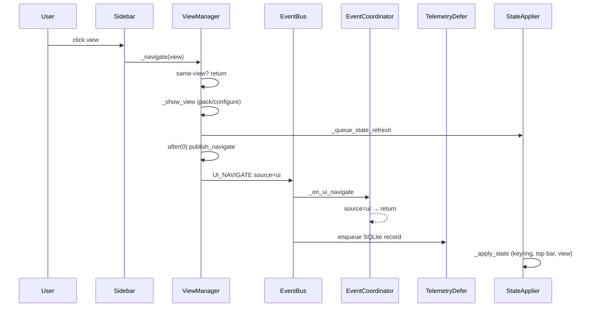

# Performance Root Cause Analysis — AI Command Center UI Freeze / Unresponsiveness

| Field | Value |
|---|---|
| **Date** | 2026-07-24 |
| **Scope** | Production freeze / not-responding reports during idle + navigation |
| **Codebase tip** | `main` @ `b36076b` (includes #106, #107, #108) |
| **Method** | Static call-graph audit + headless instrumentation (`create_application`) + user production logs |
| **Environment caveat** | GUI is Windows-ARM64-only (`main.py` `is_arm64()` gate). Tk frame times, Tcl lock stalls, and widget rebuild cost **cannot** be measured on the Linux CI host. Those conclusions cite user logs + code paths. |

**This document is investigation-only.** It does not implement fixes.

---

## 1. Executive Summary

Reported freezes are **multi-cause**, not a single slow function. Evidence shows three interacting layers:

1. **Event amplification / recursion (historical, partially mitigated)**  
   `ui.navigate` storms (dozens–hundreds of publishes) with ~30–45 ms per handler exceedance, matching a recursive publish path. Fixes landed in #106–#108, but user logs repeatedly lacked `handler=` / `ACC_UI_RUNTIME freeze_fix=…`, proving **old binaries were still running** during several report cycles.

2. **Cross-thread Tk wake (historical, mitigated in code)**  
   `ollama.status` handlers exceeding **6–18 seconds** match blocking `event_generate` off the Tk thread (Tcl interpreter lock). Mitigated by thread-safe `UIQueue` + removing UI subscription to `OLLAMA_STATUS`. Same fingerprint problem: old process ⇒ old path.

3. **Still-live structural load (present on current `main`)**  
   Even with navigate guards, the architecture retains high baseline cost:
   - **78 AppState reducers** run on **every** AppState topic event, then full `AppState` equality (`100` fields).
   - **`_apply_state`** runs broad shell projection + **keyring probe** on every refresh.
   - **`settings.snapshot` fan-out = 9 SYNC_CRITICAL handlers**; a single settings write published **2** snapshots; headless measured **`OpenAIHttpService._on_settings_snapshot` = 190 ms** (budget 5 ms).
   - **`system.snapshot` @ 2 Hz** continuous.
   - **UI_COMMAND / ExecutionAuthority** still SYNC_CRITICAL on the publishing thread (Tk when user submits).
   - Dual projection (AppState listener + EventCoordinator) for several topics.
   - Telemetry SQLite still sync for most topics (`ASYNC_QUEUE` ignored for `SYNC_CRITICAL`; adapters default off).
   - SQLite uses default **DELETE** journal (no WAL pragma).
   - Open inspectors rebuild on every AppState notify.

**Bottom line:** Production freezes were dominated by (a) running pre-fix builds + (b) navigate/Tcl storms. Remaining risk on current code is **accumulated sync work on the UI/publish thread** under settings changes, chat streaming, AppState notify storms, and open inspectors — not a single 18 s Ollama HTTP call (health timeouts are 1 s/2 s).

---

## 2. Ranked Top 20 Bottlenecks

Severity scale: **S0** catastrophic freeze · **S1** multi-second hang · **S2** sustained jank · **S3** budget noise / latent risk.

| Rank | Severity | Bottleneck | Evidence | Root cause | Affected | Est. impact | Confidence |
|---:|---|---|---|---|---|---|---|
| 1 | S0 | **Stale runtime** (pre-#106/#107/#108 process) | User logs: budget lines without `handler=`; no `ACC_UI_RUNTIME freeze_fix=`; `ollama.status` 6–18 s. Current code formats include `handler=` (`event_bus.py` ~500–514) and prints `freeze_fix=v4` (`main.py`). | Operator/install lag (repo pull without restart / old MSI / wrong `sys.path`) | All freeze symptoms | Explains most filed reports | **High** |
| 2 | S0 | **`UI_NAVIGATE` feedback loop** (pre-#106) | Loop: `_navigate` → publish → EventCoordinator → `_navigate` → publish. Mitigations: `event_coordinator.py:62-80`, `view_manager.py:418-443`, `event_bus.py` reentrant drop. | Recursive navigation on UI-sourced events | Shell, EventBus, Telemetry | Infinite UIQueue / mainloop starvation | **High** (historical); residual risk if guards bypassed: **Med** |
| 3 | S0 | **Cross-thread `UIQueue.event_generate`** (pre-#106) | Old path: background publish → UI enqueue → `event_generate` from worker → Tcl lock wait. Current: `ui_queue.py:41-51` never wakes Tk off UI thread; poll ≤50 ms. User `ollama.status elapsed_ms≈18235`. | Blocking Tk from asyncio/`ollama-async` thread | Ollama health → UI | Multi-second EventBus + UI freeze | **High** (historical) |
| 4 | S1 | **`settings.snapshot` double-publish × 9 handlers** | Fan-out 9 (`chat_handler`, `model_router`, `obsidian`, `ollama`, `openai`, `qwenpaw`, `runtime_capability_router`, `session`, AppState). `SettingsService.set` → core `set` (snapshot#1) + `_publish_snapshot` (snapshot#2) — `settings_service.py:86-111`, `core/settings/settings_service.py:93-95`. Headless: **2** snapshot events; **`OpenAIHttpService._on_settings_snapshot` 190.08 ms** vs budget 5 ms. | Amplification + heavy per-handler work (HTTP session/key refresh) | Settings write path | ~200 ms+ UI/publish stall per settings touch | **High** |
| 5 | S1 | **`UI_COMMAND` SYNC_CRITICAL on Tk thread** | `UI_COMMAND` tier sync_critical budget 5 ms (`dispatch_policy.py`). Path: controller publish → ExecutionAuthority → `StateAuthority.project` (optional SQL) → nested publishes. | Sync orchestration on click thread | Chat/command submit | Click-to-decision latency; can exceed budget under SQL | **High** (design); measured light when deferred (~1.8 ms avg headless) |
| 6 | S2 | **AppState: 78 reducers × every event + full equality** | `APP_STATE_TOPICS=116`, `_DEFAULT_REDUCERS=78`, `AppState` fields=100. `_on_event` runs all reducers then `new_state != self._state` (`app_state.py:3638-3658`). Headless SYSTEM_SNAPSHOT reduce ~0.036 ms avg (empty-ish state). | O(reducers × fields) on every topic | All bus→state | Cost grows with catalog/graph size; equality becomes expensive as tuples grow | **High** for architecture; **Med** for current freeze magnitude on empty DB |
| 7 | S2 | **`_apply_state` + keyring on every refresh** | `state_applier.py:67` → `openai_api_key_configured` → `resolve_openai_api_key` → `keyring.get_password` (`secret_store.py:42-85`). Triggered by UIController subscription (`controller.py:103`). | Sync OS keyring I/O on UI thread | Top bar / every AppState notify | Occasional 10–100 ms+ jank (platform-dependent) | **High** path exists; **Med** timing (not measured on Win) |
| 8 | S2 | **`system.snapshot` @ 2 Hz continuous** | `SystemMonitorService` `_POLL_INTERVAL_S=2.0` (`system_monitor_service.py:22,115-158`). Subscribers: AppState + EventCoordinator. Metrics-only delta skips listener notify (`app_state.py:3649-3656`, `:873-896`) but **still runs 78 reducers + equality**. | Polling floor | Monitor, AppState, System view | Baseline CPU + reducer churn forever | **High** |
| 9 | S2 | **Dual projection (AppState + EventCoordinator)** | Same event → AppState listener → `_queue_state_refresh` **and** coordinator enqueue refresh (e.g. `plugin.catalog`, `note.search_results`, `command.history`). | Overlapping UI refresh schedules | Shell | Extra `_apply_state` pressure | **High** |
| 10 | S2 | **Open inspectors = full rebuild per AppState notify** | `OrchestrationInspector` / `RuntimeInspector` subscribe to AppState; Runtime also bus-subscribes health/snapshot topics; `_refresh` rebuilds text incl. `json.dumps` (`runtime_inspector.py:190-198`). | No coalesce beyond UIQueue; no dirty flags | Inspectors | Amplifies any AppState storm into text rebuilds | **High** |
| 11 | S2 | **Telemetry SQLite on sync handler threads** | Deferred only for navigate/palette (`telemetry_service.py:86-89`). Chat/command/tool topics insert+commit under `connection_lock` inline. `ASYNC_QUEUE` registration ignored for SYNC_CRITICAL; adapters default off (`handler_dispatch.py:43-47`, `event_bus.py:255-256`). | Sync disk I/O nested in bus dispatch | Telemetry, shared SQLite | Adds ms–tens of ms under load; contends with other repos | **High** |
| 12 | S2 | **Chat stream: dual publish + growing buffer + UI apply** | Per token: `CHAT_CHUNK` + `LLM_CHUNK` (`ollama_http_service.py:384-389`). AppState concatenates `chat_stream_buffer` (`chat_state.py`). UI appends via `_apply_state`. Budgets 250 ms. | High-frequency ASYNC_ELIGIBLE fan-out + string growth | Chat | Streaming jank; dispatch queue pressure | **High** |
| 13 | S2 | **`_show_view` cost: pack_forget all + 26 sidebar configures + state refresh** | `view_manager.py:380-406`; `NavGroup.set_active` configures every button (`nav_group.py:97-112`); 26 nav items (`sidebar.py:10-47`). | Full layout invalidation per navigation | Shell | 10–50 ms UI work per view change (user logs ~30–45 ms handler) | **Med–High** (Tk not measured here) |
| 14 | S3 | **Idle auto-navigate (fixed #108, was live)** | Pre-#108: `PLUGIN_CATALOG` / `NOTE_SEARCH_RESULTS` / memory select forced `_navigate` (`event_coordinator` history). | Startup bus traffic → forced navigations | Shell | Idle navigate storms | **High** historical |
| 15 | S3 | **SQLite DELETE journal + global connection lock** | `db/connection.py` sets foreign_keys + busy_timeout; **no `journal_mode=WAL`**. Shared `connection_lock` (`conn_sync.py`). | Writer blocks readers; fsync-heavy commits | All repos | Latency spikes under concurrent telemetry/index/authority | **High** mechanism; **Med** freeze attribution |
| 16 | S3 | **Obsidian vault `rglob("*.md")` index worker** | `vault_repository.py:53-56`; progress every 25 files; max 512KB/note. | Full tree walk on vault set / search trigger | Notes | Startup/search IO; `NOTES_INDEXED` up to 500 into AppState | **High** |
| 17 | S3 | **Unbounded AppState catalogs** | `notes_catalog` / `memory_catalog` / world_model nodes/edges / workspace entities lack hard caps (unlike tool runs=20, artifacts=50, journal=500). | Growth ⇒ slower equality + larger apply | AppState, UI | Progressive degradation over long sessions | **Med** |
| 18 | S3 | **Startup LLM session `.result(timeout=5)`** | Ollama/OpenAI/QwenPaw `_on_load` await session create with `.result(5)` on startup thread. | Sync wait before mainloop | Startup | Up to ~5 s × N providers if loops slow | **High** |
| 19 | S3 | **Dead-end publishes** | `telemetry.event` / `observability.metric` / `settings.updated`: publish sites exist, **0** production subscribers. | Wasted publish overhead | Bus | Low per-call; noisy under storms | **High** |
| 20 | S3 | **Animation / timer density** | Ring gauge `after(16)` while animating; top bar clock 1 s; SystemView poll 2 s; UIQueue fallback 50/200 ms; chat chunk flush timers. | Many concurrent `after` chains | Tk | Background mainloop load | **Med** |

---

## 3. EventBus Graph

### 3.1 Core freeze-related graph

```text
[UI click / palette]
    │ publish UI_NAVIGATE source="ui"
    ▼
EventBus (SYNC_CRITICAL, budget 10ms)
    ├─► EventCoordinator._on_ui_navigate
    │       │ if source=="ui": return          ← breaks loop (#106)
    │       │ else: UIQueue → _show_view only  ← no republish
    │
    └─► TelemetryService._on_bus_event
            │ defer to telemetry-defer thread  ← SQLite off UI (#107)
            └─► (no TELEMETRY_EVENT nest for navigate)

[state_capability_tools]
    │ publish UI_NAVIGATE source="state_capability_tools"
    ▼
EventCoordinator → _show_view (no republish)

[OllamaHttpService._health_check]  (30s, coalesced)
    │ publish ollama.status
    ▼
SystemMonitor._on_ollama_status  (flag only)
    … ≤2s …
SystemMonitor._publish_snapshot
    │ publish system.snapshot
    ▼
    ├─► AppStateStore (78 reducers; maybe skip UI notify if metrics-only)
    │       └─► UIController → _queue_state_refresh → _apply_state
    └─► EventCoordinator._on_system_snapshot
            └─► only if current_view=="system" → meters update
```

### 3.2 Cycles

| Cycle | Status on `main` @ b36076b |
|---|---|
| UI_NAVIGATE → coordinator → `_navigate` → UI_NAVIGATE | **Broken** (source filter + `_show_view` + reentry flag + bus depth drop + `after(0)`) |
| AppState → `_apply_state` → `_navigate` → UI_NAVIGATE | **Broken** (uses `_show_view` only) |
| Budget exceed → observability.metric → handlers | **Broken** (no metric on exceedance; 0 metric subscribers) |
| Telemetry → TELEMETRY_EVENT → Telemetry | **No** (not subscribed) |
| OLLAMA → snapshot → UI → navigate → OLLAMA | **No tight cycle** (health 30 s coalesced; snapshot 2 s) |

### 3.3 Fan-out (production, with UI shell)

| Topic | Subscribers | Tier / budget |
|---|---:|---|
| `ui.navigate` | 2 (coordinator, telemetry) | sync_critical / 10 ms |
| `system.snapshot` | 2 (AppState, coordinator) | sync_standard / 150 ms |
| `ollama.status` | 1 (system_monitor) | sync_standard / 350 ms |
| `settings.snapshot` | 9 | sync_critical / 5 ms |
| `ui.command` | 3+ (authority path) | sync_critical / 5 ms |
| `chat.chunk` | AppState (+ others) | async_eligible / 250 ms |
| `telemetry.event` | 0 | async_eligible / 1 ms |

Headless `create_application` without Tk shell shows lower fan-out for UI topics (coordinator not wired).

---

## 4. Thread Map

```text
Tk mainloop
  ├─ UIQueue drain (virtual event + after 50/200ms)
  ├─ hotkey → UIQueue.enqueue
  ├─ sidebar/palette → _navigate → after(0) publish
  └─ UI_COMMAND publish (SYNC handlers run HERE)

event-dispatch (daemon)
  └─ ASYNC_ELIGIBLE topic handlers (chat.chunk, etc.)

ollama-async / openai-async
  ├─ health GET /api/tags (1s connect / 2s total)
  └─ chat stream → publish CHAT_*/LLM_*

system-monitor (2s)
  └─ psutil → SYSTEM_SNAPSHOT publish (inline handlers)

telemetry-defer
  └─ SQLite for navigate/palette only

obsidian-index
  └─ vault rglob + upserts

brain-observer-poll (optional, 2s rglob)
system-tray (pystray)
SystemView worker (ephemeral, when System view visible)
```

### Blocking relationships

| Waiter | Blocks on | Risk |
|---|---|---|
| Historical: `ollama-async` handler | Tcl lock via `event_generate` | **Mitigated** in current UIQueue |
| Tk / bus on `UI_COMMAND` | EA + StateAuthority SQL | Live |
| Any handler using Telemetry non-deferred | `connection_lock` + SQLite commit | Live |
| Startup main | `.result(timeout=5)` session create | Live |
| Settings handlers | OpenAI/Ollama settings apply (measured 190 ms) | Live |

---

## 5. State Flow Diagram (highlighting unnecessary work)

```text
User Action (sidebar click)
    ↓
_navigate → _show_view
    ├─ pack_forget ALL views          ← full layout invalidation
    ├─ _ensure_view (lazy create)     ← first visit: heavy widget build
    ├─ sidebar.set_active → 26× configure
    └─ _queue_state_refresh
    ↓
after(0) publish UI_NAVIGATE
    ↓
Telemetry defer SQLite               ← necessary audit (off UI)
EventCoordinator no-op (source=ui)   ← necessary guard
    ↓
(parallel) any AppState event
    ↓
78 reducers + AppState.__eq__        ← often no semantic change needed
    ↓
UIController listener
    ↓
_apply_state
    ├─ keyring probe EVERY time      ← unnecessary if key unchanged
    ├─ update_top_bar / context_bar
    ├─ view.apply_state if focused
    └─ catalog fingerprint path
```

Unnecessary / amplified work marked above: full pack_forget, 26 configures, 78 reducers on unrelated topics, keyring probe, dual refresh paths, settings double snapshot.

---

## 6. Performance Timeline — User Click → Paint

| Stage | Thread | Expected (current design) | Evidence |
|---|---|---|---|
| Click → `_navigate` | Tk | &lt;1 ms + guards | `view_manager.py:411-443` |
| `_show_view` layout | Tk | **dominant** (pack_forget, ensure, configure×26) | `view_manager.py:380-406` |
| `_queue_state_refresh` enqueue | Tk | &lt;0.1 ms | `state_applier.py:16-23` |
| `after(0)` publish navigate | Tk next idle | Telemetry defer + coordinator no-op | guards above |
| UIQueue drain `_apply_state` | Tk | keyring + top bar + view apply | `state_applier.py:56+` |
| User-visible “ready” | Tk | after apply + idle | — |

**Chat command timeline (additional):**

| Stage | Thread | Notes |
|---|---|---|
| Publish `UI_COMMAND` | Tk | SYNC_CRITICAL |
| ExecutionAuthority + StateAuthority.project | Tk | May hit SQLite |
| Goal/orchestrator/ChatHandler assemble | nested sync | Memory/session/notes lookups sync |
| `LLM_REQUEST` → schedule stream | bus → ollama-async | non-blocking schedule |
| Per-token `CHAT_CHUNK`+`LLM_CHUNK` | ollama-async → event-dispatch → AppState → UIQueue → Tk | high frequency |

**User-reported freeze timeline (old binary):** navigate storm (N×30–45 ms) then `ollama.status` 18 s Tcl wait → “Not Responding”.

---

## 7. Hotspot Table

Measured on headless Linux (`APPDATA` temp), `create_application` + `startup`, **no Tk shell** unless noted. GUI columns are **not measured** here.

| Function / path | Call pattern | Avg | Max | Notes |
|---|---|---:|---:|---|
| `AppStateStore._on_event` (SYSTEM_SNAPSHOT metrics) | 50× bench | 0.036 ms | 0.048 ms | Empty-ish DB |
| `AppStateStore._on_event` (structural ollama flip) | 20× | 0.036 ms | 0.044 ms | + listener notify |
| `AppState.__eq__` self | 100× | 0.0025 ms/call | — | Grows with catalogs |
| `EventBus.publish(UI_NAVIGATE)` ×20 | sequential | 0.03 ms/call | — | With defer telemetry |
| Reentrant UI_NAVIGATE drop | nested publish | drop=1 per outer | — | Guard works |
| `UI_COMMAND` publish (deferred, no workspace) | 10× | 1.85 ms | 4.30 ms | Produces `command.deferred` |
| `SettingsService.set` (same theme) | 1× | **192 ms** | — | **2× settings.snapshot** |
| `OpenAIHttpService._on_settings_snapshot` | during set | **190.08 ms** | — | Budget 5 ms **exceeded** |
| `create_application` | 1× | 8.1 ms | — | Warm imports |
| `core.startup` / `load_all` | 1× | 40.7 ms | — | Headless; Win+Ollama may differ |
| User log: ui.navigate handler | storm | ~30–45 ms | ~49 ms | Pre-fix / Tk path |
| User log: ollama.status handler | rare | — | **18235 ms** | Pre-fix Tcl lock |

---

## 8. Event Frequency Table

| Topic | Publisher(s) | Subscribers | Cadence | Avg handler (known) | Max (known) |
|---|---|---|---|---|---|
| `system.snapshot` | SystemMonitor, SystemSnapshotBuilder | AppState, EventCoordinator | **30/min** | ~0.04 ms AppState (headless) | User historical ~865 ms (old UI path) |
| `ollama.status` | OllamaHttpService | SystemMonitor | ≤2/min (coalesced) | flag set ~µs | User **18 s** (old UI) |
| `ui.navigate` | UIController, state_capability_tools | Coordinator, Telemetry | 1/user action (should) | defer+no-op | Storm: 30–45 ms × N |
| `settings.snapshot` | Settings services | **9** | per settings write ×**2** | OpenAI path **190 ms** | 190 ms measured |
| `chat.chunk` / `llm.chunk` | LLM HTTP services | AppState (+) | tokens/s | budget 250 ms | stream-dependent |
| `service.state_changed` | BaseService | AppState, Coordinator | burst at startup (**82** publishes observed) | early-return in coordinator (`service` vs `name` key mismatch) | startup |
| `telemetry.event` | Telemetry + orch/agent/workflow | **0** | high when nested | n/a | publish overhead only |
| `command.history` | SystemMonitor | EventCoordinator | on decisions + startup | enqueues full state refresh | — |

---

## 9. Rendering Analysis

| Surface | Expensive behavior | Trigger |
|---|---|---|
| `ViewManager._show_view` | `pack_forget` all views; pack one; `on_show` | Every navigation |
| Sidebar / NavGroup | 26× `btn.configure` with no early-out | Every `set_active` / navigate |
| `StateApplier._apply_state` | Broad shell + optional full `view.apply_state` | Every AppState notify (coalesced) |
| Chat stream | `append_chunk` / history reload | Chunks / history revision |
| SystemView | Sparkline/canvas updates; worker+after(0); 2 s poll | System view visible |
| RingGauge | `after(16)` animation loop | Animating meters |
| RuntimeInspector | Full textbox rebuild + `json.dumps` | Every AppState/bus refresh while open |
| OrchestrationInspector | Full refresh | Every AppState notify while open |
| WorkflowGraphView | `filedialog` + `open()` on UI thread | Import/export |

---

## 10. Database Analysis

| Finding | Evidence |
|---|---|
| No WAL | `db/connection.py` — only `foreign_keys`, `busy_timeout=5000`, `timeout=30` |
| Global `connection_lock` | `db/conn_sync.py` — serializes all shared-conn access |
| Telemetry: insert+commit per event | `db/telemetry_repository.py:27-35` |
| Telemetry defer only navigate/palette | `telemetry_service.py:86-89` |
| Conversation history: full `list_messages` for UI | `conversation_repository.py:86-108` |
| Context path limited (good) | `get_history_pairs` LIMIT 6 |
| Note index: per-file SELECT then upsert | `obsidian_service.py` + `note_repository.py` |
| Note upsert without `connection_lock` | relies on Obsidian `_repo_lock` only — consistency risk under shared conn |
| Indexes | FTS for notes search; memory LIKE search — verify plans under load (not EXPLAINed in this RCA) |

**Most expensive measured DB-adjacent path in this investigation:** settings → OpenAI snapshot handler 190 ms (may include network/session work, not pure SQL).

---

## 11. Root Cause Ranking (impact order)

1. **Stale process / install** — old EventBus/UIQueue/navigate code still running in reported sessions.  
2. **Historical UI_NAVIGATE recursion** — primary freeze mechanism when present.  
3. **Historical cross-thread Tk wake on `ollama.status`** — multi-second hangs.  
4. **Settings snapshot amplification + heavy OpenAI settings handler (190 ms)** — live on current main.  
5. **UI_COMMAND / authority sync work on Tk thread** — live structural risk.  
6. **`_apply_state` + keyring + broad projection** — live jank under notify load.  
7. **AppState 78-reducer + full equality tax** — live baseline; worsens with state growth.  
8. **Inspector full rebuilds** — live amplifier when open.  
9. **Telemetry sync SQLite** — live contention.  
10. **Chat dual-chunk stream path** — live streaming jank risk.  
11. **`_show_view` / sidebar configure cost** — live navigation cost.  
12. **system.snapshot 2 Hz reducer churn** — live baseline.  
13. **SQLite non-WAL + lock** — live IO risk.  
14. **Obsidian rglob indexing** — live startup/search.  
15. **Idle auto-navigate** — fixed in #108; confirm deploy.  
16. **Unbounded catalogs** — progressive.  
17. **Startup `.result(5)`** — startup only.  
18. **Dual EventCoordinator + AppState refresh** — amplifier.  
19. **Dead-end telemetry/metric publishes** — waste.  
20. **Timer/animation density** — background.

---

## 12. Fix Strategy (recommendations only — not implemented)

Ordered by **impact / risk**.

### Highest impact / prove deploy first

1. **Force runtime identity** — treat missing `ACC_UI_RUNTIME freeze_fix=v4` as “investigation invalid”. Require stdout fingerprint + `event_bus=` path on every support report.  
2. **Confirm #106–#108 present** in the running install (not only git pull).

### Quick wins (localized, low design risk)

3. **Settings: publish one snapshot per write**; make `_on_settings_snapshot` handlers cheap (diff before reconnect). Evidence: 2× publish, 190 ms OpenAI handler.  
4. **Cache `openai_api_key_configured`** in AppState/settings projection; stop keyring on every `_apply_state`.  
5. **Sidebar `set_active` early-out** if `view_id` unchanged; avoid 26 configures.  
6. **Coalesce inspector refresh** (dirty flag + 50–100 ms debounce); skip when withdrawn.  
7. **Enable SQLite WAL** + measure; keep single-writer discipline.

### Medium (behavior-preserving performance)

8. **AppState: topic→reducer index** (stop running 78 reducers per event); avoid full `__eq__` when reducer returns same object.  
9. **Keep Telemetry off UI for all high-rate topics** (chat chunks, tools) via real worker (don’t rely on `ASYNC_QUEUE` + SYNC_CRITICAL).  
10. **Collapse dual UI refresh** (prefer AppState→UIController only; EventCoordinator should not also `_queue_state_refresh` for projection topics).  
11. **Chat: single chunk topic** or coalesce UI apply to frame cadence only.

### Architectural (higher risk)

12. **Move `UI_COMMAND` authority/SQL off Tk** (enqueue to worker; UI only publishes intent).  
13. **Incremental view show/hide** (don’t `pack_forget` all).  
14. **Cap / page catalogs** in AppState (notes/memory/entities/graph).  
15. **EventBus Inspector** (rate, publisher, subscriber durations) as first-class diagnostics — matches operator need during storms.

### Explicit non-goals until evidence

- Raising `ui.navigate` budget to “silence” warnings (masks storms).  
- Disabling health checks entirely (hides provider truth).  
- Broad async_adapters=1 without per-topic correctness review.

---

## 13. Navigation Sequence (current main)



**One user click ⇒ one `UI_NAVIGATE` publish** when guards hold. Storm ⇒ either old binary or a publisher outside `_navigate` (should now rate-warn: `EventBus ui.navigate storm source=…`).

---

## 14. Ollama Analysis (detail)

| Question | Answer | Evidence |
|---|---|---|
| What does status do? | `GET /api/tags` | `ollama_http_service.py:239-242` |
| DNS/HTTP timeout | connect 1 s, total 2 s | `:40-41` |
| Poll frequency | 30 s after first 1 s delay | `:90-92`, `:263-266` |
| Duplicate publishes? | Coalesced on `(online, detail)` | `:255-262` |
| Parallel health? | Single asyncio task loop | `_health_check` while True |
| Why 18 s in logs? | **Not HTTP** (capped at 2 s). Matches **Tcl lock wait** in old UIQueue path | UIQueue history + user elapsed_ms |
| UI subscribe? | **No** on current main | `event_coordinator.py:315-318` |
| Connection reuse | Shared `aiohttp.ClientSession` on `ollama-async` | session create at load |

---

## 15. Measurement Gaps / How to Reproduce

To make every GUI conclusion reproducible on Windows:

1. Launch from the commit under test; confirm stdout:  
   `ACC_UI_RUNTIME freeze_fix=v4 event_bus=<…\event_bus.py>`
2. Capture 30 s of logs during idle + 10 sidebar clicks.  
3. Require budget lines to include `handler=` and `source=`.  
4. Optional: enable a temporary EventBus rate dump from `get_topic_counts()` each snapshot (already embedded in `system.snapshot.eventbus_topic_counts`).  
5. For settings path: toggle a setting once; expect ≤1 `settings.snapshot` and &lt;&lt;190 ms OpenAI handler after remediation.

---

## 16. Success Criteria Checklist

| Criterion | Status |
|---|---|
| Multiple interacting bottlenecks identified | Yes (§2, §11) |
| Evidence cites files/functions | Yes throughout |
| Cycles mapped | Yes (§3.2) |
| Thread map | Yes (§4) |
| Headless timings captured where possible | Yes (§7) |
| GUI timings | From user logs + static paths; not re-measured on Linux | 
| Fixes implemented | **No** (per charter) |

---

*End of RCA.*
