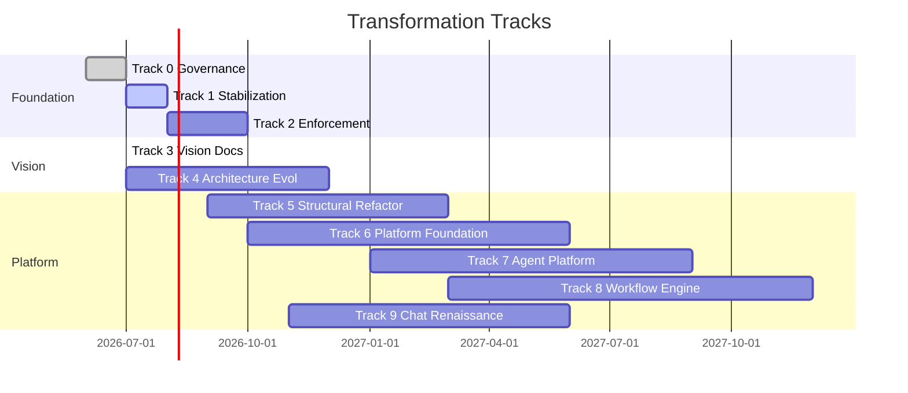
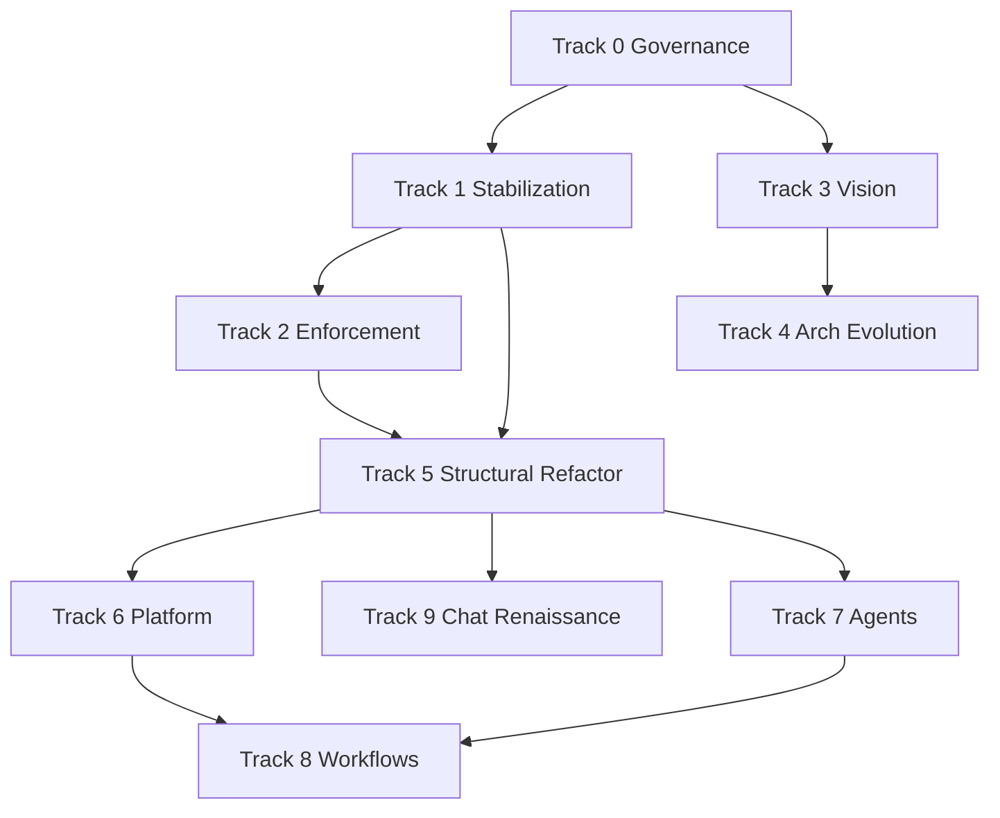

# Transformation Roadmap

**Program:** AI Command Center Transformation  
**North star:** [WORKSPACE_VISION.md](../architecture/WORKSPACE_VISION.md)  
**Audit:** [TRANSFORMATION_AUDIT.md](TRANSFORMATION_AUDIT.md)  
**Enforcement:** [ENFORCEMENT_ROADMAP.md](ENFORCEMENT_ROADMAP.md)

---

## Track Overview

---

## Track 0 — Governance

| Field | Value |
|-------|-------|
| **Objective** | Establish constitutional authority and audit baseline |
| **Status** | Complete |
| **Tasks** | TRANSFORMATION_AUDIT.md; verify_constitution CI; UCGS v5 bootstrap |
| **Dependencies** | None |
| **Risks** | Profile mismatch (`default` vs `ai-command-center`) |
| **Effort** | S |
| **Exit criteria** | Audit published; constitution PASS in CI |
| **Acceptance** | All authority files present |

---

## Track 1 — Stabilization

| Field | Value |
|-------|-------|
| **Objective** | Fix P0/P1 runtime and lint defects without architectural redesign |
| **Status** | Complete (this PR) |
| **Tasks** | F821 fixes; SystemView lifecycle; inspector thread safety; bus/app_state errors; ModelRouter wiring; shell hardening; STABILIZATION_LOG.md |
| **Dependencies** | Track 0 |
| **Risks** | SystemView behavior change when not visible |
| **Effort** | M |
| **Exit criteria** | ruff F821 clear; pytest 29/29 pass; compileall pass |
| **Acceptance** | No P0 items open in audit |

---

## Track 2 — Enforcement

| Field | Value |
|-------|-------|
| **Objective** | Progress UCGS warn → CI block |
| **Tasks** | ENFORCEMENT_ROADMAP stages 2–3; ai-command-center profile; import grep in verify_constitution |
| **Dependencies** | Track 1 |
| **Risks** | CI noise from legacy violations |
| **Effort** | M |
| **Exit criteria** | Stage 3 CI block on main |
| **Acceptance** | Documented grandfather list for legacy debt |

---

## Track 3 — Vision

| Field | Value |
|-------|-------|
| **Objective** | Publish north star and architecture specs |
| **Status** | Complete (this PR) |
| **Tasks** | WORKSPACE_VISION + 5 architecture specs |
| **Dependencies** | Track 0 |
| **Effort** | M |
| **Exit criteria** | ARCHITECTURE.md references all new docs |
| **Acceptance** | Product identity = Workspace OS documented |

---

## Track 4 — Architecture Evolution

| Field | Value |
|-------|-------|
| **Objective** | Expand ARCHITECTURE.md; align subsystem map with vision |
| **Status** | In progress (this PR expands, does not replace) |
| **Tasks** | Mission summary; subsystem map; long-term direction section |
| **Dependencies** | Track 3 |
| **Risks** | Authority hierarchy drift |
| **Effort** | S |
| **Exit criteria** | Single ARCHITECTURE.md source of truth preserved |
| **Acceptance** | No duplicate architecture authority files |

---

## Track 5 — Structural Refactoring

| Field | Value |
|-------|-------|
| **Objective** | Reduce god classes; eliminate UI→repo violations |
| **Tasks** | Refactor hero_panel, layout/compiler; dedupe db/repositories; split app.py bus handlers |
| **Dependencies** | Track 1, Track 2 Stage 2 |
| **Risks** | UI regression |
| **Effort** | L |
| **Exit criteria** | UCGS layer import PASS; app.py < 500 LOC |
| **Acceptance** | Zero UI repository imports |

---

## Track 6 — Platform Foundation

| Field | Value |
|-------|-------|
| **Objective** | Packaging, paths, cross-platform abstractions |
| **Tasks** | PLATFORM_STRATEGY phases P0–P1; HotkeyProvider; MSI build |
| **Dependencies** | Track 5 |
| **Effort** | L |
| **Exit criteria** | Signed Windows installer smoke test |
| **Acceptance** | No hardcoded Windows paths outside platform/ |

---

## Track 7 — Agent Platform

| Field | Value |
|-------|-------|
| **Objective** | Bus-native supervised agents |
| **Tasks** | AGENT_FRAMEWORK phases A0–A2; AgentRuntimeService |
| **Dependencies** | Track 5, MODEL_ORCHESTRATION M1 |
| **Risks** | Runaway loops |
| **Effort** | XL |
| **Exit criteria** | Single agent demo with permission gate |
| **Acceptance** | No service→service imports in agent code |

---

## Track 8 — Workflow Engine

| Field | Value |
|-------|-------|
| **Objective** | Multi-step automation on EventBus |
| **Tasks** | WORKFLOW_ENGINE W0–W2; WorkflowRepository |
| **Dependencies** | Track 7 A1, Tool runtime stable |
| **Effort** | XL |
| **Exit criteria** | 2-step workflow from command palette |
| **Acceptance** | Workflow state in AppState |

---

## Track 9 — Chat Renaissance

| Field | Value |
|-------|-------|
| **Objective** | Chat-as-tool UX modernization |
| **Tasks** | CHAT_MODERNIZATION_SPEC C1–C4 |
| **Dependencies** | Track 5 partial, Workspace OS canvas |
| **Risks** | Streaming regression |
| **Effort** | L |
| **Exit criteria** | Chat attached to workspace entity; AppState-first UI |
| **Acceptance** | chat_view.py < 600 LOC; existing chat tests pass |

---

## Dependency Graph

---

## Program Exit Criteria

- [ ] Workspace canvas is default home view
- [ ] All tracks 0–4 complete; 5–9 in flight with clear owners
- [ ] CI enforcement Stage 3 active
- [ ] No P0 audit items open
- [ ] 29+ pytest tests; daily driver PASS
